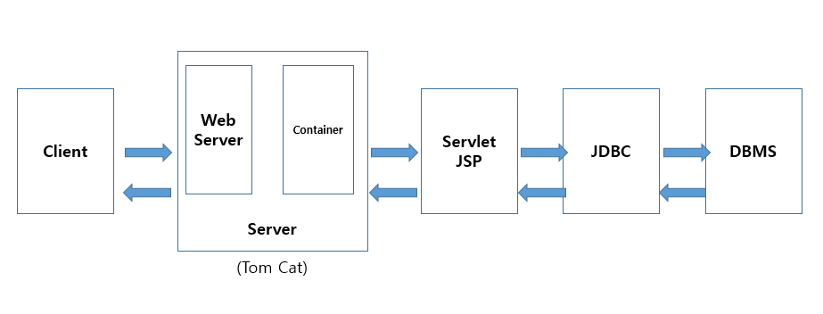

# HTML

>  웹프로그래밍에서 웹페이지의 내용을 책임지는 파트
>
> client에게 보여지기 위한 기본 SW기술

## 1. 기본

### 웹 표준 기술

1. HTML5: 내용 및 기본 뼈대 - 웹페이지의 내용을 작성한다.
2. CSS3: 웹페이지 스타일 - 웹페에지를 컨셉에 맞게 예쁘게 꾸민다.
3. Javascript: 웹페이지의 기능 - 웹페이지 상호작용 및 동작  (**중요**)

### 개념 

1. **웹서버:** 엔진X, 아파치 - 정적 콘텐츠 활용

   A Web server is a server program that uses HTTP (Hypertext Transfer Protocol) to serve the static files to users, in response to their requests. 

   **정적 콘텐츠:** 코드로 지정된 콘텐츠. 메뉴나 이미지처럼 변화지 않음.

   > "If a web server gets a request to serve a static HTML, CSS of Javascript file, it just returns the requested file.
   >
   > But what happens if a web server gets a request that has to be processed dynamically?
   >
   > That's when an application servers comes in.

   

2. **웹 어플리케이션 서버:** 웹로직, 제우스, 톰캣 - 동적 콘텐츠

   WAS is a server program that uses HTTP Content but is not limited to just HTTP. It can be provided other protocol support such as RMI/RPC.

   **어플리케이션:** 특정한 업무를 수행하기 위해 개발된 응용 소프트웨어. 

   웹과 모바일로 나뉜다. 

   **프로토콜:** 컴퓨터간에 정보를 주고받을 때, 통신방법에 대한 규칙과 약속.

   **동적 콘텐츠:** Request를 받아 서버로 부터 가져온 데이터를 Response 하는 콘텐츠. 로그인이나 DB 서버를 활용.

   

3. **데이타베이스 서버:**

   Database server is a computer system that provides other computers with services related to accessing and retrieving data from a database.

   

4. **JSP Java Sever Pages :**

   -Java Server Page: WAS에서 동작하는 class

   -HTML문서안 사이사이에 JSP문법의 코드가 삽입되는 형태 작성 HTML코드는 그래도 클라이언트(웹브라우져)전송되지만, <%%>서버태그는 웹 컨테이너쪽에서 실행되고결과만 웹 브라우저로 전송된다.

   -HTML내에 자바 코드를 삽입하여 웹 서버에서 동적으로 웹 페이지를 생성하여 웹 브라우저에 돌려주는 언어이다.

   

5. **WAS(Web Application Server):** 

   -인터넷 상에서 HTTP를 통해 사용자 컴퓨터나 장치에 애플리케이션을 수행해 주는 미들웨어(소프트웨어 엔진)로서, Server 단에서 Application을 동작할 수 있도록 지원한다.

   -웹 애플리케이션 서버는 동적 서버 콘텐츠를 수행하는 것으로 일반적인 웹 서버와 구별이 되며, 주로 데이터베이스 서버와 같이 수행이 된다.

   -WAS로 인해 안정된 시스템 구성이 가능하여 안정적 서비스 보장, 자동적인 어플리케이션 복구기능을 제공하며, 업무 로직이 중간 어플리케이션 서버에 존재하여 쉽고 빠르게 구축할 수 있다.                     


6. **Jquery:** 제이쿼리는 "적은 코드로 더 높은 생산성" 이라는 목표로 개발된 경량의 자바스크립트 라이브러리입니다.
7. **스프링:** 자바 스프링은 자바라는 프로그래밍 언어에 의해 동작하는 프레임워크입니다. 
8. **프레임워크:** 빈 공장같은 것. 빈 공장에 자바라는 프로그래밍언어로 공장 안을 디자인하는 것. 구체적으로 웹을 동작시키기 위한 기능들을 모아둔 '틀'. 그 틀 안에서 제공하는 기능들로 웹을 쉽게 만들 수 있도록 하는 것이 자바 스프링 프레임워크.
9. 자바와 자바스크립트는 완전히 다른 언어이다.


**커넥티드카 과정에서 HTML를 공부하는 이유**

- 우리는 HTML 디자인 목적이 아닌, 전반적인 흐름을 파악하기 위해서 웹의 기본 구성을 알아야 한다. 
- 웹과 모바일을 연동하기 위해서는 웹을 알아야 한다.

## 2. 톰캣

> 동적콘텐츠를 지원하는 웹 어플리케이션 서버

webapps: 서버가 기본적으로 위치를 인식하는 폴더


기본 웹 요청 방식:

http://127.0.0.1:8088//context명

'-------'  '----------'  '-------'   '-----------' 
프로	웹서버	port	기본콘턴츠는 생략(root)
토콜 	IP			web의

​							기본port80-생략가능

http://127.0.0.1:8088//docs
										폴더명이 올수도 있음.

​	예시:

​	서버를 킨다.

​	매니저의 index.jsp

​	http://127.0.0.1:8088/manager/index.jsp

​	examples => servlets

​	http://127.0.0.1:8088/examples/servlets/index.html


​	서버가 다른곳을 인식하도록 설정하기

​	edit plus 키고, 아파치=>톰캣=>conf=>server.xml

​	<Context docBase="C:\mypro" path="/mypro" reloadable="true" debug="0"/> 

​	그리고 재부팅


xml은설정파일

log는 전부기록파일


contect

​	jsp,html,js,css,image

​	Web-Inf

​		web.xml: 설정파일

​		lib			: 라이브러리

​		classes	: 자바파일, 서블릿, DAO, DTO




서버지우는 방법

1. project explorer (왼쪽메뉴)에서 삭제
2. 가운데 아래 servers에서 삭제
3. window-preferences-server-server runtime environments 삭제


표준화된 폴더 경로

C:\IoTJY\WebWork\.metadata\.plugins\org.eclipse.wst.server.core\tmp0\wtpwebapps


테이블

4행 4열 경우

Col: td

Row: tr

```html
<table>
    <tr>
        <td>콜룸1</td>
        <td>콜룸2</td>
        <td>콜룸3</td>
        <td>콜룸4</td>
    </tr>
</table>
```

화면에서 그룹으로 묶을 때

div: 줄바꿈 있음

span: 줄바꿈 없음

## 3. HTML5 기본 요소

```html
<!--단락 태크 -->
<p>이것이 하나의 단락</p>

<!--줄바꿈 태크 -->
<br/>

나머지는 basic html 파일 참고

```

중요코드

```html
링크
<a href="http://www.naver.com" target="_self">네이버방문</a>
기존창에서 링크를 연다
<a href="http://www.naver.com" target="_blank">네이버방문</a>
새창/탭에서 링크를 연다
```

### Request

> 클라이언트 컴퓨터가 서버 컴퓨터로 데이터를 전달하는 방식에는 2가지 방식이 있다

1. HTTP GET 요청

   URL 주소 뒤에 파라미터를 붙여서 데이터를 전달하는 방식이다.

   주소에 관련 데이터가 보인다

2. HTTP POST 요청

   사용자가 입력한 데이터를 URL 주소에 붙이지 않고 HTTP 바디에 포함시켜서 전송하는 방식이다.