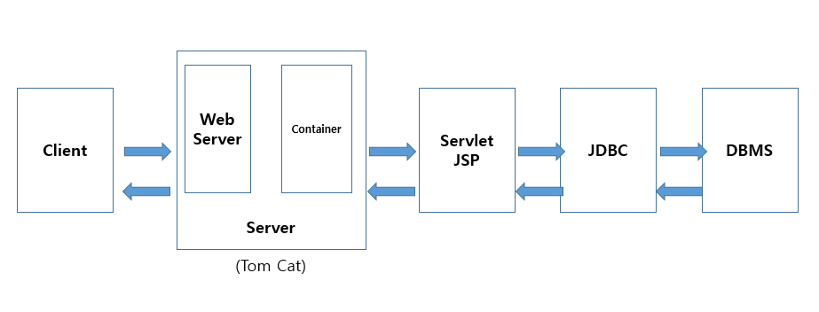
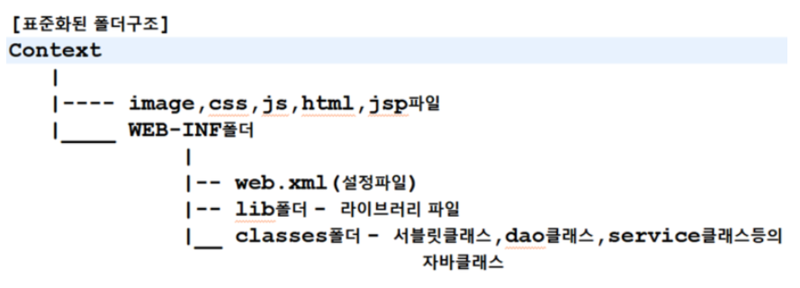
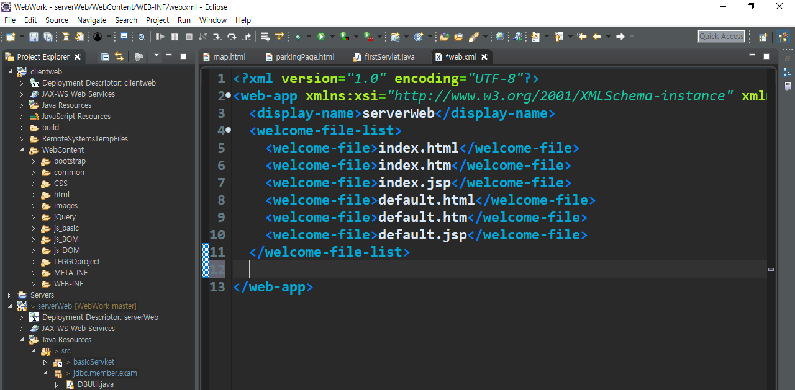
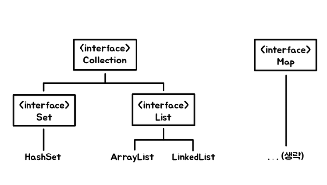
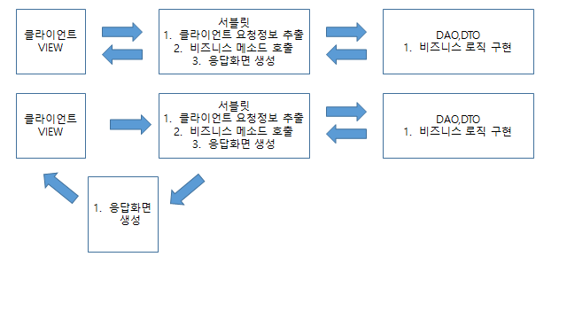
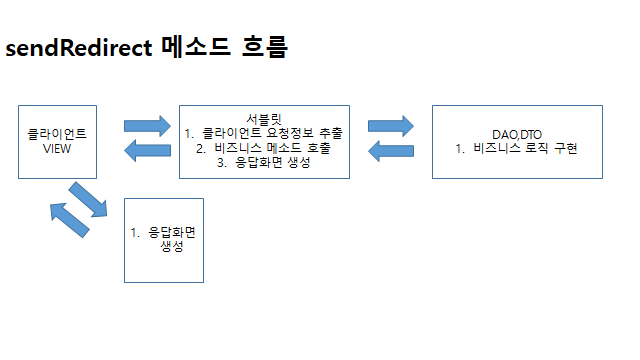

# Servlet

> 웹플렛폼에서만 사용되는 기술
>
> 동적기능은 자바 언어를 사용해야 하고 WAS는 자바를 실행할 수 없으므로
>
> 새로운 라이브러리, Servlet JSP를 사용한다. 
>
> HTML, CSS< Java Script 에서 자바를 사용하지 못함. 
>
> 오직 Servelt JSP로 통하여 요청을 한다.


## 로그인

로그인은 동적기능이므로, 클라이언트 페이지에서 서브릿으로 데이터를 요청한다.

요청: 클라이언트 => WAS=> 서블릿 => JDBC 코드 실행 => DB 연동

응답: DB 연동 =>  JDBC 코드 실행 => 서블릿 => WAS => 클라이언트 페이지



## Servlet

> 1. 서블릿은 자바로 만들어진 웹 기술
>
> 2. 클라이언트 페이지에서 발생하는 클라이언트에 요청을 처리하기 위한 기술
>
> 3. 클라이언트로부터 요청이 전달되면 서버에서 실행되며 DB연동이나 서버의 자원을 엑세를 하여 만들어진 결과를 클라이언트로 응답한다.
> 4. 클라이언트의 요청을 인식하고 실행하기 위해서는 서블릿은 정해진 규칙대로 작성되어야 함.
> 5. 서버가 서블릿을 찾아서 실행할 수 있도록 정해진 위치에 작성되어야 한다.
> 6. 정해진 위치: 표준화된 폴더 구조안에 있는 classes 폴더(서블릿 디렉토리)

## 웹 시험 1번 문제




**서버가 인식하는 위치:** 

C:\IoTJY\WebWork\.metadata\.plugins\org.eclipse.wst.server.core\tmp0\wtpwebapps


**Context = Web Application Folder**

C:\IoTJY\WebWork\.metadata\.plugins\org.eclipse.wst.server.core\tmp0\wtpwebapps\serverWeb\WEB-INF\classes


## Servlet 작성 규칙

1. 표준화된 폴더 구조안에서 서블릿 디렉토리에 저장되어야 한다. 

   ( 위 이미지 참조) Context (WEB-INF\classes) 위치에 서블릿 클래스가 없으면 못 찾는다

2. 서버가 찾아서 실행해야 하므로 public로 작성해야 한다. 

3. 서블릿 클래스를 상속해야 한다.

   서버가 우리가 작성한 서블릿 클래스를 찾아서 생성하고 호출하기 위해서는 서버가 인식/사용할 수 있는 타입이어야 하므로 서버가 등록된 타입으로 서블릿 클래스를 작성한다.

**팁:** 서블릿 구조: Sevlet(인터페이지: 최상위) - Generic Sevlet(일반적인 내용) - Http Servlet(웹에 특화된 내용)- 나만의 서블릿(개발자가 하고 싶은 일을 담는 서블릿)

4. Http Servlet을 상속받아서 나만의 서블릿을 만든다.

   serverWeb-build path-add library-apache tomcat 설정을 해야 extends HttpServlet을 상속받을 수 있다

5. 서버가 호출하는 메소드를 오버라이딩 해야 한다.

   서블릿 클래스는 일반 클래스를 사용하는 방법처럼 객체생성해서 사용하는 클래스가 아니다. 

   서블릿이 호출되면 서버가 서블릿 객체를 생성하고 적절한 시점에 따라 정해진 메소드를 자동으로 호출한다. 즉, 서블릿의 Lifecycle을 서버가 관리한다.

   Lifecycle: 객체를 생성하고 소멸하는 것

   서버가 적절한 시점에 따라 자동으로 메소드를 호출할 때 원하는 자업을 처리하기 위해서는 서버가 호출하는 메소드를 오버라이딩해서 내가 원하는 내용을 기술해야 한다.

   [오버라이딩할 메소드]

   init: 서블릿이 초기화될 때 호출 됌

   service: 클라이언트가 요청을 하면 호출되는 메소드

   ​				=> 클라이언트의 요청을 처리할 수 있는 내용을 기술

   ​					ex. 로그인, 게시만목록보기, 회원가입 등등

   ​				=> 요청방식의 구분없이 모두 호출

   **doGet**: service와 동일하게 동작하며 클라이언트가 get방식으로 요청하는 

   ​			경우에만 호출

   **doPost**: service와 동일하게 동작하며 클라이언트가 post방식으로 요청하는 

   ​				경우에만 호출

   **destroy**: 서블릿 객체가 소멸될 때 (메모리에서 해지될 때)호출

6. 서블릿을 등록

   서버가 서블릿을 찾아서 실행할 수 있도록 섭르릿을 web.xml에 등록

   web.xml: 서블릿에 대한 내용을 등록하는 설정파일

   **서블릿 등록** (위치: serverWeb-Webcontent - WEB-INF안에잇음) 

   

   ```java
     서블릿 등록
         => 사용할 서블릿이 어떤 클래스인지 정의
   <servlet>
   	<servlet-name>서블릿의 이름</servlet-name>  
   	<servlet-class>실제사용할 서블릿 클래스(패키지포함)</servlet-class>
     </servlet>
   ```

   ex. basic 패키지에 자성한 FirstServlet을 first 라는 이름으로 등록

   ```java
     <servlet>
   	<servlet-name>first</servlet-name>  
   	<servlet-class>basic.FirstServlet</servlet-class>
     </servlet>
   ```

7. 서블릿매핑

   => 서블릿을 어떤 url로 요청할지 등록

   ```java
   	<servlet-mapping>
   		<servlet-name></servlet-name>
   		<url-pattern></url-pattern>
   	</servlet-mapping>
   ```

   ex. 위해서 등록한 first서블릿을 /first.multi로 요청 .multi라는 확장자가 없어도 그냥 개발자 마음대로 함.

   네이버 주소 참고

   

   ​	

   ```java
   <servlet-mapping>
   		<servlet-name>first</servlet-name>
   		<url-pattern>first.multi</url-pattern>
   	</servlet-mapping>
       서버 restart
   ```

   **연습예제:** GuGuServlet작성하게

   ​				=> 콘솔에 7단 출력하게

   ​				서블릿명: gugu

   ​				요청url: /gugu.html

   ​				FirstServlet과 동일한 방법으로 요청하고 .java와 실행화면 캡쳐 제출

   ```java
   package basicServlet;
   
   import java.io.IOException;
   import javax.servlet.ServletException;
   import javax.servlet.http.HttpServlet;
   import javax.servlet.http.HttpServletRequest;
   import javax.servlet.http.HttpServletResponse;
   
   public class GuGuServlet extends HttpServlet{
   	public void service(HttpServletRequest req, 
   			HttpServletResponse res) throws
   			ServletException, IOException{	
   		
   		for(int i=1;i<10;i++) {
   			System.out.println("7 x"+i+" = "+7*i);
   		}
   		System.out.println("GuGU 서블릿: FirstServlet과 동일한 방법으로 요청");
   	}
   }
   --------------------------------------------------------------
       web.xml 파일
       	  <servlet>
   	<servlet-name>gugu</servlet-name>  
   	<servlet-class>basicServlet.GuGuServlet</servlet-class>
     </servlet>
   
   	<servlet-mapping>
   		<servlet-name>gugu</servlet-name>
   		<url-pattern>/gugu.html</url-pattern>
   	</servlet-mapping>
   ```

   

## Servlet 요청 방법

### 1. get방식으로 요청

> 요청할 때 입력하는 내용이  url뒤에 추가되어 전송되는 방식.
>
> (요청메시지가 헤더에 추가)
>
> 클라이언트가 입력하는 내용이 그대로 노출된다
>
> 전송할 수 있는 데이터의 크기에 제한이 있다.
>
> 서버의 데이터를 가져오기
>
> ex) d게시판 목록 확인하기, 싱품정보 가져오기, 검색하기

1. 주소표시줄에 입력하고 요청

   => 테스트용으로 사용

   http://70.12.115.50:8088/serverweb/first.multi

   serverweb: server.xml에 등록한 path. 보통은 context명

   first.multi: web.xml에 등록한 요청 path<url-pattern>에 등록

2. 하이퍼링크 클릭

   ```java
   <a href="ip주고:포트/cotext path/서블릿 요청 url">받은 편지함(하이퍼링크 요청하기)</a>
       
   <a href="http://70.12.115.61:8088/serverWeb/first.multi">받은 편지함(하이퍼링크 요청하기)</a>
   
   주로 이렇게    
   <a href="/first.multi">받은 편지함(하이퍼링크 요청하기)</a>
   
   ```

3. < form>태그에서 method속성을 get으로 설정하고 submit버튼 선택

   => action 속성에 설정한다.

   => form 태그를 정의하면서 method 속성을 생략하면 get방식으로 요청 

   => submit 버튼을 눌러서 요청하면 < form > 태그의 action 속성에 정의한 서블릿이 요청되며 < form > < /form> 내부에 정의한 모든 양식태그들의 name과 value가 서블릿으로 전달된다. 

   ```java
   	<form method="get" action="/serverWeb/first.multi">
   	<input type="text" name="id"><br/>
   	<input type="submit" value="전송">
   	</form>
   ```

   

### 2. Post 방식으로 요청

> 요청메세지 body에 추가되어 전송되므로 클라이언트에 노출되지 않지만 툴을 이용하면 확인할 수 있으므로 암호화해서 전송해야 한다.
>
> 보낼 수 있는 데이터 크기에 제한이 없다.
>
> 서버의 값을 클라이언트가 원하는 값으로 변경하는 경우
>
> ex) 회원등록(insert), 회원정보 수정(update), 파일업로드

1. < form>태그에서 method속성을 post으로 설정하고 submit버튼 선택

   => action 속성에 설정한다.

   => form 태그를 정의하면서 method 속성을 생략하면 get방식으로 요청 

   => submit 버튼을 눌러서 요청하면 < form > 태그의 action 속성에 정의한 서블릿이 요청되며 < form > < /form> 내부에 정의한 모든 양식태그들의 name과 value가 서블릿으로 전달된다. 

   ```java
	<form method="post" action="/serverWeb/first.multi">
	<input type="text" name="id"><br/>
	<input type="submit" value="전송">
	</form>
   ```

서블릿 콘테이너 작동 

> 클라이언트 요청
>
> 웹서버가 컨테이너한테 전달
>
> 메모리에 요청된 서블릿 객체가 로딩되어 있는지 확인한다. 메모리에 있다 없다
>
> 메모리에 없다면, 서블릿 객체를 생성한다. init 메서드를 생성하면서 서블릿 객체가 초기화 된다.
>
> 쓰레드 생성 ( 여러 사람들이 한개의 페이지를 이용할 수 있도록) 
> request (HttpServletResponse) 객체 &
> Response (HttpServletRequest) 객체 생성
>
> 서비스: 우리가 HttpServletRequest req, 
> 				HttpServletResponse res) throws
> 				ServletException, IOException 명시하는 메서드
>
> get or post 방식
>
> DB 연동 후 서비스로 전달. 서비스가 콘테이너로 전달. 콘테이너-웹서버-client

예제

클라이언트 페이지

```java
<!DOCTYPE html>
<html>
<head>
<meta charset="EUC-KR">
<title>Insert title here</title>
</head>
<body>
	<form method="post" action="/serverWeb/login.do">
		아이디:<input type="text" name="id"><br/>
		패스워드:<input type="password" name="pass"><br/>
		<input type="submit" value="로그인">
	</form>
</body>
</html>
```

서버 페이지

```java
package basicServlet;

import java.io.IOException;

import javax.servlet.ServletException;
import javax.servlet.http.HttpServlet;
import javax.servlet.http.HttpServletRequest;
import javax.servlet.http.HttpServletResponse;

public class LoginServlet extends HttpServlet{
	public void doPost(HttpServletRequest req, 
			HttpServletResponse res) throws
			ServletException, IOException{
		
		req.setCharacterEncoding("EUC-KR");
		//1. 요청 정보 추출
		String id = req.getParameter("id");
		String pass = req.getParameter("pass");
		
		System.out.println("아이디: "+id);
		System.out.println(패스워드: "+pass);
	}
}

```

## 클라이언트 입력 정보 추출

> Hashset amd Hashmap

### 1. Hashset

> 고객의 ID, 물건의 가격, 제품의 시리얼넘버 등등
>
> 이러한 것들은 우리는 **데이터**라고 합니다.
>
> 그리고 이러한 데이터가 많아지면 **관리가 필요**하기 때문에 '**자료구조**'를 이용합니다.
>
> 컬렉션은 크게 두 가지로 나뉩니다. Set과 List로 말이죠.
>
> 두 자료구조의 가장 큰 차이점은 아래와 같습니다.
>
> **Set** : ① 데이터의 순서가 없다. ② 데이터가 중복될 수 없다.
>
> **List** : ① 데이터의 순서가 있으며 Index로 관리한다. ② 데이터가 중복될 수 있다.


```java
package API.Util;

import java.util.HashSet;
import java.util.Iterator;
//HashSet사용하기 - 데이터 저장하고 저장된 데이터 꺼내기
//집합: 중복을 허용하지 않는다.
public class HashSetTest {
	public static void main(String[] args) {
		HashSet<String> set = new HashSet<String>(); //자료구조 생성
		set.add("Java");
		set.add("JDBC");
		set.add("Oracle");
		set.add("Html");
		set.add("Css");
		set.add("Java");
		System.out.println("사이즈=> "+set.size());//중복은 하나로 처리. 중복NO
		
/*		set에 저장된 요소를 추출
		1. Hashset 데이터를 표준 인터페이스 
		 모든 자료구조에 담긴 데이터를 변환해서 담을 수 있도록 제공되는
		추출전용 인터페아스 iterator로 변환*/
		Iterator<String> it = set.iterator();
		System.out.println();
		//2. 변환한 후 추출
		while(it.hasNext()) {
			String data= it.next();
			System.out.println("꺼낸 요소"+data);
		}
		System.out.println();
		for(String data : set) {
			System.out.println("set에 저장된 요소: "+data);
		}

	}

}

```

```java
package API.Util;
import java.util.ArrayList;

public class ArrayListTest01 {
	public static void main(String[] args) {
		//E는 ArrayList를 사용하는 시점에 정의하는 데이터 타입
		//ArrayList에 저장되는 요소의 타입
		ArrayList<Integer> list = new ArrayList<Integer>();
		list.add(10);
		
		for(int i =1; i<=10;i++) {
			list.add(i);
		}
		System.out.println(list.size());
		System.out.println("=============================");
		System.out.println("ArrayList에 저장된 요소들: ");
		for(int i =0; i<list.size();i++) {
			System.out.println(list.get(i));
		}
	}

}

```

```java
package API.Util;
import java.util.HashSet;
import java.util.Iterator;
import java.util.Set;
//Set의 주요기능인 합집한 교집합 기능을 구현해보기
public class HashSetTest2 {

	public static void main(String[] args) {
		HashSet<String> set = new HashSet<String>(); //자료구조 생성
		set.add("Java");
		set.add("JDBC");
		set.add("Oracle");
		set.add("Html");
		set.add("Css");
		set.add("Java");
		System.out.println("사이즈=> "+set.size());//중복은 하나로 처리. 중복NO
		print(set,"set");
		
		HashSet<String> set2 = new HashSet<String>(set);
		set2.add("servelt");
		set2.add("jsp");
		set2.add("hadoop");
		print(set2,"set2");
		
		//두개. 합집합
		
		HashSet<String> set3 = new HashSet<String>();
		set3.add("Java");
		set3.add("JDBC");
		set3.add("Oracle");
		set3.add("hive");
		print(set3,"set3");
		//set과 set3의 교집합 구하기
		set.retainAll(set3);
		print(set,"교집합set");

		

	}

	//set에 저장된 데이터를 꺼내서 출력
	public static void print(Set<String> set, String setName) {
		System.out.println("사이즈=>"+set.size());
		for(String data: set) {
			System.out.println("Set에 저장된 요소=>"+data);
			
		}
		System.out.println("==================================");
	}
}

```

### 2. Hashmap

> 그리고 Map이라는 자료구조도 있습니다.
>
> Set이랑 List는 같은 특징이 있어 Collection으로 묶어서 표현할 수 있었지만
>
> Map은 애매해서 따로 표기를 하였습니다. 다른 블로그를 참고하니 다른 분들도 다 이렇게 표현하셨더라구요!
>
> 아무튼 Map은 표현하기로는 이렇게 따로 분리되어있지만 **일반적으로 Collection**이라고 하면 이렇게 **Set, List, Map**을 뜻합니다.
>
> **Map의 특징**은 아래와 같습니다.
>
> ① 순서가 없다. (정확히는 순서라고 하기 애매) ② 데이터가 중복될 수 있다.




### 3. 입력 정보 추출

> 클라이언트가 전달하는 요청 메세지에서 클라이언트의 입력정보 추출하기

1. 요청

   [요청객체]

   Servlet Request

   ​		HttpServletRequest (상속)

   > 클라이언트가 요청 메세지를 서버로 전달하면 여러가지 클라이언트 정보(클라이언트가 입력한 데이터, 쿠기, 세션정보, 클라이언티ip,  port...)가 서버로 전달된다.
   >
   > 서버는 이 데이터를 가지고 요청객체를 생성한다

   - http 프로토콜에 특화된 내용은 => HttpServletRequest에서 찾는다.
   - 일반적인 내용 => ServletRequest에서 찾는다.

2. 요청 정보 추출

   getParameter

   > ServletRequestgetParameter
   >
   > ServletRequest의 메소드를 호출하며 전달한 name에 대한 value를 리턴
   >
   > 리턴값: String으로 파라미터값
   >
   > ​	파라미터값: 주소표시줄에 직접 넘긴 value로 = 의 오른쪽 문자열
   >
   > ​						form태그를 이용해서 사용자가 직접 인력한 값
   >
   > ​	매개변수: String으로 파라미터 이름
   >
   > ​						파라미터 이름: 주소 표시줄에 직접 넘긴 name으로 
   >
   > ​						= 의 왼쪽에 있는 문자열
   >
   > ​						<input type="text" name="id">

   getParameterValues

   > ServeletRequest의 메소드로 파라미터명이 같은 모든 값을 모아서 
   >
   > String[]로 리턴
   >
   > => CheckBox, List에서 복수 개 선택, 임의로 동일한 이름을
   >
   > 리턴타입: String[]

### 3. 응답

> 클라이언트가 요청한 내용을 처리하고 처리결과를 웹 페이지에 출력되도록 응해야하 한다.
>
> 서블릿에서 응답할 수 있도록 출럭스트림을 지원한다.

1. 응답하는 문서의 타입과 인코딩방식을 정의

   res.setContentType("응답형식(MINE타입);문자셋")

   res.setContentType("text/html;charset=euc-kr")

2. 응답객체에서 출력 스트림 얻기

   ServeletResponse객체의 getWriter를 이용해서 리턴받는다.

   PrinterWriter pw = response.getWriter()

3. 메소드의 매개변수로 응답할 내용을 명시한다

   실제로 불가능(추후에 개선된 내용)

   




응답화면은 아래와 같이 생성한다.

​		새로 만든 HTML 파일: 분리하기 위해.

​		response.sendRedirect("/serverWeb/dept/insertResult.html");

​		하지만 이렇게 구현하면 자바 코드를 구현할 수 없다. 

대안: JSP는 자바코드를 구현할 수 있다. HTML 파일을 JSP 형식으로 바꾼다


## DB 연동

> 이클립스에서 오라클 접속하기
>
> **[출처]** [이클립스에서 오라클 접속하기](https://blog.naver.com/heaves1/221580311109)|**작성자** [heaves1](https://blog.naver.com/heaves1) 
>
> 참고하기

1. DB유틸 파일 

   C:\oraclexe\app\oracle\product\11.2.0\server\jdbc\lib 에서 ojdbc6.jar severWeb-WebContent-WEB_INF-lib에 복붙한다.
   
   예시: 아래 파일 참고
   
   serverWeb - Java Resource - dept
   
   serverWeb - WebContent - dept 

# JSP

> Java Server Page: HTML+JAVA라고 생각하면 된다
>
> HTML에서 자바의 코드를 사용하기 위해. JAVA => HTML
>
> 클라이언트의 요청에 따라 동적컨텐츠를 만들 때 사용되는 기술. 
>
> HTML 문서에 화면을 구성하는 방법과 동일하게 작성
>
> 클라이언트-서블릿-JSP path로 실행되므로 자바코드 사용 가능
>
> 기본적으로 자바코드를 다양하게 많이 정의하지 않도록 간단하게 구현해야 한다.

## 1. JSP 스크립트 요소

### 1. 기본

```JSP
<%    %>
<h1>1. JSP 스크립트 요소</h1>
<%	int num =100; %> 
```

> 자바코드를 작성할 수 있는 스크립트요소
>
> 문자의 끝에 반드시 ; 을 추가해야 한다
>
> 스크립트 요소는 여러 번 반복할 수 있다. 되도록 적게. 지양.
>
> 서블릿이 공유하는 데이터를 꺼내서 출력하는 작업
>
> 메소드 선언할 수 있지만 클래스 선언은 하지 않는다.
>
> java.lang 패키지뺴고 모두 import 가능
>
> 스크립트 내부에서 정의하는 변수는 모두 _jspService()메소드의 지역변수

### 2. 선언문

```jsp
<%!   %>
<h1>2. 선언문</h1>
		<%!	int num =100000; %>
		<%!  public void test(){
			System.out.print("test");		
		}%>
```

> JSP파일이 서블릿으로 변환될 때 서블릿클래스의 멤버로 작성될 메서드나 변수를 정의

### 3. 표현식

```jsp
<%= %>
	<h1>3. 표현식</h1>
		<h2><%= 10000 %></h2>
		<h2><%= 10.5 %></h2>
		<h2><%="문자열의 길이"+str.length() %></h2>
		<h2><%= new Date().toString() %></h2>
		<h2><%= 100/3 %></h2>
		<h2><%= str.charAt(0) %></h2>
```

> 동적 컨텐츠를 구성하는 값을 출력하기 위해 사용하는 스크립트요소
>
> 서블릿으로 변활될 때 out.print()의 배누에 매개변수로 추가가 되므로 ;을 추가하지 않는다
>
> 표현식은 값을 출력하기 위해 사용하므로 사용할 수 있는 타입이 제한적이다.
>
> ​	=> 기본형, String, 앞의 내열한 타입을 반환하는 메서드 호출문 또는 연산

## 2. 지시자

## 3. JSP 내장객체

> JSP  내장객체란 jsp가 서블릿으로 변환될 때 jsp 컨테이너에 의해서 _jspService()메서드 내부에 추가된 지역변수이다. 
>
> jsp문서 내부에서 변수 선언하지 않고 사용할 수 있다
>
> 객체명은 컨테이너가 자동생성해준 이름이므로 반드시 정해진 이름으로 사용해야 한다.

request : HttpServletRequest

response : HttpServeltResponse

session : HttpSession

application : ServletContext

- Request 객체

> 클라이언트이ㅡ 요청정보를 담고 있는 객체
>
> 서블릿으로 부터 전달받아 사용한다. 
>
> ​	=> 서블릿에서 사용하는 모든 것을 사용할 수 있다

## 4. 요청 재지정

> 클라이언트로부터 들어온 최초 요청을 서블릿에서 원하는 다른 자원(JSP)으로 요청을 넘기느 것을 요청 재지정이라 한다.
>
> 요청재지정을 하는 목적은 서블릿에서 화면단을 분리시키고,
>
> 분리시킨 화면이 응답하도록 하기 위해서 필요하다.
>
> 웹을 개발하기 위해 사용하는 최적화된 패턴인 MVC패턴을 적용하기 위해 반드시 필요한 개념

### 1. 데이터 공유

 1. scope

    page, request, session, application에 각각 map(name과value를 같이 저장) 구조의 저장소를 갖고 있고, 

    그 저장소에서 추가하고 꺼내온다.

    - page => javax.servlet.jsp.PageContext

    - request => jacax.servlet.ServletRequest

      한번에 리퀘스트에 대해서 처리하고 리스펀스하기 전까지 사용되는 모든 객체에서 공유

    - session => javax.servlet.http.HttpSession

      세션이 생성되고 사용되는 모든 것들이 공유할 수 있도록

      세션이 생성되는 시점 로그인

      세션이 해제되는 시점 로그아웃 

      (or 정해진 시간 동안 사이트를 사용하지 않은 경우: 세션이 마감되었습니다)

    - application => javax.servlet.ServletContext

      모두공개: 톰캣메모리에 공유

      => 로그인 유무와 상관ㅇ벗이 사용하는 모든 곳에서 공유

	2. 데이터 공유하는 메소드

    공유되는 데이터를 atrribute라 한다

    - 모든 객체 (scope에 해당하는)의 

      setAttribute(공유할 atrribute이름, 공유할 객체)

      ​					공유할 객체: 자바에서 사용할 수 있는 모든것: java.lang.Object

### 2. 요청재지정 방법

1. 리다이렉트 (sendRedirect)

   - 문법:

     HttpServletResponse의 sendRedirect 메소드를 이용해서 구현

     response.sendRedirect("요청재지정될 web application의 경로")

     ​													html, jsp, 서블릿 모두 가능

     ​										"/contectpath/폴더명.../요청application의path"

     ​										ex)

     ​										"/serverWeb/dept/list.do"

   - 실행흐름

     1. 클라이언트에서 요청한다

     2. 서블릿이 실행된다

     3. 서블릿의 실행이 모두 완료되면, 클라이언트로 응답한다

     4. 클라이언트가 서블릿에서 요청재지정한 (sendRedirect에서 설정한) jsp 파일을 다시 요청한다.

     5. jsp페이지가 클라이언트에 응답된다.

        

        - 특징
          1. 클라이언트의 요청이 서블릿을 통해 들어 갔다가 다시 클라이언트로 돌아오면 요청 데이터는 지워진다
          2. 데이터 공유 불가능
          3. 주소표시줄이 마지막 요청 path로 변경된다

2. Forward

   > sendRedirect와 다르게 한 번의 요청으로 모든 웹 어플리케이션이 실행된다.
   >
   > 요청재지정된 어플리케이션으로 모든 제어를 넘기기 때문에 요청재지정된 jsp 파일이 응답된다. RequestDispatcher가 이런 일을 처리하는 객체

   - 문법:

     RequestDispatcher rd = 
     	request.getRequestDispatcher ("/요청재지정할 applicatio 경로");
     	rd.forward(request, response);

     

     RequestDispatcher rd = 
     	request.getRequestDispatcher ("/JSP/JSPBasic/forward/subPage.jsp");
     	rd.forward(request, response);

     ​		포워드하면서 리퀘스트와 리스폰드가 전달되므로 request를 공유해서		 사용할 수 있다
     
   - 실행흐름
   
     1. 클라이언트에서 요청을 서블릿으로 보낸다.
     2. 서블릿이 실행된다
     3. 서블릿이 클라이언트로 응답되지 않는 상태에서 jsp에 요청재지정을 한다 (호출)
     4. jsp가 실행되고 실행된 결과를 클라이언트로 보낸다.
   
   - 특징:
   
     1. 한 번의 요청으로 모든 APPLICATION이 실행되므로 데이터 공유가 가능
     2. 주소표시줄이 최초 요첮ㅇ된 서블릿PATH에서 변경되지 않는다
   
3. Include

   > forward와 동일하게 RequestDispatcher의 메소드를 이용하여 실행하며 요청재지정될 때 모든 제어를 jsp로 넘기지 않고 다시 서블릿으로 돌아와 서블릿에서 응답된다.

   - 실행흐름

     1. 클라이언트가 서블릿에 요청을 한다
     2. 서블릿이 실행된다
     3. 서블릿이 클라이언트로 응답되지 않은 상태에서 jsp에 요청 재지정
     4. jsp가 실행이 완료되면 jsp 실행 결과를 갖고 서블릿으로 되돌아온다
     5. 서블릿에서 클라이언트로 최종 응답된다

   - 문법(Forward와 동일)

     RequestDispatcher rd = 
     	request.getRequestDispatcher ("/요청재지정할 applicatio 경로");
     	rd.include(request, response);

   - 특징(Forward와 동일)

     1. jsp에서 주로 사용하는 요청재지정방식

