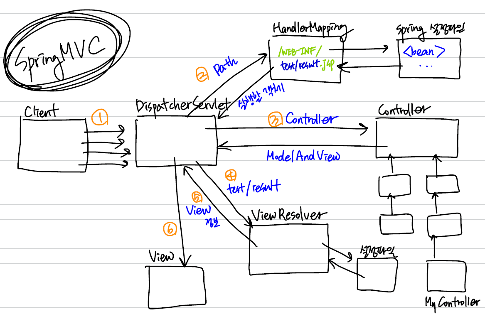

# Spring 프레임워크

> 개발의 뼈대. 독립적이고 완성된 프로그램이 아님. 자바 프레임워크. 
>
> 개발 방식. 어떻게 운영하는지 정해짐.
>
> 개발을 어떤식으로 표준화해서 작업하자.
>
> 그래야 다른 사람들과 협업할 때 작업이 용이해진다.
>
> 개발: 쇼핑몰, 예약관리시스템, 인터넷뱅킹....등등
>
> 재사용이 가능한 모듈이며 일반적으로 프레임워크를 통해서 개발하는 시세틈의 공통모듈을 프레임워크에서 제공: 늘 하는 작업을 라이브러리로 만들어서 쉽고 빠르게 진행.
>
> new 객체 매번 생성 안 하고 컨테이너와 xml를 활용한다.

**Spring의 특징**

- 경량시스템(포함된 라이브러리가 거이 1MB가 넘지 않는다)

- POJO(Plain Old Java Object)로 개발하기 때문에 작성하는 OOP 의 특징을 적용할 수 있다

- 내부에 IoC 컨테이너를 포함하고 있다.

  1. 의존성을 주입

     시스템내부(내가 만든 프로그램)에서 사용하는 객체를 직접 생성하지 않고 스프링 내부에 존재하는 컨테이너를 통해 전달받아 필요한 곳에서 사용한다.

  2. 스프링 내부의 IoC 컨테이너를 통해 객체를 관리하면서 커플링을 낮출 수 있다.

  3. 스프랭 내부에는 발생할 수 있는 다양한 모든 경우에 반응할 수 있도록

     많은 컨테이너 클래스를 제공한다.

**의존성주입**

1. DL(Dependency Lookup)

   => 컨테이너가 만든 객체를 getBean 메소드를 통해 가져와서 사용하는 것

2. DI(Dependency Injection)

**컨테이너** : 스프링 내부에서 라이브러리로 존재

​	spring-breans-4.2.4.RELEASE.jar

- 객체생성을 관리하는 역할. Life Cycle관리
- 우리는 서블릿 객체를 만들지 않는데. 어떻게 사용하지는 알고 있고
- 컨테이너가 객체 생성을 알아서 관리해준다. xml를 활용한다.


**스프링 컨테이너의 종류**

1. BeanFactory: 개발자가 객체를 요청하는 시점에 객체를 생성한다.

   BeanFactory <=ApplicationContext <=WebApplicatioContext (상속관계)

   - **BeanFactory:** 개발자가 객체를 요청하는 시점에 객체를 생성한다. 요청할 때 만든다
   -  **ApplicationContext:** 컨테이너 객체가 생성될 때 전달된 xml안에 정의된 모든 빈을 생성하고 의존성주입을 처리한다. (지금당장 쓰지 않는 것도 미리 다 만든다) 여러게 쓸 때 용이하다.
   - 

   


**OOP 특성**

- 캡슐화: private

- 상속성

- 다형성


수정전: 결합도가 높은 프로그램

```java
package app1;
/*
 * 결합도가 극도로 높은 프로그램
 * => 클래스간의 결합도가 강하고 의존성이 높다.
 * => 사용되는 클래스를 변경하면 이 클래스를 사용하고 있는 모든 소스를 수정해야 한다
 * 		즉, 수정해야 하는 범위가 넓어진다.
 * 			oop특성도 적용되어 있지 않다.
*/
public class MyBeanTest {
	public static void main(String[] args) {
		MyBeanStyleB obj = new MyBeanStyleB();
		run(obj);
		show(obj);
	}
	public static void run(MyBeanStyleB obj) {
		System.out.println("*****************************");
		obj.hello("현빈");
		obj.hello("현빈");
		System.out.println("*****************************");
	}
	public static void show(MyBeanStyleB obj) {
		System.out.println("==============================");
		obj.hello("현빈");
		obj.hello("현빈");
		System.out.println("==============================");
	}

}
```

## Annotatio 활용

> 설정파일에 빈을 등록하지 않고 사용한다
>
> 간단하게 기호를 이용하여 빈을 사용할 수 있도록 설정
>
> Annotation을 이용해서 컨트롤러를 작성하는 경우 메소드를 정의할 떄 개발자가 워하는 형태로 에모스를 정의할 수 있다.
>
> 매개변수나 리턴타입으로 올 수 있는 타입들이 정해져 있긴 하지만 그 안에서 원하는 스펙을 다양하게 적용할 수 있다.
>
> 리턴타입: String, void, ModelAndView
>
> ​				String: view에 대한 정보만 넘길 때
>
> ​				ModelAndView: 공유할 데이터와 뷰에 대한 정보를 함께 리턴
>
> 매개변수: String, HttpServletRequest, HttpServletResponse, HttpSession, Model, DTO

### 규칙

1. 설정파일 <Context:component-scan > element를 이용해서 컨테이너가 빈을 찾을 수 있도록 패키지를 등록

2. 기본생성자를 반드시 추가해야 한다.

3. 빈 생성을 위해 사용할 수 있는 annotation기호

   - Component: 일반적인 Bean

   - Service: d비즈니스로직(DAO제외)이 정의되어 있는 빈을 등록하는 경우 사용

     클래스의 첫 글자를 소문자로 변경한 이름을 빈 name에 등록

     Dice => dice

     Player => player. 변경 방법: @Service("myplayer")

   - Repository: DAO를 등록하는 경우

---

<<Spring MVC프로젝트 구성>>
1. Dynamic Web Project 생성
2. 라이브러리 lib 폴더에 복사하기
3. DispatcherServlet(모든 요청을 받을) web.xml에 등록 (웹에서 사용할 xml)
	=> 모든 요청이 여기를 통해 진입하도록 설정해야 스프링이 제공하는 여러 가지 기능을 적용할 수 있다.
		(frontController패턴이 적용되어 있다)
4. spring에서 사용할 설정파일을 작성한다. (스프링에서 사용할 xml)
	=> 따로 등록하지 않으면 web프로젝트에서 사용할 스프링 설정 파일은 파일명을 작성할 때 규칙이 있다.
		[DispatcherServlet을 등록한 서블릿명]-servelt.xml
		ex. 서블릿명: srpingapp
			/WEB-INF/
				springapp-servlet.xml
5. Controller작성하기
	=> 기본 web에서 서블릿과 같은 역활을 하는 클래스
	=> 실제 처리를 담당하는 클래스
6. 스프링설정파일에 컨트롤러 등록하기
	<bean> 태그를 이용해서 5번에서 생성한 컨트롤러 등록하기
	요청 path를 기준으로 컨트롤러를 등록할 것이므로 id속성을 쓰지 않고 name속성을 사용한다.
	DispatcherServlet 내부에서 요청path에 맞는 컨트롤러를 getBean할 수 있도록 등록
	[형식]
		<bean name="요청path" class="컨트롤러 클래스"/ >
		
	[예제]
		/test.do로 TestController를 요청
		<bean name="/test.do" class="test.TestController"/ >




<<spring mvc 구성요소>>
스프링MVC를 구축하고 웹을 실행
스프링이 제공하는 모든 기능을 잘 활용하기 위해서 스프링이 내가 작성한 자바빈을 관리할 수 있도록 작업해야 한다.
(스프링 내부의 컨테이너가 내가 작성한 빈을 생성하고 관리할 수 있도록 작업)
이를 위해 모든 요청이  DispatcherServlet이라는 서블릿을 통해 들어올 수 있도록 처리

1. DispatcherServlet: 클라이언트의 모든 요청을 처리하기 위해 첫 번째로 실행되는 서블릿
2. HandlerMapping: 클라이언트가 요청한 path를 분석해서 어떤 컨트롤러를 실행해야 하는지 분석하여
					DispatcherServlet으로 넘겨주는 클래스
3. Controller: 클라이언트의  요청을 처리하는 클래스
				DAO의 메소드를 호출하는 기능을 정의
4. ModelAndView: Controller에서 DAO의 메소드 호출결과로 만들어진 데이터에 대한
				정보나 응답할 view에 대한 정보를 갖고 있는 객체
5. ViewResolver: ModelAndView에 저장된 view의 정보를 이용해서
				실제 어떤 view를 실행해야 하는지 정보를 넘겨주는 객체
				
	===> 스프링MVC를 구축하면 위의 클래스들이 자동으로 실행되며 일처리를 한다.
		따라서 필요에 따라 스프링에서 지원하는
		ViewResolver나 HandlerMapping 객체를 다양하게 등록하고 사용할 수 있다.
	===> 기본 설정을 이용하는 경우 개발자는 Controller만 작성하고 설정파일이나
		annotation으로 등록하면 된다. 
		

