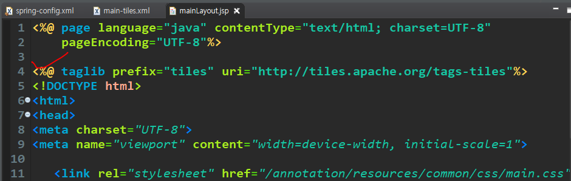
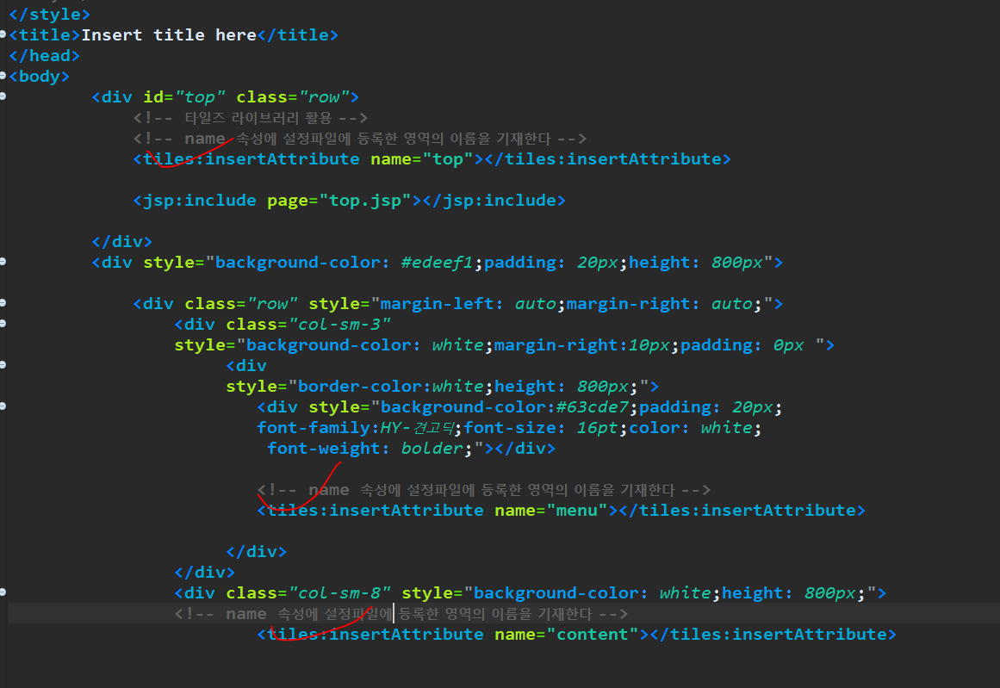
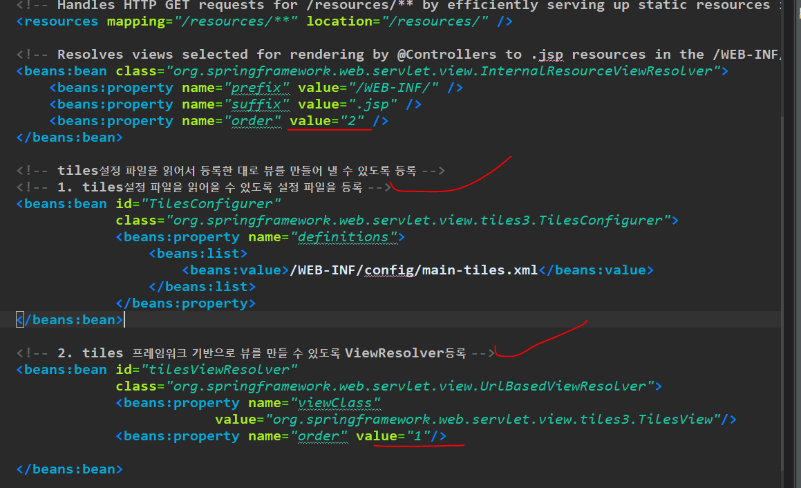
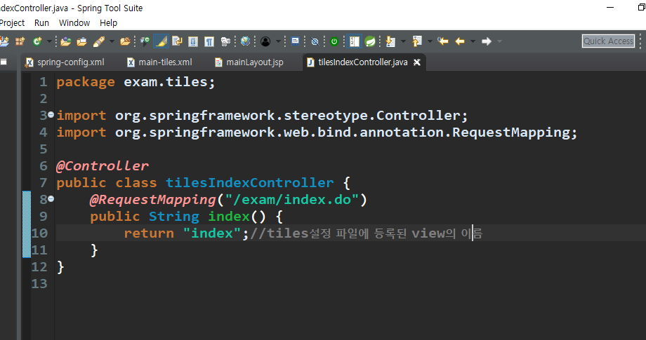
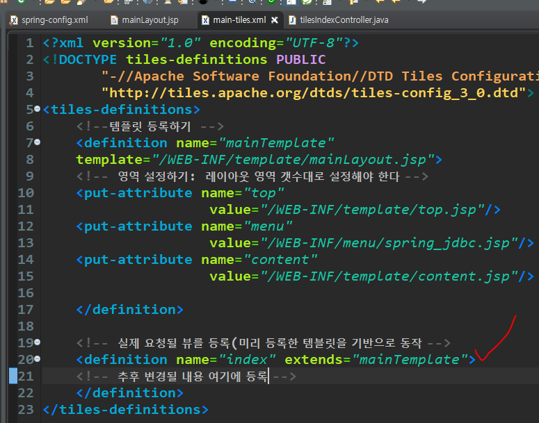
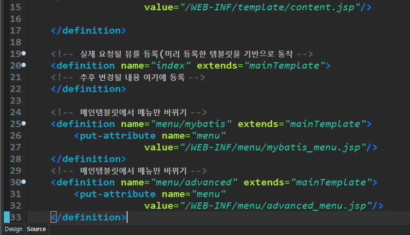
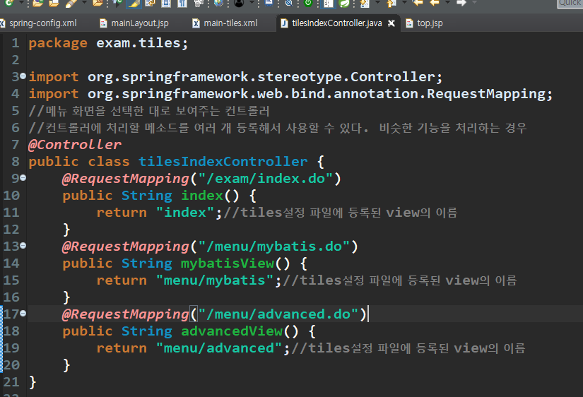

# Tiles 프레임워크

##  1. 화면구성하기

1. 라이브러리를 pom.xml에 등록하기

2. tiles 설정파일을 src-main:WEB-INF-config에 만든다.

3. 레이아웃이 적용되어 있는 템플릿과 연결할 jsp 을 미리 준비한다.

4. tiles 설정 파일을 작성한다

   - 템플릿 등록: 각 영역을 나누고 기본적으로 연결할 jsp 파일을 설정한다.

   ``` xml
   <?xml version="1.0" encoding="UTF-8"?>
   <!DOCTYPE tiles-definitions PUBLIC
          "-//Apache Software Foundation//DTD Tiles Configuration 3.0//EN"
          "http://tiles.apache.org/dtds/tiles-config_3_0.dtd">
   <tiles-definitions>
   	<!--템플릿 등록하기  -->
   	<definition name="mainTemplate" 
   	template="/WEB-INF/template/mainLayout.jsp">
   	<!-- 영역 설정하기: 레이아웃 영역 갯수대로 설정해야 한다 -->
   	<put-attribute name="top"
   					value="/WEB-INF/template/top.jsp"/>
   	<put-attribute name="menu"
   					value="/WEB-INF/menu/spring_jdbc.jsp"/>
   	<put-attribute name="content"
   					value="/WEB-INF/template/content.jsp"/>
   	
   	</definition>
   </tiles-definitions>
   ```

5.  템플릿 파일을 mainLayout.jsp로 등록하고 다른 jsp 파일을 각 영역에 일치하도록 등록한다. 위 참고.

   => tiles에서 제공하는 태그를 사용한다. 

   => 템플릿으로 등록한 mainLayout에 외부 라이브러리인 tiles를 등록한다.

   => 그래야 tiles 라이브러리가 작동된다.





5. 스프링 내부에서 실행될 때 DispatcherServlet이 뷰 정보를 ViewResolver에게 전달하면

   ViewResolver가 tiles 프레임워크를 활용해서 뷰를 만들 수 있도록 spring 설정파일에 등록

   => tiles 설정 파일이 어떤 파일인지 등록한다.

   => 만들어야 하는 뷰가 tiles뷰임을 등록한다

   

6. 템플릿을 활용해서 만들어진 뷰의 정보를 tles 설정파일에 등록 

   컨트롤러



tiles 설정파일





컨트롤러에 메서드 




top 템플릿 수정

