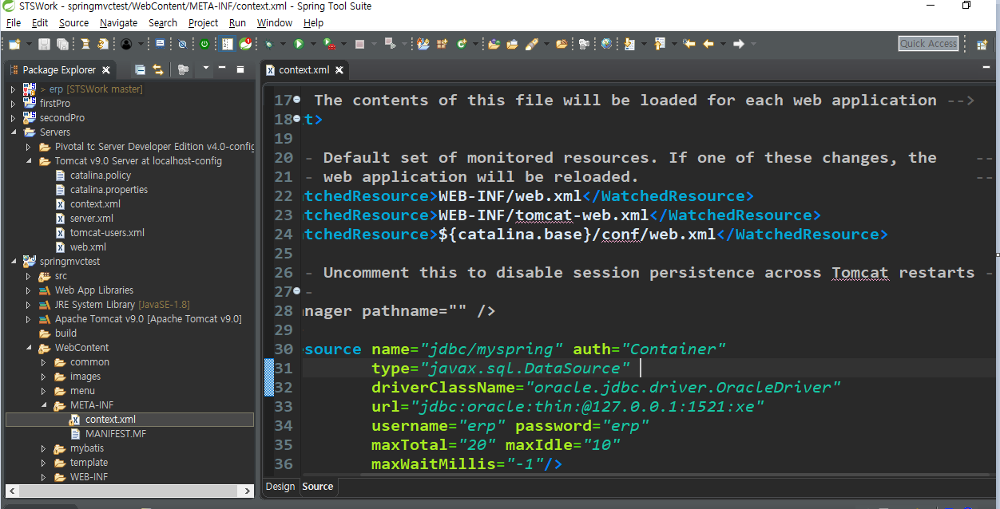

# Connection Pool

이클립스에서 DB.Util 파일에서 Connection과 Statement 같이 DBMS 접속 관련 코딩을 짠다.

나중에 동시 시간 접속자가 많을 경우 DB와 연결할 때 시간이 너무 걸리므로, Connection Pool이라는 걸 이용해서 효율적으로 신속하게 연결할 수 있다.

평균 동시 접속자

## WAS로 사용하는 방법

자원: WAS에서 제공해주는 객체

### xml 설정

## Mybatis 작업

1. POM xml 의존모듈을 추가

   - mybatis
   - mybatis-spring

2. mybatis에서 사용할 설정 파일을 작성

   - mybatis 메인 설정 파일: mybatis를 실행할 때 필요한 내용을 정의

     Connection 관리를 위해 필요한 내용 (spring으로 관리하므로 생략)

     mapper에 대한 정보

     mapper에서 사용할 dto

     spring 설정파일이 저장되는 위치에 추가

     /WEB-INF/config/mybatis-config.xml로 저장

   - mapper: sql문을 정의하는 설정 파일

     테이블 한 개에서 사용하는 sql문을 하나의 mapper 파일

     src폴더에 추가

3. spring설정 파일에 mybatis를 사용할 수 있도록 등록

   SqlSession객체가 mybatis에서 사용하는 핵심클래스

   (Spring jdbc의 jdbcTemplate과 동일)

   - Connection을 사용/생성할 수 있도록 등록

   - SqlSession을 사용할 수 있도록 factory객체부터 생성해야 하므로

     Factory 객체를 먼저 설정한다. 

     (spring에서 mybatis의 핵심 클래스를 사용하기 위한 객체)

     => Connection 객체를 사용, mybatis의 메인설정파일을 등록

   - mybatis의 핵심 클래스인 SqlSession 클래스의 하위클래스를 생성

     SqlSessionTemplate => spring.jdbc의 JdbcTemplate과 같은 역할

[기능추가하기]

1. 새로운 데이블로 작업을 한다면 mybatis=config.xml 파일에 VO파일과 mapper파일 등록

2. mapper에 sql문 추가

3. DAOImpl 클래스에 메소드 정의

   => mybatis의 핵심 클래스인 SqlSession클래스를 이용해서 작업

4. ServiceImpl 클래스에서 dao의 메소드 호출할 수 있도록 메소드 정의

5. Controller에서 ServiceImpl의 메소드를 호출해서 작업할 수 있도록 정의

6. Controller에서 responnse하는 뷰에서 Controller에서 공유해준 데이털를 꺼내서

   출력하기 (select작업)

7. tiles설정 파일에 뷰등록

