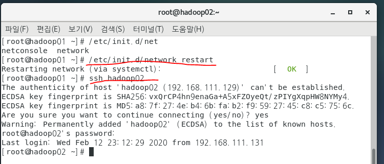
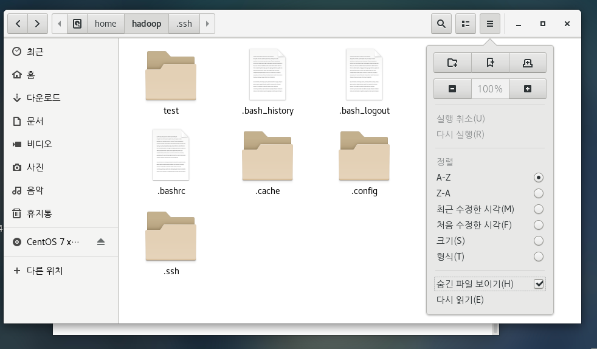
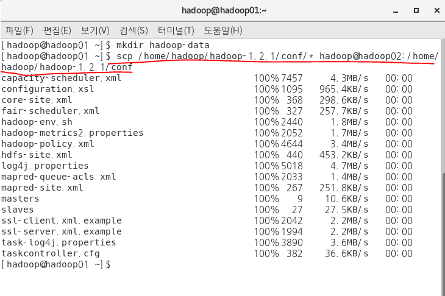

# 리룩스 설치

> 빅데이터플랫폼 구축

> 최소 4대 pc로 리룩스를 돌려야 하둡을 사용할 수 있다.
>
> 그래서 가상셋업으로 실행을 할 예정이다. 

## 1. 리룩스란

리룩스는 Windows 처럼 하나의 운영체제이다.

리룩스의 무료버전: CentOS

​				상용버전: 레드햇

장점: 

- 저가지만 누릴 수 있는게 참 많다. 
- 네트워크를 효율적으로 관리 가능.
- 내부 자원에 접근 권한을 적용할 수 있다. 보안유지 좋다. 

하둡: 데이터 모이고, 처리하고 관리

**핵심개념: HDFS(저장소) & Map Reduce(처리방식)**

## 2. 기본 설치

1. CentOS-7 다운로드

   이전 버전인 7을 다운 받는다

   http://mirror.kakao.com/centos/7.7.1908/isos/x86_64/

   

2. 가상 컴퓨터 4대를 설치할 것 이다.

   VMware player 다운받는다

   https://www.vmware.com/kr/products/workstation-player/workstation-player-evaluation.html

3. PC 가상화작업

   vmnetcfg zip 파일 확인

4. 사양확인

   **Securable**

   [**https://www.grc.com/securable.htm**](https://www.grc.com/securable.htm)

----

설치 후 c드라이브의 profram Files(x86) Vmware play 홈 다이렉토리 확인

바탕화면에 workstation 실행

---

**가상 컴퓨터 1대 만들기**

player - file - new Virtual Machine에서 I will install the operating system laster 클릭

Guest OS 설정: Linux, 버전: CentOS 7 64비트

Vm 이름 설정: Hadoop01

20.0 GB & Store virtual disk as a single file

Customize Hadware: 보기만 해라

finish: hadoop01 생성됌

---

edit VM settings

메모 2GB 설정: 마스터로 설정하고 나머지는 1GB 총 5기가로 설정할 예정

Play vm => 실행 , 화면 누르고 ctrl+alt 눌러야 마우스가 움직인다.

나가기.

홈에서 hadoop01클릭해서 오른쪽 클릭하면 remove와 delete가 보임. 

remove는 여기서 안 보이는 거고 delete는 완전 삭제.

remove한 후에 open에서 사용자 student에 하둡 다이렉토리에서 불러올 수 있다.

---

cmd: ipconfig

VMnet1 & VMnet8 : 가상

VMnet9: IPv4: 192.168.116.1 확인

cd VMware 폴더 경로 넣은 후 엔터 //

rundll32.exe vmnetuo.dkk.VMNetUI_ShowStandalone 하면 모듈이 없다.

플레이어에 포함되어 있지 않다. 

우리가 다운 받았던 vmnetcfg 압축 파일을 푼다.

압축을 푼 파일을 program files => VMware => Vmware Player에 복붙

복붙한거 클릭(Virtual Network Editor): 

​	NAT 선택 change settings: NAT Subnet IP 192.168.111로 바꾼다.

변경후 ipconfig확인하면 ip주소가 변경되어 있다. 

---

## 3. CentOS 설치

haddop01 setting: CD/DVD connection에서 Use ISO image file 선택

CentOS 파일 선택 => 가상 머신에 DVD 넣음

Power On => 화면 클릭하고 CentOS 7 => install CentOS 클릭 => 엔터

한국어 설정 => 키보드에 한국어 영어 모두 추가. 영어를 우선 순위로. 완료

소프트웨어 선택에 ''최소설치를 개발 및 창초를 위한 워크스테이션''. 완료

네트워크 및 호스트명 => 이더넷 켬으로 변경 . 완료

설치대상 => 로컬표준 디스크 2번 선택하면 파란색으로 체크됌 =>  

아래 파티션을 설정합니다 클릭 => 완료 => LVM을 표준파티션으로 변경

=> +버튼 => 마운트지점: swap 용량: 2gb => +누르고 => 마운트 / 체크 후 추가

완료. 메세지가 뜨고 변경 사항 적용

설치시작!

---

Root 암호설정: bigdata

사용자생성: hadoop

설정완료

---

약관동의

설정완료

목록에 없습니다: root => 암호는 bigdata

다 건너뛰고 시작!

---

가상머신명: hadoop02

RAM: 1gb

하드디스크: 20gb

---

바탕화면 => 오른쪽 클릭 => 터미널열기 => 커멘드창이다

ls 입력하면 dir과 똑같다.

계정변경하는 방법: su - hadoop

root로 돌아가기: su - 하고 암호입력

---

home directory: 특정 계정으로 로그인 했을 때 자동으로 위치하는 폴더. 계정마다 다 있음.

Root home directory: 기본 설정은 홈디렉토리명이 계쩡명과 동일. Root folder

root (관리자계정) => 프롬프트 #

일반계정 => 프롬프트 $

cd (띄어쓰기)/ :change directory

계정 @ 호스트명, 현재 접속중인 폴더, ]# or $

cd ~ : 홈디렉토리로 연결

cd / :  root로 연결

cd ~ 한 후에 ls 와 cd / 한 후에 ls는 다르다

usr 폴더: 윈도우의 proram files

dev: 장치들이 위차하는 폴더 

## 4. VM 복제하기

> hadoop01 복제하기
>
> 

**복제방법**

가상 머신이 설치되어있는 문서로 간다

복사하여 복제본을 만든다.

워크스테이션에서 player-file 불러오기. 경로 확인후  hadoop03으로 이름을 변경한다.

"I copied it"

root로 로그인

총 4대 세팅 완료하고 ip 확인

## 5. 클러스터링

> 여러대를 1대로 제어하기: 클러스터링
>
> 머신 4대를 하나의 서버처럼 처리한다.

- **하둡 서버를 구축하기 위한 클러스터링 설정하기**

hadoop01 => 오른쪽 마우스 => 터미널 => ifconfig

hadoop01 IP: 192.168.111.131

hadoop02 IP: 192.168.111.129 

hadoop03 IP: 192.168.111.132

hadoop04 IP: 192.168.111.130

화면잠금끄기: 프로그램=> 시스템도구 =>설정=>개인정보=>화면잠금 끔

- **호스트네임설정**:터미널 키고
-  hostnamectl set-hostname (바꿀 호스트 이름)

호스트네임을 hadoop01로 변경한다. 아래 이미지 참고

ssh ip주소 하면 접속 됌 (1번째에서 2번째 접속)

나오기: exit

   - **방화벽해제**

     내폴더 => 다른위치=>내컴퓨터=>ets=>검색창에 hostname => 오른쪽클릭 텍스트로 편집

     설정 변경 확인하고 방화벽 확인하기

     터미널=> systemctl list-units --type=service

     방화벽이 firewalld.service임 active한지 확인

     or

     systemctl status firewalld이렇게 확인

     방화면 해제

     

     하지만 이러면 reboot 시 다시 원점 상태. 방화벽이 꺼져있다.

     systemctl disable firewalld 쓰고 reboot하면 방화멱이 꺼져있다.

     

방화면 끄는 방법:

​	systemctrl status firewalld

​	systemctrl stop firewalld

​	systemctrl disable firewalld

    - 네트워크 설정

---

STS 오른쪽 상단 open perspective => remote system explorer

SSH only => 1번 ip주소

continue connection 팝업: yes ->  root & bigdata 로그인

**DNS설정**

1. hosts파일 등록

2. 네트워크 프로세스를  restart

3. 설정확인 - 설정을 성공 완료했는지 확인

4. 4대 모두 적용되도록 하둡01에서 하둡02~04 직접 접속

   

**ip로 접속이 아닌 머신 이름으로 접속하는 방법**

ssh hadoop02 이런식으로

방법: 내폴더=>다른위치=>컴퓨터=>etc=>hosts 검색 및 텍스트 파일로 열기

안에 내용 삭 다 지우고

하둡01 IP hadoop01 명시

하둡02 IP hadoop02 명시

하둡03 IP hadoop03 명시

하둡04 IP hadoop04 명시

위와 같은 방식으로 다 설정. 이제 이름으로 접속 가능.

**원격 서버로 copy**

scp /복제할 파일(위치까지 명시) /복제를 받을 서버의 위치

scp /etc/hosts root@hadoop02:/etc/hosts

''-----     -----------   ----------------------------------------''

명령어 복제할      파일/ 타겟서버의 위치와 파일명

아래보면 하둡02에 하둡01 파일이 복제되었다.

[root@hadoop01 ~]# ssh hadoop02 "/etc/init.d/network restart"

복제가 완료되었그면 네트워크 restart를 하여 반영을 시킨다. 

3번 4번 하둡도 같은식으로 반영시킨다.

**암호화 통신**

> 암호화된 통신을 위해서 공개키 생성 후 배포
>
> x 윈도우/그놈: VMware 바탕화면

ssh: secure shell

비공개 키: 마스터

공개 키: 나머지 3대

두개가 일치해야 통신이 된다. 내부에서 알아서 한다. 

우리는 공개키 비공개키 만들어서 공개키만 배포하면 된다. 

일반 계정인 하둡의 홈 디렉토리는 내컴퓨터에 홈이다

키만들기

ssh-keygen -t rsa

파일이 숨겨져 있음

이렇게 3번 4번에도 공개키를 두면 1번에서 접근할 때 비번이 필요없다.

단 1번에서 다른곳으로 접근할 때만 사용된다. 

---

보여주고 설정은 아직 안 함

C:\Program Files (x86)\VMware\VMware Player

클릭: vmnetcfg.exe

---

모든 플랫폼 설정은 끝난다. 이제 하둡만 설치하면 된다. 

---

# 자바다운 및 설치

https://www.oracle.com/java/technologies/oracle-java-archive-downloads.html

Java SE 8 Archive Downloads (JDK 8u211 and later) 클릭

STS IoT폴더에 다운받은 파일을 넣고

STS open perspective로 연결하고 root로 들어가서 IoT폴더 파일 복사 후 root usr 폴더에 복붙하면 리룩스 usr 파일에 다운로드 파일을 확인할 수 있다.

파일명: jdk-8u231-linux-x64.rpm

옵션

​	U: upgrade

​	v: view

​	h: #

위처럼 설치가 완료되면 하둡 02,03,04에도 설치한다.

하는 방법:

 [root@hadoop01 ~]# scp /root/jdk-8u231-linux-x64.rpm root@hadoop02:/root

[root@hadoop01 ~]# ssh hadoop02 "rpm -Uvh jdk-8u231-linux-x64.rpm"

 [root@hadoop01 ~]# scp /root/jdk-8u231-linux-x64.rpm root@hadoop03:/root

[root@hadoop01 ~]# ssh hadoop03 "rpm -Uvh jdk-8u231-linux-x64.rpm"

 [root@hadoop01 ~]# scp /root/jdk-8u231-linux-x64.rpm root@hadoop04:/root

[root@hadoop01 ~]# ssh hadoop04 "rpm -Uvh jdk-8u231-linux-x64.rpm"

# 하둡 다운 및 설치

https://archive.apache.org/dist/hadoop/common/hadoop-1.2.1/

자바는 루트에 설치

하둡은 하둡에 설치: 그 이유는 하둡계정에서 테스트 및 실행을 할 예정

하둡파일 하둡계정에 설치하기

하둡파일 => 홈으로 이동

옮기고 계정이동. su hadoop

권한 변경됌

**압축풀기**

강사님 블로그

하둡01에서 직접해보기

폴더가 생성됐다.

다른 컴퓨터에도 같은 작업을 한다.

1. 파일 복제하고

   scp /home/hadoop/hadoop-1.2.1.tar.gz  hadoop@hadoop02:/home/hadoop/

   

   

2. 압축 풀고

   ssh hadoop02 "tar -zxvf hadoop-1.2.1.tar.gz"

   ssh hadoop03 "tar -zxvf hadoop-1.2.1.tar.gz"

   ssh hadoop04 "tar -zxvf hadoop-1.2.1.tar.gz"

3. conf 폴더 : 홈=>하둡=>압축푼 파일폴더=>conf

   

   

   주석풀고 경로를 수정해준다.

   하둡이 내부에서 자바를 사용하기 때문에 우리가 설치한 곳으로 경로를 제대로 지정해준다. 

   그 다음 conf=>masters

   

   그 다음은 conf=> slaves

   

---

이제 임시 디렉토리를 만든다

이렇게 쓰면

만들어짐

conf=>core-site.xml

이제는 conf=>hdfs-site.xml

>
>
>HDFS: 파일을 한 곳이 아닌 여러 곳에 분산하여 저장관리한다.
>
>name node(각 저장될 컴퓨터)에 64MB으로 나눠서 저장한다.
>
>namenode가 회손되면 파일을 열 수 없으니 백업용으로 secondary namenode도 필요하다.
>
>4+4 = 기본 총8대
>
>HDFS [Hadoop Distributed File System]
>
>

3개 본제본

마지막으로 conf=>mapred-site.xml

총 6곳 설정하고 이 모든 파일을 2~4번으로 복제

다 완료가 되면 빈폴더에 하둡파일 포멧해야 한다.

---

하둡실행하기: start all

역할부여 확인

하둡 종료하기

이렇게 끄면 된다

jps

다시 킬 때는 start 다시 쓰고

이렇게 확인

**로그확인하기**

홈=>하둡=>하둡1.2.1=>로그파일

# 샘플작업1:

> 어떻게 돌아가는지 보기

input이라는 폴더를 생성하고 readme 를 그 안에 넣어주기

fs- mkdir 라는 하둡 명령어를 사용하기 위해서는 hadoop- 1.2.1이 있어야 함

README.txt 는 hadoop- 1.2.1 폴더에서 복사해 온거임

input 폴더는 폴더상에 눈으로 보이는게 아님. HDFS 에서 알아서 관리하는 거임

확인:

파이어폭스

http://hadoop01:50070

노드정보 확인 가능.

Readme가 01~04 다 들어가있다

---

# 샘플작업2:

hadoop jar 라는 명령어를 사용할 건데

hadoop-examples- 1.2.1. jar 압축파일에서

wordcount class를 input폴더 readme.txt에 사용하고

HDFS 상 output  폴더에 보이도록 한다.

wordcount 사용해 보기

단어가 몇번 나오는지 빈도수가 나온다.

# 샘플작업3:

> hadoop-examples-1.2.1.jar의 wordcount를 이용해서 작업하기
>
> - HDFS에 myinput 폴더를 작성한다.
> - LICENSE.txt 를 복사한다
> - wordcound를 적용
> - c출력결과는 myoutput으로 작성

명령어 맨 끝 output을 myoutput으로 수정해서 다시 만듦

