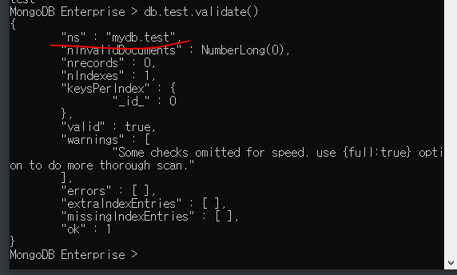
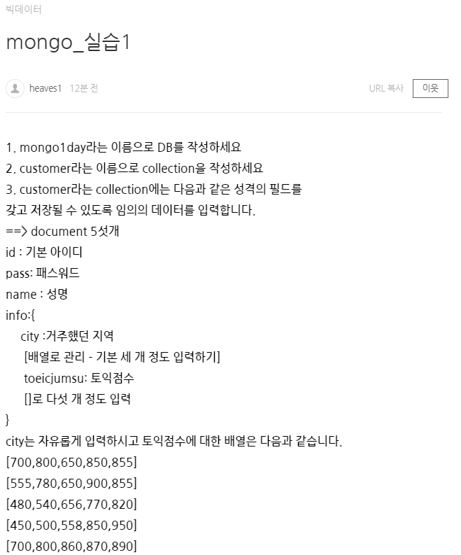
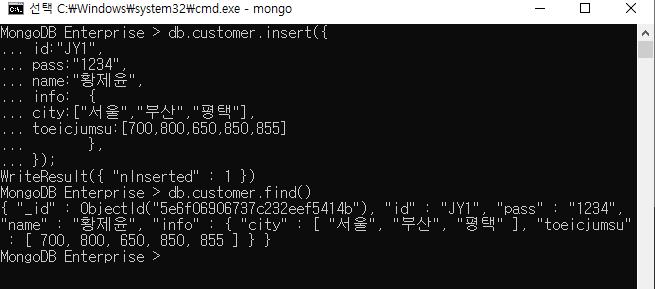
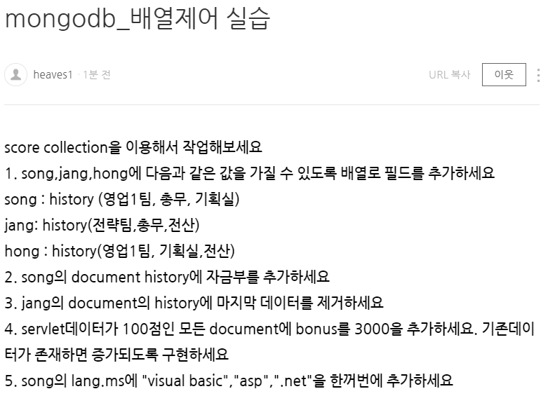

# 몽고 DB

> Not Only SQL (NO SQL)
> 비정형 데이터 처리 (스키마가 없다: 규칙이 없다)
> Foreign Key를 사용하지 않기 때문에(Join불가) 
> 그냥 row data를 사용하기 좋음 
> GPS (위치정보기술), Streaming Server, 빅스비
> 내부에서 데이터를 처리 (Json 형태)
> 데이터를 저장용도로 편함. 개발용도로는 어려움

https://www.mongodb.com/download-center/enterprise


C:\Program Files\MongoDB\Server\3.6\bin

## 환경변수 설정


텍스트편집
cmd에서 mongod 명령어를 쓸 때 환경변수로 path를 걸어줘야 인식할 수 있음


## 서버올리기


서버가 올라가다가 에러가 뜸
데이터가 저장될 폴더가 있어야 됌
폴더 만들자: 


몽고 데이터 DB Path입니다라는 뜻
enter하고 뭐 누르지마셈. 실행이 끝까지 안될 수 있어 에러뜸.
실행 다 되길 기다리셈
mongod -dbpath C:\IoTJY\bigdata


서버가 실행된 화면
메뉴얼보면 path 자동설정도 할 수 있는데 이 부분은 skip
https://docs.mongodb.com/v3.6/introduction/

cmd 창 하나 더 
새로운 창에서 mongo라고 치면 아래처럼 뜸


서버창과 2개의 클라이언트 창
보기만 한 거임. 클라이어튼 하나 창 컨트롤 c누르고 끈다

여기서 설치관련 자세한 정보를 볼 수 있음


## 데이터베이스

> 내가 구축할 영역같은 거임
>
> use mydb: conn scott/tiger 계정같은 개념.
> 하지만 완전 같지는 않음


use mydb: 내가 사용할 db에 접속함
use 명령어는 db가 있으면 사용하고 없으면 생성한다.
컬렉션 세부 설정된게 없음
나갈 떄는 로그아웃


## 몽고 DB 구축

1. collection (관계형에서 테이블 생성같은 것)

   => 관계형 데이터베이스 처럼 스키마를 정의하지 않는다.

   - 명령어: 테이블 만들기

   db.createCollection("test")

   

   

   - 종류

     - capped collection: 

       고정 사이즈를 주고 생성하는 컬렉션
       => 데이터 사이즈가 지정되고 그 저장공간이 도달하면 가장 오랜된 순서로 삭제된다.

     - non capped collection:

       일반적인 컬렉션
   
   - 생성
     db.createCollection("컬렉션명") => 일반컬렉션
   
     
   
     db.createCollection("컬렉션명",{옵션list})
     => 각각의 옵션을 설정해서 작업(json)
   
     
   
     db.createCollection("emp2",{capped:true, size:1000000});
   
     db.createCollection("emp2",{capped:false, size:1000000});
   
     
   
     
   
   - 삭제
   
     drop
   
     
   
     
   
   - 이름변경
   
     rename
   
     
     
   - capped 여부
   
     
   
     

### 예제:기본

> mini 데이터베이스 생성
> emp (size:10000, capped 컬렉션)
> shop(일반컬렉션)
> 데이터베이스 목록, 컬렉션목록을 캡쳐
> 컬렌션 validate()화면캡쳐

``` 
MongoDB Enterprise > use mini
switched to db mini
MongoDB Enterprise > createCollection(emp, {capped:true, size:10000})
2020-03-16T11:22:33.194+0900 E QUERY    [thread1] ReferenceError: createCollection is not defined :
@(shell):1:1
MongoDB Enterprise > db.createCollection(emp, {capped:true, size:10000})
2020-03-16T11:22:48.842+0900 E QUERY    [thread1] ReferenceError: emp is not defined :
@(shell):1:1
MongoDB Enterprise > db.createCollection("emp", {capped:true, size:10000})
{ "ok" : 1 }
MongoDB Enterprise > db.createCollection("shop")
{ "ok" : 1 }
MongoDB Enterprise > show collections
emp
shop
MongoDB Enterprise > db.emp.validate()
{
        "ns" : "mini.emp",
        "nInvalidDocuments" : NumberLong(0),
        "nrecords" : 0,
        "nIndexes" : 1,
        "keysPerIndex" : {
                "_id_" : 0
        },
        "valid" : true,
        "warnings" : [
                "Some checks omitted for speed. use {full:true} option to do more thorough scan."
        ],
        "errors" : [ ],
        "extraIndexEntries" : [ ],
        "missingIndexEntries" : [ ],
        "ok" : 1
}
MongoDB Enterprise > db.shop.validate()
{
        "ns" : "mini.shop",
        "nInvalidDocuments" : NumberLong(0),
        "nrecords" : 0,
        "nIndexes" : 1,
        "keysPerIndex" : {
                "_id_" : 0
        },
        "valid" : true,
        "warnings" : [
                "Some checks omitted for speed. use {full:true} option to do more thorough scan."
        ],
        "errors" : [ ],
        "extraIndexEntries" : [ ],
        "missingIndexEntries" : [ ],
        "ok" : 1
}
MongoDB Enterprise >        
```


---

## insert

> https://docs.mongodb.com/v3.6/crud/
>
> db.emp.insert({id:"lee",pass:"1234",info:"JY"})    

[구문]
db.컬렉션명.insert({데이터...})

db.컬렉션명.insertOne({데이터...})

db.컬렉션명.insertMany({데이터...})

- document(관계형db에서 레코드의 개념)에 대한 정보는 json 형식으로 작성


사이즈를 다르게 줬는데 그냥 들어감. 스키마가 없음. 

- 몽고 db에서  document를 삽입하면 자동으로 _id가 생성되고 이게 기본키의 역할을 한다. 

- _id가 생성: 기본키의 역할ObjectId("5e6ee7ae8a4703cad71162d7")
                  "_______________________________________________________________________________"

  현재 timestamp, 


for문으로 insert


배열로 insert

```
db.emp.insert([{_id:111111,id:"test",val1:2000,val2:3000},
			{id:"kang",val1:2000,val2:3000,name:"홍길동"},
			{id:"hong",val1:2000,val2:3000}
			])
```


```
db.emp.insert([{_id:111111,id:"test1",val1:2000,val2:3000},
{id:"kang",val1:2000,val2:3000,name:"홍길동"},
{id:"hong",val1:2000,val2:3000}])

```

### 예제: insert



풀이

```
use mongo1day

db.createCollection("customer")

show collections

db.customer.insert({
id:"JY1",
pass:"1234",
name:"황제윤",
info:  {
	city:["서울","부산","평택"],
	toeicjumsu:[700,800,650,850,855]
       }
});


db.customer.insert({
id:"hwang", 
pass:"1234", 
name:"JY",
info:{ 
	city:["seoul","busan","songtan"], 
	toeic:[555,780,650,900,855   ]
	} 
})
```




```
db.customer.insert({id:"kang",
                           pass:"1234",
                           name:"강감찬",
                           info:{ city:["서울","인천","부산"],
                                  toeicjumsu:[700,800,650,850,855]
                                 }
		});

db.customer.insert({id:"jang",
                           pass:"1234",
                           name:"장동건",
                           info:{ city:["인천","안산","안양"],
                                  toeicjumsu:[555,780,650,900,855]
                                 }
		});

db.customer.insert({id:"hong",
                           pass:"1234",
                           name:"홍길동",
                           info:{ city:["수원","교하","파주"],
                                  toeicjumsu:[480,540,656,770,820]
                                 }
		});

db.customer.insert({id:"lee",
                           pass:"1234",
                           name:"이민호",
                           info:{ city:["대구","대전","부산"],
                                  toeicjumsu:[450,500,558,850,950]
                                 }
		});

db.customer.insert({id:"park",
                           pass:"1234",
                           name:"박문수",
                           info:{ city:["강릉","속초","양양"],
                                  toeicjumsu:[700,800,860,870,890]
                                 }
		});

```


## update

> document 수정을 위해서
>
> 조건을 적용해서 수정하기 위한 코드도 json으로 구현


[update를 위한 명령어]
$set: 값 수정
		non-capped collection인 경우 업데이트할 필드가 없으면 그 필드가 추가된다.
$inc: 값 증가
$unset

일단 3개 추가

```
MongoDB Enterprise > use mydb

MongoDB Enterprise > show collections

MongoDB Enterprise > db.emp.insert({id: "hwang", "pass" : "1234"});
db.emp.update({id:"hwang"},{$set:{pass:"abcs"}});
```

이제 수정

update
db.컬렉션명.update({조건필드:값}, //sql의 update문 where 절
                                {$set:{수정할 필드:수정값}} //set절
                                {update 옵션:옵션값}								
)


여러개 중복 데이터가 있으면

맨 위에 있는게 수정됌 => 이럴 때 옵션을 쓴다

**업데이트 옵션: multi**
multi: true를 추가하지 않으면 조건에 만족하는 document중 첫 번째만 수정됌

```
db.emp.insert({id : "kang", "val1" : 1000});
db.emp.insert({id : "kang", "val1" : 2000});
db.emp.insert({id : "kang", "val1" : 3000});
db.emp.insert({id : "kang", "val1" : 4000});

db.emp.update({id:"kang"},{$set:{val1:5000}},{multi:true});
```


### inc
$set 대신 inc를 활용: increament 즉 더해진다

```
db.emp.update({id:"kang"},{$inc:{val1:2000}},{multi:true});
```


### 예제: update

```
use mydb


db.score.insert({id:"hong",name:"홍길동",dept:"인사",addr:"서울",java:100,servlet:88})
db.score.insert({id:"kim",name:"김민선",dept:"전산",addr:"인천",java:99,servlet:98})
db.score.insert({id:"lee",name:"이문세",dept:"인사",addr:"인천",java:88,servlet:77})
db.score.insert({id:"test",name:"테스트",dept:"총무",addr:"대구",java:97,servlet:80})
db.score.insert({id:"park",name:"박수홍",dept:"인사",addr:"대구",java:56,servlet:98})
db.score.insert({id:"jang",name:"장동건",dept:"총무",addr:"제주",java:77,servlet:100})
db.score.insert({id:"kang",name:"강감찬",dept:"전산",addr:"제주",java:88,servlet:92})
db.score.insert({id:"kkang",name:"강동원",dept:"전산",addr:"서울",java:98,servlet:82})
db.score.insert({id:"jjang",name:"장길산",dept:"인사",addr:"인천",java:30,servlet:88})
db.score.insert({id:"song",name:"송미미",dept:"전산",addr:"서울",java:90,servlet:55})
db.score.insert({id:"na",name:"나나나",dept:"인사",addr:"인천",java:100,servlet:100})

//이러면 따로 컬렉션을 만들지 않아도 저절로 만들어서 데이터가 들어간다.
```


Question:

1. ID가 kang 사람의 dept를 "총무"로 변경
2. dept가 "전산"인 모든 addr을 "안양"으로 변경
3. Id가 jang인 document의 bonus를 1000추가
4. dept가 "인사"인 모든 document의 bonus에 2000을 추가

```


	db.score.update({id:"kang"},{$set:{dept:"총무"}},{multi:true});
	db.score.update({dept:"전산"},{$set:{addr:"안양"}},{multi:true});


	db.score.update({id:"jang"},{$inc:{bonus:1000}},{multi:true});
	db.score.update({dept:"인사"},{$inc:{bonus:2000}},{multi:true});
```


### unset

> 특정 컬럼을 삭제한다

```

db.score.update({id:"hong"},{$set:{msg:"test"}});

db.score.update({id:"hong"},{$unset:{msg:"test"}});

msg 필드만 삭제된다.

```

```
db.score.update({id:"jang"},
				{$set:
					{info:
						{city:["서울","안양"],
						movie:["겨울왕국","극한직업","쉬리"]
						}
					}
				}
			)
```

### addToSet

> 주로 배열에 데이터 추가
> 베열의 요소를 추가: 없는 경우에만 값이 추가된다.
> 중복을 체크

```
db.score.update({id:"jang"},{$addToSet:{"info.city":"인천"}})
```

### push

> 중복을 허용한다: 즉 무족건 추가된다.

```
db.score.update({id:"jang"},{$push:{"info.city":"천안"}})
```

### pop

> 컬럼이 아닌 그 안에 데이터를 삭제할 떄 사용
>
> 배열에서 요소를 제거할 떄 사용
> 1: 마지막 요소 제거
> -1: 첫 번째 요소 제거

```
db.score.update({id:"jang"},{$pop:{"info.city":1}}) //오른쪽 끝에서 삭제
db.score.update({id:"jang"},{$pop:{"info.city":-1}}) //왼쪽 끝에서 삭제
```

### each

> addToSet이나 push에서 사용할 수 있다
> 여러개의 배열에 추가할 떄 사용

```
db.score.update({id:"jang"},{$push:{"info.city":{$each:["천안","가평","군산"]}}})
```

### sort

> 정렬(1:오름차순, -1:내림차순)

```
db.score.update({id:"jang"},{$push:{"info.city":{$each:["천안","가평","군산"],$sort:1}}})
```

### pull and pullAll

> 배열에서 조건에 만족하는 요소를 제거
> pop은 조건이 없고 순서로 지움

```
db.score.update({id:"jang"},{$pull:{"info.city":"천안"}}) //조건1개
db.score.update({id:"jang"},{$pullAll:{"info.city":["가평","군산"]}}) //조건여러개
```

### 예제1



```
db.score.insert([
	{id:"song", history:["영업1팀","총무","기획실"]},
	{id:"jang", history:["전략팀", "총무","전산"]},
	{id:"hong", hisotry:["영업1팀", "기획실","전산"]}
])

db.score.update({id:"song"},{$addToSet:{"history":"자금부"}},{multi:true})

db.score.update({id:"jang"},{$pop:{"history":1}},{multi:true})

db.score.update({servlet:"100"},{$inc:{bonus:3000}},{multi:true});

db.score.update({id:"song"},{$push:{"lang.ms":{$each:["visual basic","asp",".net"]}}})
```

### 예제2


```
db.createCollection("board")

db.score.insert([
	{id:"song", history:["영업1팀","총무","기획실"]},
	{id:"jang", history:["전략팀", "총무","전산"]},
	{id:"hong", hisotry:["영업1팀", "기획실","전산"]}
])

db.board.insert([
	{no:"1",id:"ID1",title:"TITLE1",content:"CONTENT1",count:"COUNT1",writedate:"Mar.16"},
	{no:"2",id:"ID2",title:"TITLE2",content:"CONTENT2",
			comment:[
			{content:"CONTENT1",count1:"COUNT1",count:"COUNT2",writedate:"Mar.16"},
			{content:"CONTENT1",count2:"COUNT1",count:"COUNT2",writedate:"Mar.16"},
			{content:"CONTENT1",count3:"COUNT1",count:"COUNT2",writedate:"Mar.16"}],
			count:"COUNT2",writedate:"Mar.16"},
	{no:"3",id:"ID3",title:"TITLE3",content:"CONTENT3",count:"COUNT3",writedate:"Mar.16"},
	{no:"4",id:"ID4",title:"TITLE4",content:"CONTENT4",count:"COUNT4",writedate:"Mar.16"},
	{no:"5",id:"ID5",title:"TITLE5",content:"CONTENT5",count:"COUNT5",writedate:"Mar.16"}
])
```


잘 들어갔지만 문제는 댓글이 한번에 3개가 등록되는게 현실에서는 이상하다.
3개가 각각 하나씩 push 또는 addToSet으로 추가하자.

```
db.score.update({id:"jang"},{$addToSet:{"info.city":"인천"}})

db.board.update({no:"2"},{$addToSet:{"comment":[{
"content":"CONTENT1",
"count1":"COUNT1",
"count2":"COUNT2",
"writedate":"Mar.16"}]}})
```


---

 ## Reference

https://docs.mongodb.com/v3.6/reference/method/js-connection/


볼게 많음

## 용어

1. Field: column
2. document: row/record
3. collection: table
4. _id: 기본키
5. 


