# 11.  몽고DB

### 지난  예제

cmd 서버키고
mongod -dbpath C:\IoTJY\bigdata
새로운 cmd창에서 use mydb 접속
board1 컬렉션 사용

```
db.board1.update({no:2},
	{$push:
		{comment:
			{content:"댓글내용",
			count1:10,
			count2:1,
			writedate: new Date()
			}
		}
	}
) 

db.board1.update({no:2},
	{$push:
		{comment:
			{content:"댓글내용2",
			count1:5,
			count2:2,
			writedate: new Date()
			}
		}
	}
) 

db.board1.update({no:2},
	{$push:
		{comment:
			{content:"댓글내용3",
			count1:7,
			count2:3,
			writedate: new Date()
			}
		}
	}
) 


```

팁

```
var x = db.score.findOne();
x
---
db.score.save(x) //이것도 가능
```

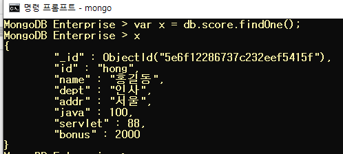

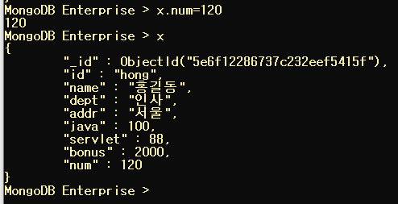

```
db.score.find().count()
```

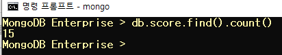

## find

> 몽고DB에 저장된 데이터 조회 -find()
>
> 문제:
>
> score의 모든 document(1000)가 추가되도록 작업 실행 결과 보기

```
var x = db.score.find()
while(x.hasNext()){
var one =x.next();
one.num = 1000;
db.score.save(one);
}

//모든 다큐먼트에 num 필드를 추가
```

> find 명령어

```
find
db.켈력션명.find(조건,조회할 필드)
db.컬렉션명.find({})와 동일:
	{}안에 아무것도 없으면 전체 데이터 조회
조건, 조회할 필드에 대한 명시 모두 json
조회할 필드의 정보 명시
	형식:{필드명:1..}: 화면에 표시하고 싶은 필드
	     {필드명:0}: 명시한 필드가 조회X
```

### 비교조건
$lt :  < less than
$gt : > greater than
$lte : <= 
$gte : >=

-addr이 인천인 데이터: id, name, dept, addr

```
db.score.find({addr:"인천"},{id:1,name:1,dept:1,addr:1,_id:0})
```

-score컬렉션에서 java가 90점 이상인 document 조회
id,name,dept,java만 출력

```
db.score.find({java:{$gte:90}},{id:1,name:1,dept:1,java:1,_id:0})
```

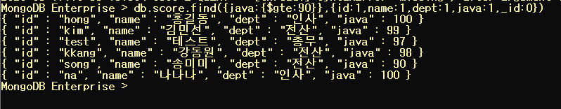

### 논리조건

$or : 여러 필드를 이용해서 같이 비교 가능
$and : and연산
$in : 하나의 필드만 비교
$nin :  not in in으로 정의한 조건을 제외한 document 조회

OR
AND 도 같은 형식

```
-dept가 인사이거나 addr이 인천인 데이터 조회
db.score.find({$or:[{dept:"인사"},{addr:"인천"}]})
```

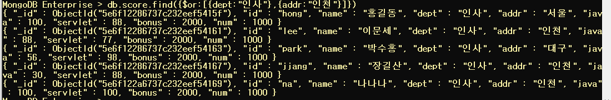

```
-id가 song, kang, hong인 데이터 조회
db.score.find({$or:[{id:"song"},{id:"hong"},{id:"kang"}]})
```

In

```
db.score.find({id:{$in:["song","hong","kang"]}})
```

nin: not in :아이디가 송, 홍, 강이 아닌 데이터 조회

```
db.score.find({id:{$nin:["song","hong","kang"]}})
```

---

데이터 추가

```
db.score.insert({id:"hong1234",name:"홍길동",dept:"인사",addr:"서울",java:100,servlet:88})

 db.score.find() //추가됌
 db.score.find({num:null}) //hong1234 나옴
```

### 조회

- findOne() : 첫 번째 document만 리턴

- find() : 모든 document 리턴

- count() : 행의 갯수를 리턴

- sort({필드명:sort옵션}) : 정렬

  ​										1 => 오름차순

  ​										 -1 => 내림차순

```
db.score.find().sort({id:1})
db.score.find().sort({java:-1})
```

- limit(숫자) : 숫자만큼의 document만 조회

```
db.score.find().limit(5)
//위에서 5개만 조회됌
```

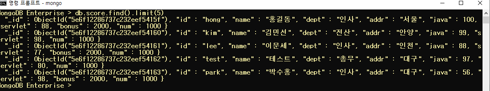

```
db.score.find().skip(5) 
//위 5개 제외
```

- skip(숫자) : 숫자만큼의 document만 skip하고 조회

### 정규표현식

db.컬렉션명.find({조건필드명:/정규표현식/옵션})

[기호]
| : or
^ : ^뒤에 문자로 시작하는지 체크 => ''^문자''로 시작 조회
[ ] : 영문자 하나는 한 글자를 의미하고 [ ]로 묶으면 여러 글자를 표현 => [a-i] a부터 i까지 모든 영문자

```
db.score.insert({id:"KIM",pass:"1234"})

아이디가 kim과 park인 document 조회
db.score.find({id:/kim|park/})
```

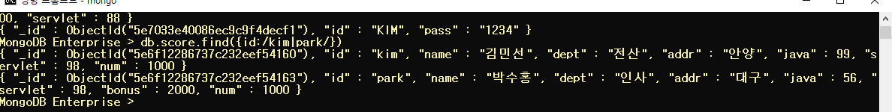

[옵션]

i: 대소문자 구문없이 조회가능

```
db.score.find({id:/kim|park/i})
```

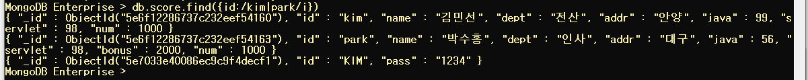

ID가 k로 시작하는 document 조회

```
db.score.find({id:/^k/})
```

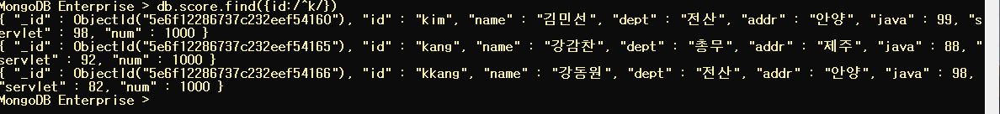

```
대소구분없이
db.score.find({id:/^k/i})
```

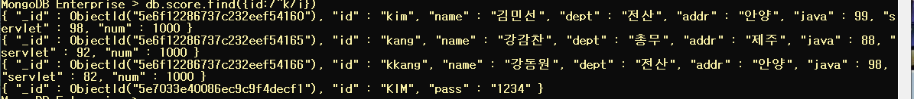

```
[a-i]까지 영문이 있는 id를 조회 //시작은 아님
db.score.find({id:/[a-i]/})

아이디가 k에서 p로 시작하는 document 조회
db.score.find({id:/^[k-p]/})
//k,l,m,n,o,p로 시작하는 단어가 검색된다.
```

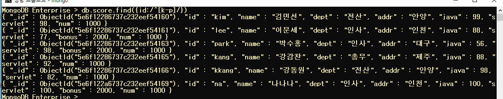

```
그럼 k와 p 만 들어간 데이터 조회
db.score.find({id:/[kp]/})
```

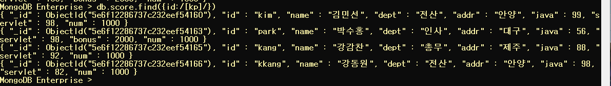

```
mongodb에 저장된 데이터 삭제하게 -remove
조건을 정의하는 방법은 find와 update에서 설명한 내용과 동일하다.
db.score.remove({})

db.score.remove({servlet:{$lt:80}})
```

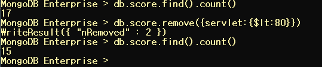

## 문제

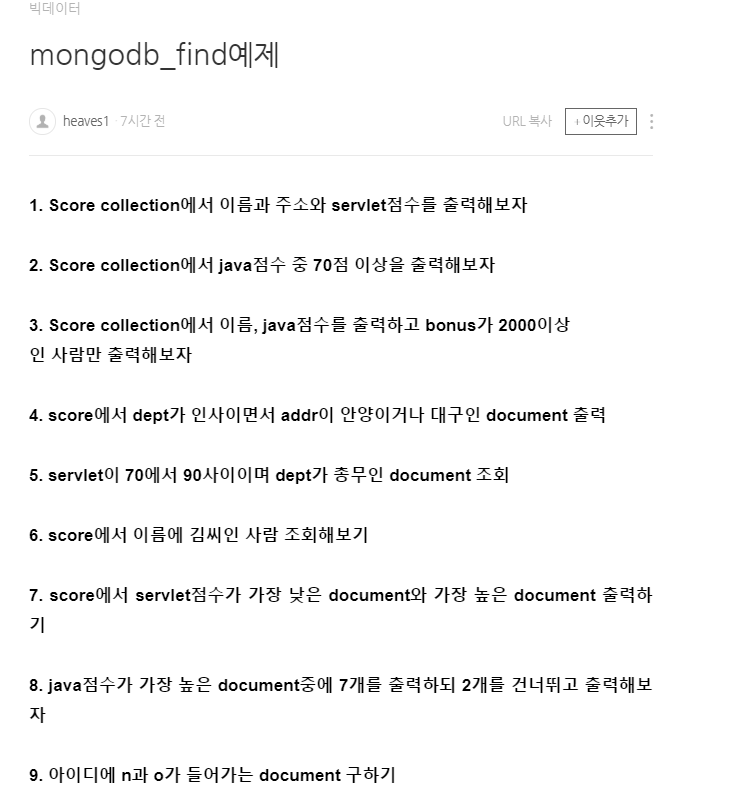

```
1.
db.score.find({},{name:1,addr:1,servlet:1})
```

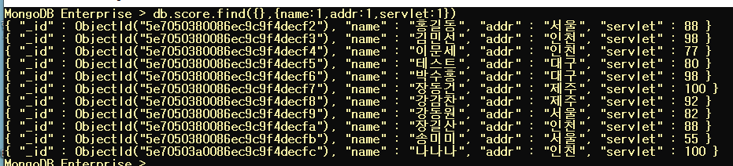

```
2. 자바 70 이상
db.score.find({java:{$gte:70}})
```

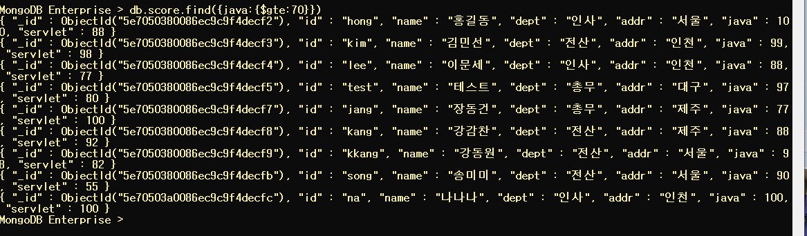

```
3. 이름, 자바,보너스 2000이상

db.score.insert({id:"hong1",name:"홍길동",dept:"인사",addr:"서울",java:100,servlet:88, bonus:2000})

db.score.insert({id:"hong2",name:"홍길동",dept:"인사",addr:"서울",java:100,servlet:88, bonus:2100})

db.score.find({bonus:{$gte:2000}},
{name:1,java:1})
```

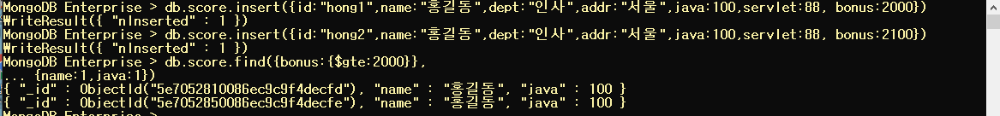

```
4. dept 인사, addr 안양 or 대구 조회

db.score.insert({id:"song2",name:"이기웅",dept:"인사",addr:"안양",java:90,servlet:55})

db.score.insert({id:"na2",name:"이기인",dept:"인사",addr:"안양",java:100,servlet:100})

db.score.find({
		$and:[
			{$or:[
			{addr:"안양"},
			{addr:"대구"}
			]},
			{dept:"인사"}
		]
	});
```

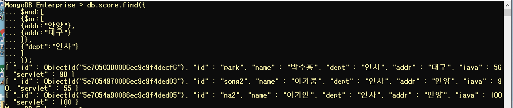

```
5. servlet 70~90, dept: 총무

db.score.find({servlet:{$gte:70},servlet:{$lte:90},dept:"총무"})

```

```
6. score에서 이름에 김씨인 사람 조회해보기
db.score.find({name:/^김/})

```


```
7.java점수가 가장 높은 document중에 7개를 출력하되 2개를 건너뛰고 출력해보자

db.score.find({servlet:{$exists:null}})

db.score.find().sort({servlet:1}).limit(1)

db.score.find({servlet:{$not:{$exists:null}}}).sort({servlet:1}).limit(1)
```


## 정답

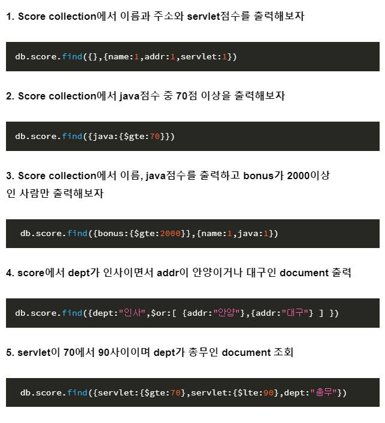

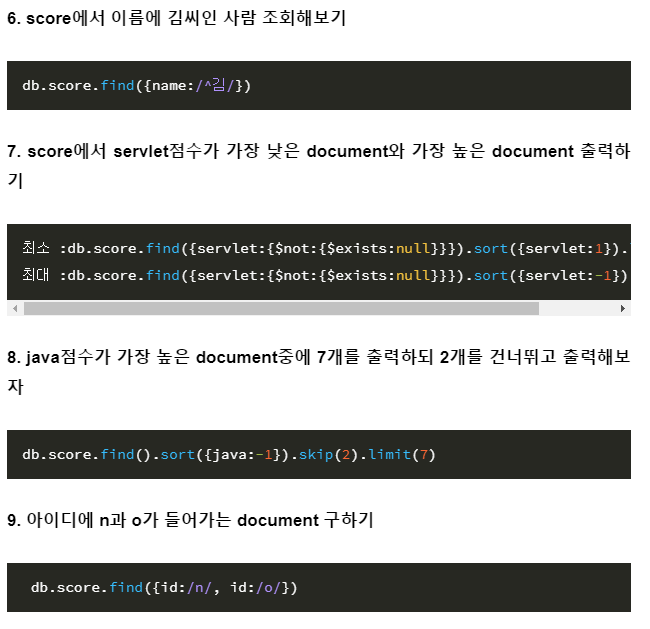

