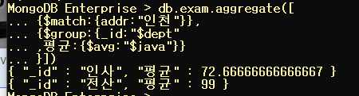
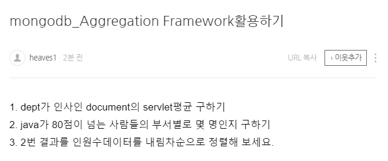

# 12. Aggregation

> -group by와 동일 개념
> -간단한 집계를 구하는 경우 mapred를 적용하는 것 보다 간단하게 작업
> -Pipeline을 내부에서 구현
> 	한 연산의 결과가 또 다른 연산의 input 데이터로 
> 	활용
> https://docs.mongodb.com/v3.6/core/aggregation-pipeline/
> 그림참고

## 1. 명령어 (RDBMS와 비교)

- $match: where절, having절
- $group: group by
- $sort: order by
- $avg: avg그룹함수
- $sum: sum그룹함수
- $max: max그룹함수

**[형식]**
db.컬렉션명.aggregate(정의)
                                   ''---------''
                                     여러 가지를 적용하는 경우 배열

## 2. group by

```
$group:{_id:그룹으로 표시할 필드명,
		저장할 필드명:{연산함수:값}}
```


- addr별 인원수

  ```
  db.exam.aggregate([
  	{$group:{_id:"$addr"
  		,num:{$sum:1}}
  	}
  ])
  ```

  

 - dept별 인원수

  ```
  db.exam.aggregate([
  	{$group:{_id:"$dept"
  		,num:{$sum:1}}
  	}
  ])
  ```

  

- dept별 java점수의 평균

```
db.exam.aggregate([{$group:{_id:"$dept",평균:{$avg:"$java"}}}])
```


- addr별 servlet 합계

```
db.exam.aggregate([{$group:{_id:"$addr",서블릿합계:{$sum:"$servlet"}}}])
```


## 3. match

```
$match:{필드명:{연산자:조건값}}
```

-dept별 java 점수의 평균 단, addr이 인천인 데이터만 작업 $match를 추가

```
db.exam.aggregate([
			{$match:{addr:"인천"}},
			{$group:{_id:"$dept"
					,평균:{$avg:"$java"}}
		}])
```



## 문제



```
1. dept가 인사인 document의 servlet평균 구하기

db.exam.aggregate([
	{$group:{_id:"$dept"
		,avg:{$avg:"$servlet"}}
	}
])
```


```
2. java가 80점이 넘는 사람들의 부서별로 몇 명인지 구하기
  
db.exam.aggregate([
			{$match:{java:{$gte:80}}},
			{$group:{_id:"$dept"
					,합계:{$sum:1}}
		}])
		
```


```
3. 2번 결과를 인원수데이터를 내림차순으로 정렬해 보세요.

db.exam.aggregate([
			{$match:{java:{$gte:80}}},
			{$group:{_id:"$dept"
					,합계:{$sum:1}}},
			{$sort:{합계:-1}}
		])
```


