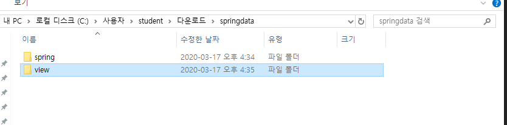
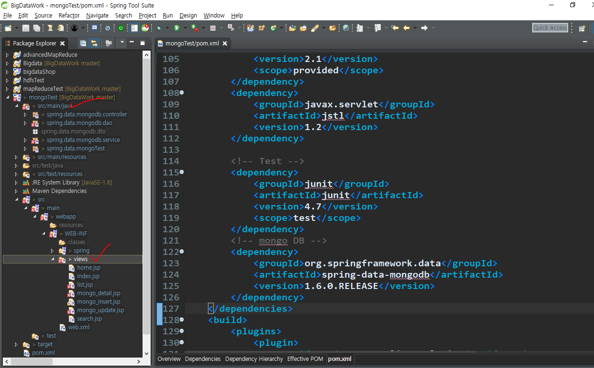
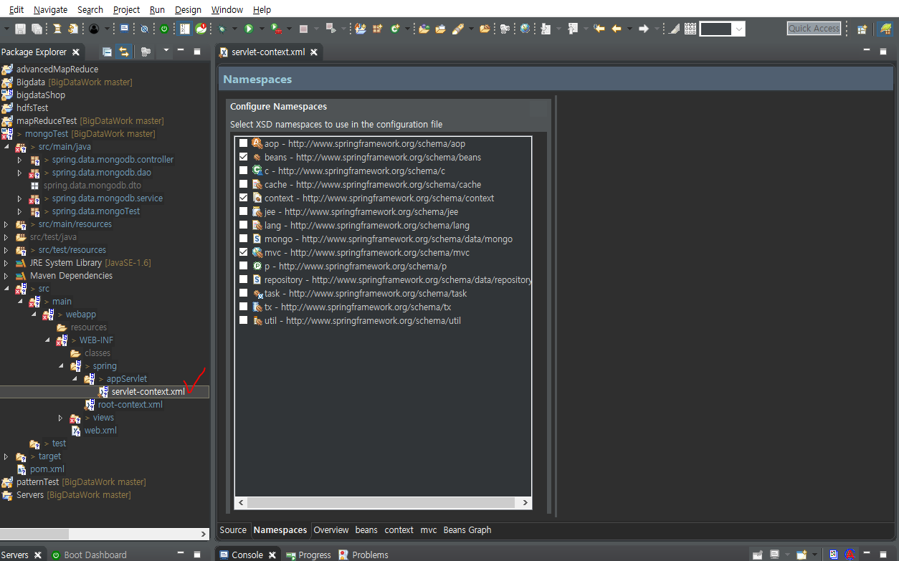
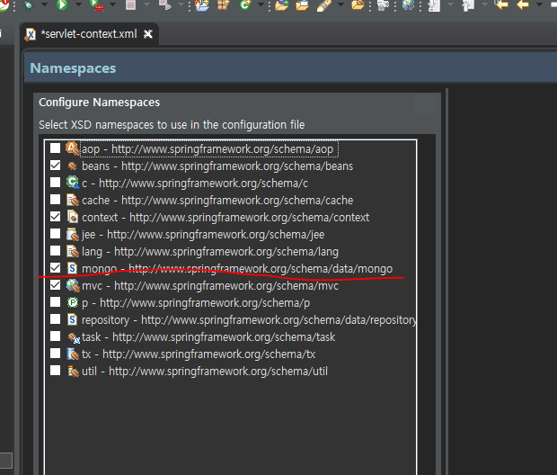
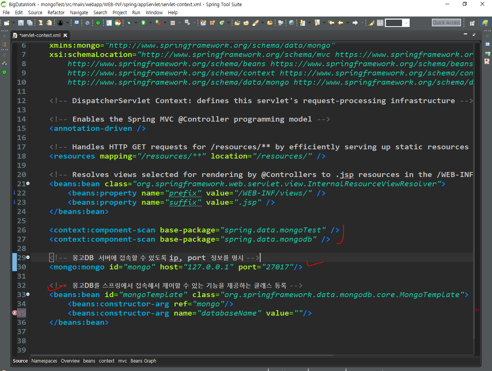
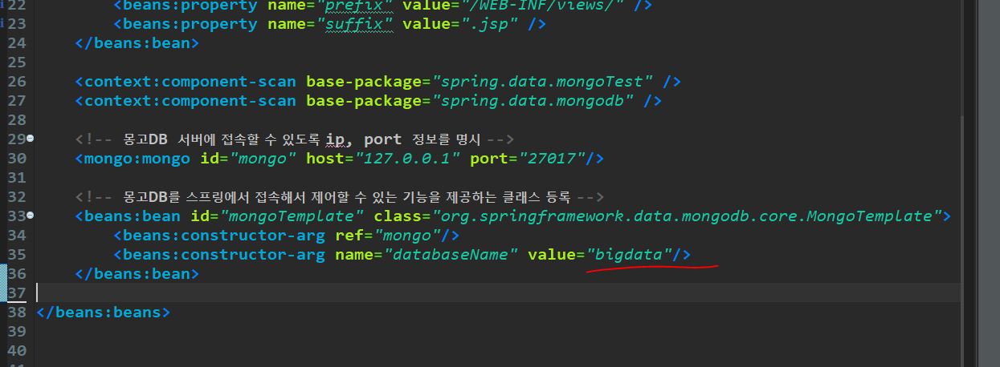

# 13. 몽고 DB 이클립스


```
<!-- https://mvnrepository.com/artifact/org.springframework.data/spring-data-mongodb -->
<dependency>
    <groupId>org.springframework.data</groupId>
    <artifactId>spring-data-mongodb</artifactId>
    <version>1.6.0.RELEASE</version>
</dependency>

```

강사님 zip 파일





파일 다 붙여놓고

여기로 이동



cmd에서 몽고DB를 사용하는데 이클립스에서도 설정
스프링에서 몽고DB 접근


몽고 체크
소스로 이동





