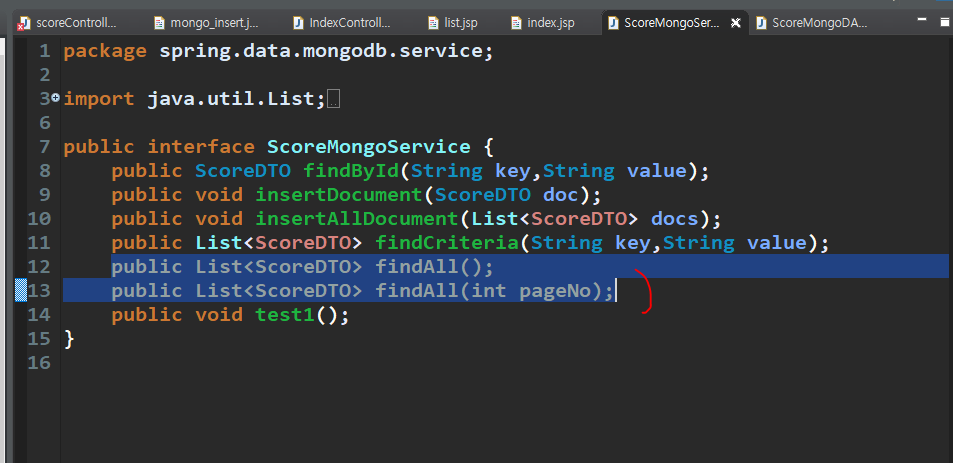

# 14. 몽고DB CRUD


```
cmd  도스창
C:\Users\student>cd \IoTJY\BigData_setup
C:\IoTJY\BigData_setup>dir /w
mongoexport -d bigdata -c score -o score.json

//이러면 현재위치에 score 파일이 저장된다
```


```
첫번째 제목줄은 제외.
모를 떈:
C:\IoTJY\BigData_setup>mongoimport --help

이게 찾던거: 로컬이라 ip주소 안씀
C:\IoTJY\BigData_setup>mongoimport /d bigdata /c test /type csv /file test.csv /headerline

이러면 test파일이 몽고db bigdata에 옮겨짐

```


score는 원래 있었고 test만 옮겨진 걸 볼 수 있다

---


몽고db 컬렉션에서 하나의 document와 매핑될 클래스이다.
score 필드 기반으로 매핑한다.

DTO
getter, setter, toString 만든다.

Repository


```
몽고DB 
bigdata 컬렉션에 데이터 추가

db.score.insert({id:"hong",name:"홍길동",dept:"인사",addr:"서울",java:100,servlet:88})
db.score.insert({id:"kim",name:"김민선",dept:"전산",addr:"인천",java:99,servlet:98})
db.score.insert({id:"lee",name:"이문세",dept:"인사",addr:"인천",java:88,servlet:77})
db.score.insert({id:"test",name:"테스트",dept:"총무",addr:"대구",java:97,servlet:80})
db.score.insert({id:"park",name:"박수홍",dept:"인사",addr:"대구",java:56,servlet:98})
db.score.insert({id:"jang",name:"장동건",dept:"총무",addr:"제주",java:77,servlet:100})
db.score.insert({id:"kang",name:"강감찬",dept:"전산",addr:"제주",java:88,servlet:92})
db.score.insert({id:"kkang",name:"강동원",dept:"전산",addr:"서울",java:98,servlet:82})
db.score.insert({id:"jjang",name:"장길산",dept:"인사",addr:"인천",java:30,servlet:88})
db.score.insert({id:"song",name:"송미미",dept:"전산",addr:"서울",java:90,servlet:55})
db.score.insert({id:"na",name:"나나나",dept:"인사",addr:"인천",java:100,servlet:100})
```


양이 별로 안되서 그냥 수기로 수정.
실제 파일 참고 list.jsp, detail, update

쉬운방법: 원래 파일을 edit plus 열고 복붙하면 된다

수정 다 했으면 index Controller 실행


(몽고DB용 연습 페이지)

## 1. 몽고 list 구축




DAO에 저장하기


다 수정했고 페이징처리는 아래


