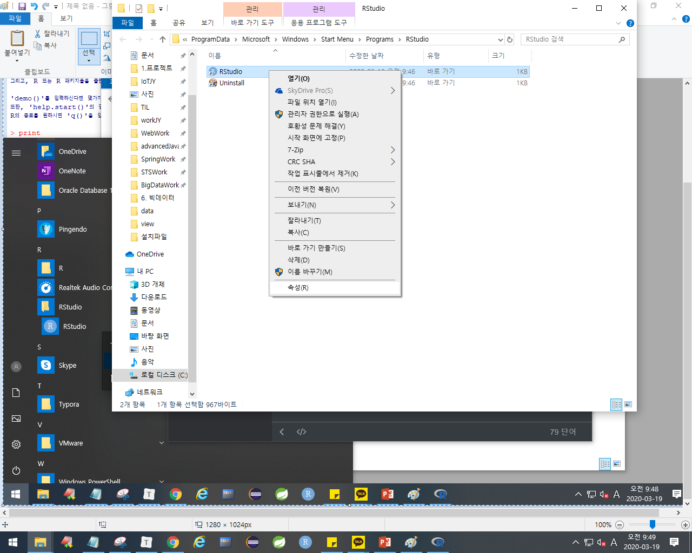
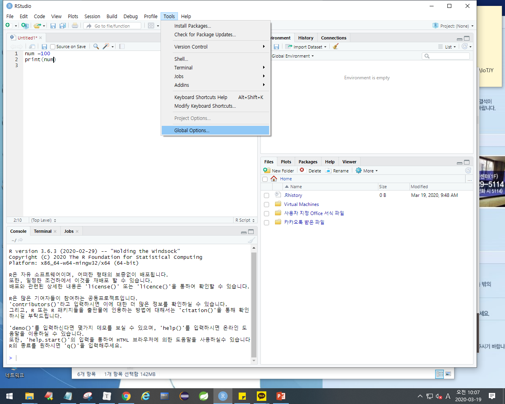

# 15. R 프로그램


하둡: 배치
Spark: 리얼타임


www.r-project.org  => R프로그램
rstudio.com			=> R프로그램 스튜디오 (Tool)

책: 32페이지
주의사항: 컴퓨터이름, 사용자이름, 국문경로 및 띄어쓰기 X
				바탕화면에 다운 X

## 설치

R-3.6.3-win.exe 먼저


화면이 조금 불편함. 마치 자바를 edit plus에서 사용하는 것과 같음. 그래서 스튜디오를 사용함

RStudio-1.2.5033.exe


항상 관리자로 접근하도록 설정하자



책: 17페이지: 

## R에 대한 이해

> 데이터를 분석하는데 사용되는 소프트웨어다.
> 통계분석, 머신러닝, 이미지분석(어려움)





컨트롤 L 하면 콘솔 clear


```
? print
(컨트롤 엔터)하면 오른쪽 하단에 설명이 나온다.

컨트롤1 and 2 누르면 커서 이동한다
```


창 크기에 따라 줄이 알아서 내려간다

```
=
<- (alt + -)
```


```
=                   => 같다
<-                  => 변수할당
<- as.character()   => 문자로 변경
class()             => 데이터 타입확인
```


---

## 예제


```
exmat <- matrix(c(80,90,70,100,80,99,78,72,90,78,82,78,99,89,78,90), nrow = 4, ncol = 4, byrow = TRUE,dimnames = list(c("kim", "lee", "hong", "jang"),c("국어", "영어", "과학", "수학")))

학생별 평균
kim <- mean(exmat[1,1:4])
lee <- mean(exmat[2,1:4])
hong <- mean(exmat[3,1:4])
jang <- mean(exmat[4,1:4])

avg_name <- matrix(c(kim,lee,hong,jang),nrow = 1,ncol = 4)
avg_name

과목별 평균
korean <- mean(exmat[1:4,1])
english <- mean(exmat[1:4,2])
science <- mean(exmat[1:4,3])
math <- mean(exmat[1:4,4])

avg_subject <- matrix(c(korean,english,science,math),nrow = 1,ncol = 4)
avg_subject
```


> 