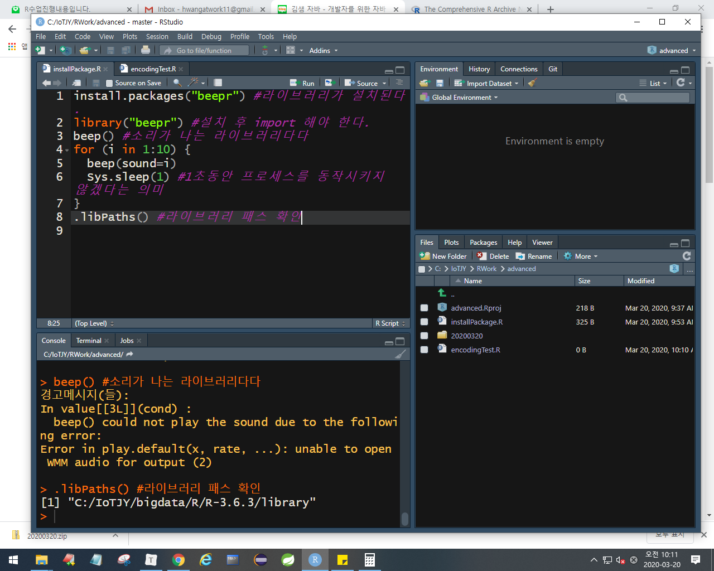
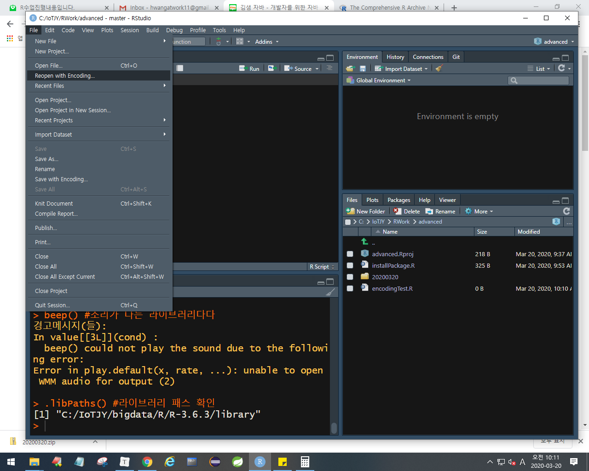

# 16. R advanced

---

## 라이브러리

> R 프로그램 라이브러리 추가하기

## 인코딩

이렇게 하도 되지만 직접 변환하는 작업을 해보자

---

Vector ()
	type이 동일
	한 줄의 형태이다
	자바에서 배열과 비슷하다

Matirx 
	type이 동일
	메트릭스(행과열)의 형태이다
	자바에서 테이블과 비슷하다

DataFrame
	type은 열(Col)방향 다르게 가능

List	
	type 다르게 가능. 아직 수업 안함. 크롤링하면서 진행.
	2차 가변 배열같은 것

---

## 데이터가져오기

1. 데이터 가져오기

   - 외부파일

   - 크롤링

   - DB(오라클, mongodb, hadoop....)

     => R에서 사용할 수 있는 여러 형태의 데이터로 변환.

     => 변환된 데이터를 액세스

2. 데이터의 정보를 확인