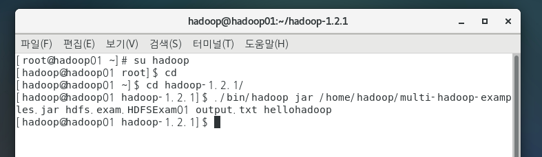
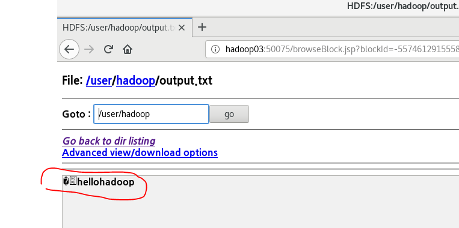

# 2. 빅데이터

IP가 변경되면

​	/etc/host

​	scp 모든 copy

​	네트워크 프로세스 restart (모든머신에 작업): init.d

하둡은 대용량 데이터를 신속하게 처리할 수 있다.

---

**Volumen, Velocity, Variety, Veracity, Value: 5V**

크기, 속도, 다양성, 정확, 가치

3대 요소 중 2가지만 충족한다면 빅데이터라고 볼 수 있다.

## 1. 과정

> 데이터 수집
>
> 데이터 저장
>
> 데이터 처리
>
> 데이터 분석
>
> 분석 결과 활용

1. 데이터 수집 (R, sqoop, flume)
   - 정형데이터
   - 로그데이터
   - SNS
   - 웹페이지
   - 크롤링
2. 데이터 저장
   - HDFS (하둡)
3. 데이터 처리 
   - MapReduce(하둡)
4. 데이터 분석
   - 감정분석
   - 자연어처리
   - 키워드분석
   - 패턴분석
   - 데이터마이닝
5. 분석 결과 및 활용 (R)
   - 각종 Cart 라이브러리 D3

## 2. HDFS 기초

언어체크: echo $LANG

홈 다이렉토리:$ cd ~

파일 복제: /home/hadoop/hadoop-1.2.1/bin/hadoop fs -copyFromLocal NOTICE.txt /input

count파일: ./bin/hadoop jar hadoop-examples-1.2.1.jar  wordcount /input/NOTICE.txt /wordcount_output

---

## 3. HDFSExam01 출력

자바 파일 작성 후

터미널: **경로, 패키지, 매개변수**

[hadoop@hadoop01 hadoop-1.2.1]$ ./bin/hadoop jar /home/hadoop/multi-hadoop-examples.jar hdfs.exam.HDFSExam01 output.txt hellohadoop

자르 명령어: 해당 파일이 리룩스에서 돌아가게 끔 함

=> ./bin/hadoop jar 자르 명령어를 실행할거고

/home/hadoop/multi-hadoop-examples.jar  그 실행할 파일 경로가 여기고

hdfs.exam.HDFSExam01 이 자바 패키지가 실행할 파일

**여기까지가 자르 명령어를 실행하는 단계** 

 이 자바패키지는 매개변수가 두개인데, 아래와 같다.

output.txt 

hellohadoop 

## 4. HDFSExam02 읽기

자바 파일 작성 후

터미널:

[hadoop@hadoop01 hadoop-1.2.1]$ ./bin/hadoop jar /home/hadoop/multi-hadoop-examples.jar hdfs.exam.HDFSExam02 output.txt 

=> ./bin/hadoop jar  명령어를 실행할건데 그 실행할 파일의 위치는 /home/hadoop/multi-hadoop-examples.jar hdfs.exam.HDFSExam02 

자바 문구대로 그냥 읽는다

## 5. HDFSHDFSCopyTest 복제

자바 파일 작성 후

터미널:

[hadoop@hadoop01 hadoop-1.2.1]$ ./bin/hadoop jar /home/hadoop/multi-hadoop-examples.jar hdfs.exam.HDFSCopyTest output.txt outputCopy.txt