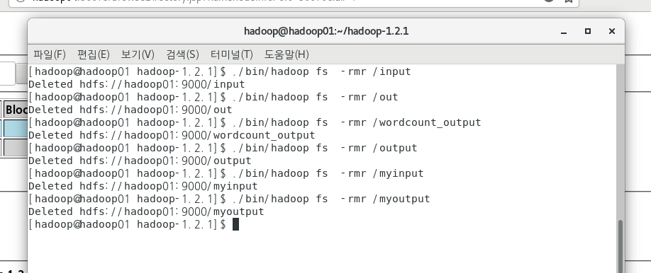

# 3. 하둡 연습

> 4번 머신 power-off하고
>
> 내문서 => 4번 파일 복제

하둡의 목적: 

1. 빅데이터를 저장: HDFS

   하둡이 가지고 있는 분산 파일 시스템이다.

2. 빅데이터 처리: Map Reduce

하둡명령어 (리룩스에서 사용하는 shell script)

1. hadoop fs -mkdir / input

   물리적으로 우리가 확인할 수 있는 폴더가 아님. 

   하둡 내부에 있는 저장소.  웹(firefox)에서만 확인이 가능

2. hadoop fs -CopyFromLocal README.txt /input

용어:

마스터 PC: namenode: 각 datanode를 관리.

그 외 3개 PC: datanode

​				64MB로 (블록)쪼게고 다른 곳에 3개 복제본도 만든다.

Secondary Node: 마스터PC 복제본. 실시간으로 마스터를 백업함

[hadoop@hadoop01 ~]$ /home/hadoop/hadoop-1.2.1/bin/hadoop fs -ls

/home/hadoop/hadoop-1.2.1/bin여기까지 경로

hadoop 쉘 파일에 fs명령어 ls 옵션

ls의 기본 폴더는 user이다

---

./bin hadoop 쉘 파일에 jar 명령어를 쓸껀데 현재위치 hadoop-examples-1.2.1 jar 안에 wordcount class가 있다

이 클래스로 input/README.txt를 카운트하고 웹 out 폴더에 보여준다

웹: hadoop01:50070

---

갑자기 start-all이 되지 않을 경우 

각 PC에서 홈 => 하둡 => hadoop-data를 지우고 

-format 명령어를 사용해라. 그럼 데이터는 날아가지만 다시 돌아간다.

---

-rmr 명령어

./bin/hadoop fs -rmr (다이렉터리)

웹에서 폴더 지우기

---

## 예제 1: HDFSCopyTest

읽고 복사하기

---

## 데이터 처리작업: MapReduce

> 저장된 대용량의 데이터를 처리하는 방법
>
> 예시: 키워드 데이터를 다 모아서 (저장소)
>
> ​		빈도수를 집계하기 (데이터 처리)

**순서:** map => reduce 

​	=>  실행: driver

**Mapper:** 분류하는 작업

​	예시: 전표를 카테고리별로 분류한다

**Reduce:** 취합하는 작업

​	예시: 카테고리별로 빈소루 취합하기