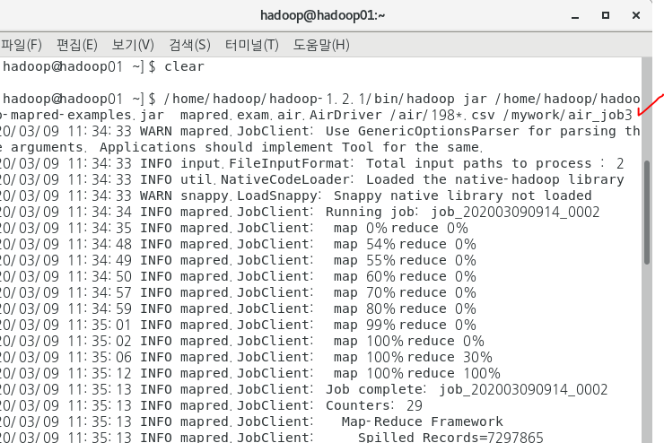
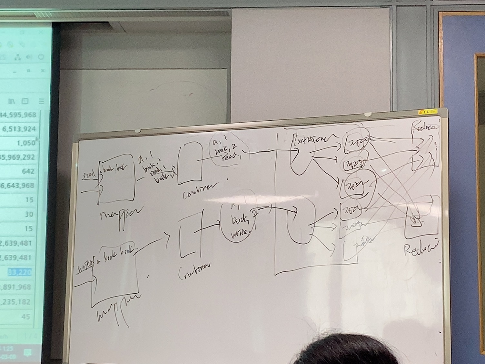

# 4. 복습

HDFS: 하둡 분산 파일 시스템

> 하둡 내부
>
> 물리적으로 확인할 수 있는게 아님
>
> 마스터: namenode
>
> 3개: datanode. 64mb 블럭 단위로 쪼게져서 각각 저장함
>
> ​		백업파일을 각각 만든다. 총 6개
>
> 하트비트를 날려 datanode의 상태를 확인한다.
>
> namenode의 백업본을 secondary namenode에서 관리한다

MapReduce: 대용량 데이터를 처리하는 기법. 프레임워크

> 마스터 슬레이브 구조이다. 위와 비슷하다.

- Mapper: 분리하는 작업을 담당한다.

  ex) Read a boo.book

  read,1 

  a, 1

  book, 1

  book, 1
  
  1111

- Shuffle

  위 데이터를 모아서 배열 형태로 변환한다.

- Reducer

  데이터를 집계한다. 

오늘의 미션: Shuffle을 customizing 하기. 

1. 정렬

2. 조인

   1. 맵사이드 조인
   2. 리듀서 조인

---

예제

https://blog.naver.com/heaves1/221835359725

STS remote가서 파일을 가상머신 마스터 Myhome에 옮겨준다.

---

## 콤바이너

- 데이커를 모아주기 때문에 네트워크 통신의 과부하를 방지한다.

---

하둡 책 P.178 

mapreduce.air.combiner

mapreduce.air.sort 참고하기

정렬 기준이 저렇게 되어있고 

저런 정렬 기준을 수정하며 커스텀을 할 것 이다.

예제

airSort 패키지: 정렬을 customizing 한다.

---

## 정렬

1. 보조정렬

   1. 정렬 기준을 정의한 사용자 키 클래스 작성

      => 복합키

   2. Mapper 클래스의 map메소드에서 사용자 키가 outputKey로 출력될 수 있도록 정의

   3. Reduce Task에 분배할 수 있는 Partitioner를 정의

      => 같은 키를 갖고 있는 Mapper의 출력데이터를 같은 리듀스테스크로 보내기 위해서 해시코드를 이용해서 계산

   4. Reduce Task로 보내기 전에 그룹핑할 수 있도록 객체를 정의

      => 그룹키 비교기

      => ex) air 데이터에서 같은 년도별로 데이터를 분류

      => GroupKeyComparator

   5. 4번에서 같은 그룹으로 정의한 데이터 내부에서 2번 째 기준을 적용해서

      비교할 수 있도록 객체를 정의

      => 복합키 비교기 (P.182)

---

## 이클립스 하둡 연동 설정

1. 마스터 머신의 home >> hadoop-1.2.1 >> conf

2. core-site.xml 열기

   마스터 가상머신 IP: 192.168.111.131

   

   

3. hdfs-site.xml 열기

   

4. mapred-site.xml 열기

   

5.  하둡 stop all

   

6. 터미널로 이동

   scp /home/hadoop/hadoop-1.2.1/conf/* hadoop@hadoop02:/home/hadoop/hadoop-1.2.1/conf/

   

   hadoop03

   hadoop04 동일

7. 하둡 start all

   

8. STS remote file system

   홈 >> hadoop-1.2.1 >>conf

   

9. 라이브러리 2개 추가

10. 라이브러리, conf 폴더 생성

11. 빌드 패스에 라이브러리, conf  인식시키기

    

1번부터 참고

