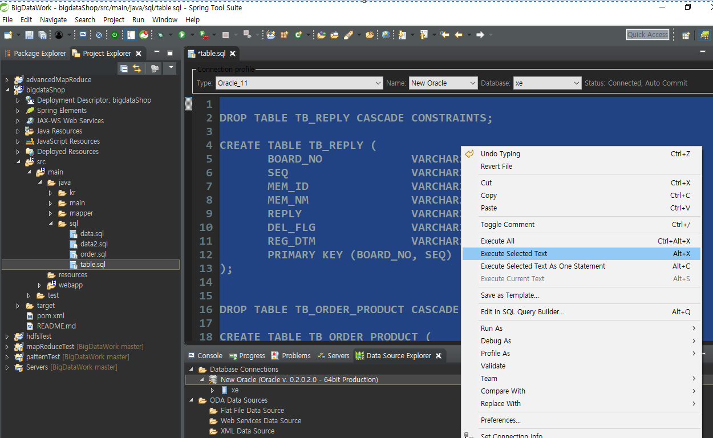

# 6. Sqoop

SQL shop/shop 만들고

show view 없으면

https://blog.naver.com/heaves1

---

http://sqoop.apache.org/docs/1.4.6/SqoopUserGuide.html

다운로드를 이미 받은 상태

[hadoop@hadoop01 ~]$ tar -zxvf sqoop-1.4.6.bin__hadoop-1.0.0.tar.gz

---

**스쿱을 이용하는 이유**

호스트의 오라클 데이터와 게스트의 하둡 시스템이 서로 통신할 수 있도록

## 환경 변수 패스 등록

export HADOOP_COMMON_HOME=/home/hadoop/hadoop-1.2.1
export HADOOP_MAPRED_HOME=/home/hadoop/hadoop-1.2.1
export SQOOP_HOME=/home/hadoop/sqoop-1.4.6.bin__hadoop-1.0.0
export PATH=$PATH:$SQOOP_HOME/bin

---

## 작성한 설정파일 실행

복사한다.

> [hadoop@hadoop01 ~]$ sqoop eval -connect jdbc:oracle:thin:@70.12.115.61:1521:xe -username shop -password shop -query "select * from tb_product"

실행된 화면

## Sqoop Import

> [hadoop@hadoop01 ~]$ sqoop import  -connect jdbc:oracle:thin:@70.12.115.61:1521:xe -username shop -password shop -table tb_product -target-dir /mywork/sqoop/ -as-textfile -columns "prd_no,prd_nm" -m 1

성공

> [hadoop@hadoop01 ~]$ sqoop import  -connect jdbc:oracle:thin:@70.12.115.61:1521:xe -username shop -password shop -table tb_product -target-dir /mywork/sqoop2/ -as-textfile -columns "prd_no,prd_nm" -split-by prd_no -m 2

---

##  오라클 export

>  분석마친 결과를 오라클로 내본내기

오라클 shop/shop 로그인

다시 머신 터미널으로

**sqoop1꺼 작업**

> sqoop export -connect jdbc:oracle:thin:@70.12.115.61:1521:xe -username shop -password shop -export-dir /mywork/sqoop/part-m-00000 -table sqoop_result -columns "prd_no,prd_nm"

작업완료.

오라클로가서 조회

---

## 예제

자바 웹 구축

데이터 완성

1. DBMS에서 하둡으로 데이터 import

sqoop import -connect jdbc:oracle:thin:@70.12.115.61:1521:xe -username shop -password shop -table pro_comment -target-dir /bigshop/ -as-textfile -columns "prd_no,mem_id,pro_comment,writedate" -m 1

2. 저 데이터를 mapper로 짜르기

4. 명령어

   sqoop export --fields-terminated-by "\t" -connect jdbc:oracle:thin:@70.12.115.61:1521:xe -username shop -password shop -export-dir /bigtest/test8/part-r-00000 -table comment_result -columns "keyword,count"