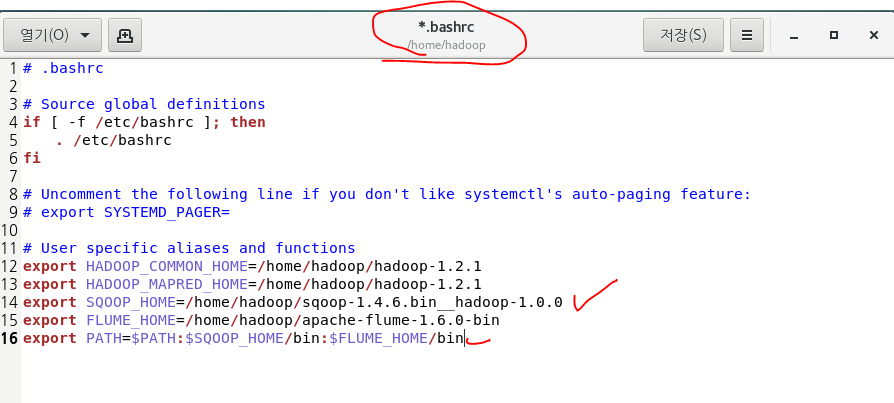
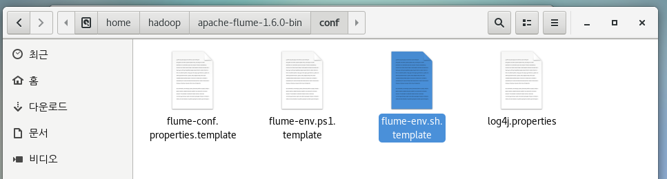
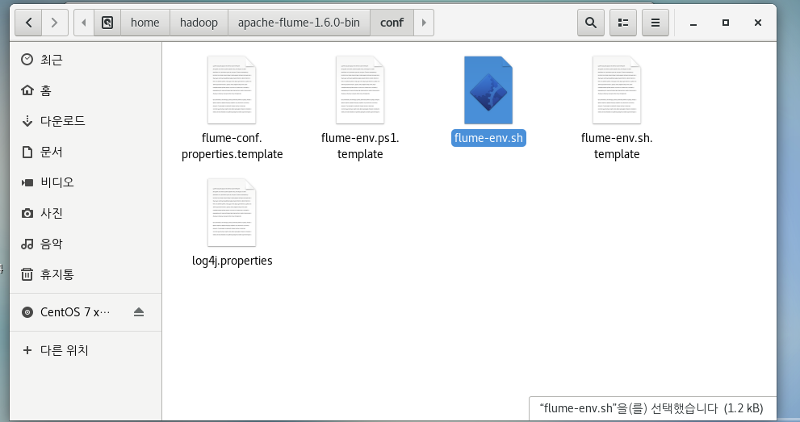
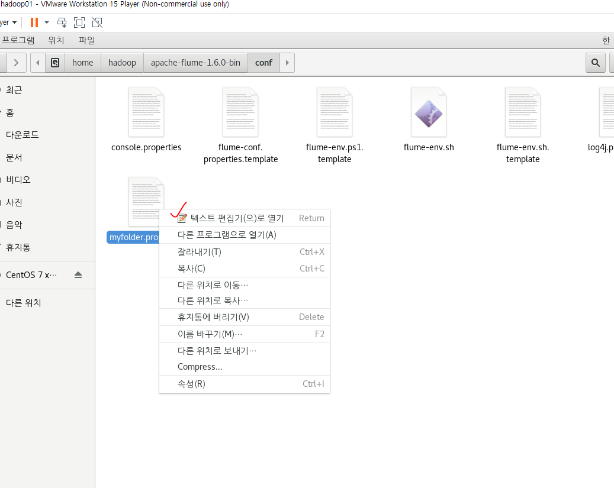

# 7. 데이터 수집

## Word Count

SQL 테이블 생성

sqoop export -connect jdbc:oracle:thin:@70.12.115.61:1521:xe -username shop -password shop -table wordcount -export-dir /wordcount/part-r-00000 -columns "word,count" -fields-terminated-by \\t

---

## 아파치 플룸

> 데이터 수집
>
> 데이터를 추출하기 위해 사용되는 프로그램
>
> 시스템 로그, 웹 서버의 로그, 클릭로그, 보안로그
>
> 비정형데이터를 HDFS에 적재하기 위해 사용하는 프로그램
>
> 대규모의 로그 데이터가 발생할 때 효율적으로 관리하고
>
> 수집하고 저장
>
> http://flume.apache.org/

source: 추출하고 싶은 데이터. 데이터 유입

channel: 여기에 보관

sink: 아웃풋으로 내보내는 역할

### 1. 다운로드

http://archive.apache.org/dist/flume/

압축풀기

### 2. .bashrc 설정 

### 3. 플룸 정보 등록

> jdk 홈디렉토리
>
> hadoop 홈디렉토리

여기로 이동 > 이게 템플릿이고 우리가 원하는 대로 설정해야 함

다시 터미널로. flume-env.sh 이게 플룸 설정파일임

생성됌. 텍스트 편집기로 열기

이게 자바 설치 폴더임.

### 4. 플룸 설정파일

> flume-conf.properties.template을 rename해서 (이름).properties로 만든다.
>
> flume agent의 source, channel, sink에 대한 정보를 등록해야 함

내용 다 지움.

[Flume의 구성 요소] : Flume의 실행 중인 프로세스를 agent라 부른다

1. Source
2. Channel
3. SInk

console properties에 정보 설정하자.

에이전트 구성요소의 이름: mySrc, memChannel, mySink

source: 어떤 방식으로 데이터가 유입되는지 type 으로 명시
	agent명.sources.source명.type=값

 	1. type
     - netcat: telnet을 통해서 터미널로 들어오는 입력데이터
       			(bind: 접속IP, port:접속할 port)
     - spoolDir: 특정 폴더에 저장된 파일
                   (spoolDir)

type: 어디서 데이터가 들어오냐? console은 netcat
bind: ip
port: 무슨 포트

sink: 데이터를 내보내는 곳

1. type
   - logger: flume 서버 콘솔에 출력이 전달
     flume을 실행할 때 Dflume.root.looger=INFO,console 
   - file_roll: 파일을 읽어서 가져오는 경우
     (directory: 읽어온 파일을 저장할 때 output폴더를 명시)

channel: 소스와 싱크사이에 데이터를 보관하는 곳 Queue
type: 메모리

실행명령어: ./bin/flume-ng agent
옵션
		--conf: 설정파일이 저장된 폴더명(-c)
		--conf-file: 설정파일명(-f)
		--name: agent의 이름(-n)
	-Dflume.root.looger=INFO,console        flume의 로그창에 기록

### 5. 플룸 실행 방법

flume-ng agent 명령어: 에이전트 실행

[hadoop@hadoop01 apache-flume-1.6.0-bin]$ ./bin/flume-ng agent
		-conf conf --conf-file ./conf/console.properties 
		--name myConsole -Dflume.root.logger=INFO,console

서로 통신하는 것을 확인할 수 있다.

---

복사

홈에 폴더 생성

**파일에서 데이터 불러올 때 형식**

[hadoop@hadoop01 apache-flume-1.6.0-bin]$ ./bin/flume-ng agent -c conf -f ./conf/myfolder.properties -n myConsole

실행 후 input 폴더에 아무 파일을 집어 넣으면

아웃풋에 뜸

---

한번 더

플룸 켜진 상태에서 input에 파일넣고 아웃풋 확인하기

 