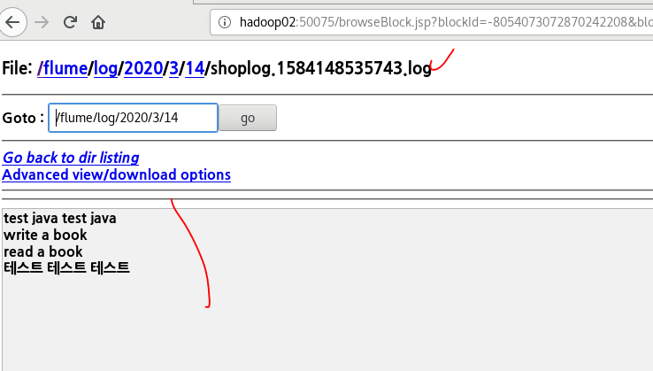
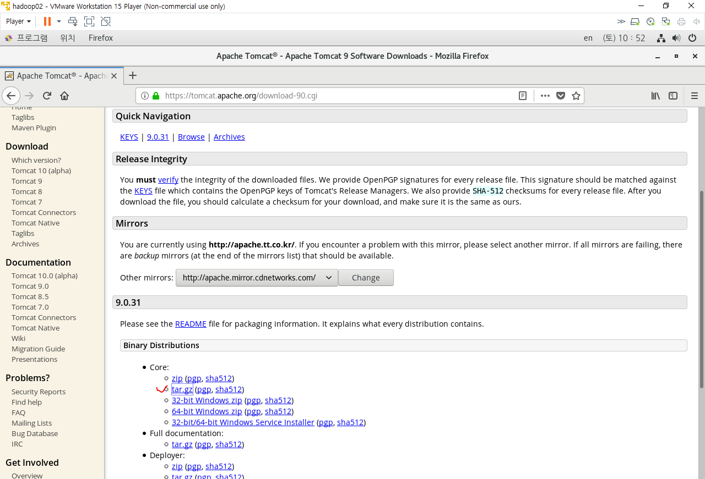
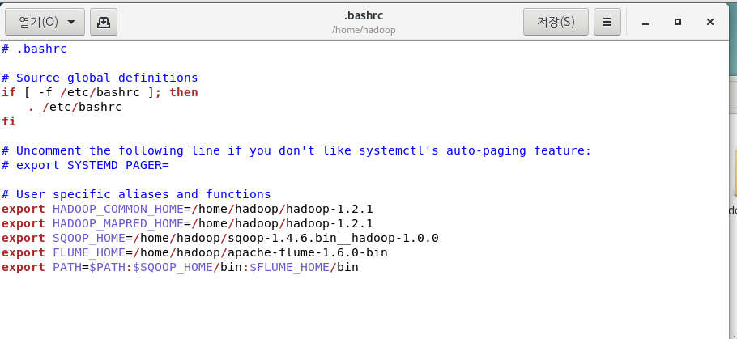
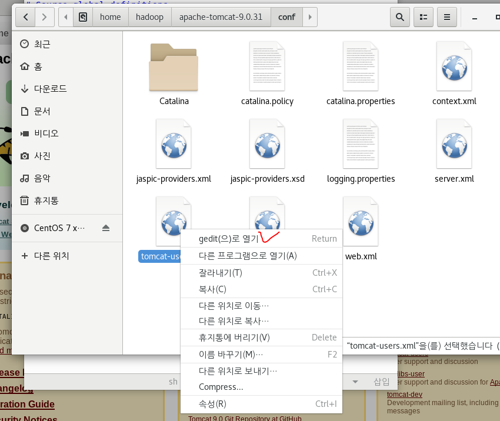
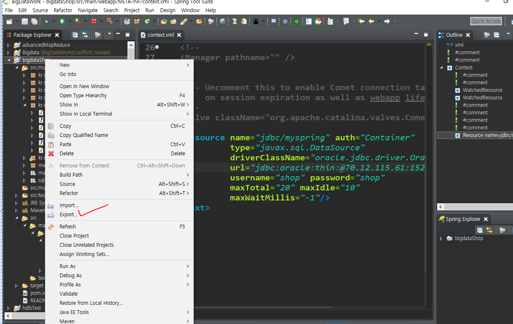
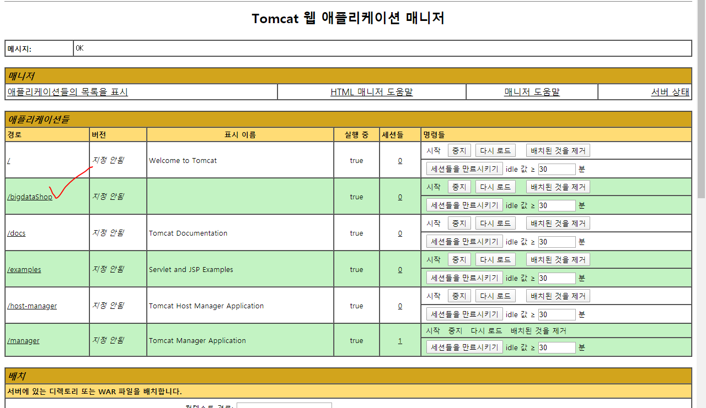

# 8. 데이터수집2

[hadoop@hadoop01 apache-flume-1.6.0-bin]$ ./bin/flume-ng agent -c ./conf/ -f ./conf/hdfs2.properties -n myhdfs

플룸 실행:  ./bin/flume-ng agent
폴더명: -c ./conf/
파일:  -f ./conf/hdfs2.properties
agent명:  -n myhdfs

추가함

지우고 다시 넣음

로그 생김

---

https://flume.apache.org/releases/content/1.9.0/FlumeUserGuide.html

completed 메세지는 안 뜸

---

2번 머신 WAS 설정

> 네트워크 통신으로

압출풀기

그리고 1먼 가상머신으로 이동. 터미널

다시 2번머신 .bashsrc 열기

복사됌. 

cp와 scp의 차이
cp: 복붙
scp: 다른 곳으로 복붙

8080 포트가 사용 중이라는 뜻

8080 포트가 중지된 상태이라는 뜻

다시키고

admin admin

안됌. 등록이 안되어 있어서 그럼

톰캣 끄고 다시 시작

가상머신 2 IP

192.168.111.129

위도우창 주소에 기재

주석처리하니까

윈도우 크롬에서 접속가능

admin admin

윈도우 cmd에서 ip주소 복사해서

배치 누른다.

요약: 하둡2 가상머신에서 톰캣을 설정했고

​		웹페이지의 서버를 오라클이 아닌 가상머신2에 있는 서버로 설정했다. 

로그 기록

---

## 미션

1. 3번 가상머신에 WAS를 구축
2. WAS에 bigdataShop을 배포
3. 3번에 flume을 설치
4. tomcat의 access log를 hdfs에 저장
   1. avro통신
   2. hdfs
      /flume/tomcatlog
5. 메일로 제출
   - 3번의 WAS manager 화면에 배포된 목록 캡쳐
   - hdfs에 저장된 access log 캡쳐
   - 각 머신의 flume 설정파일 캡쳐 