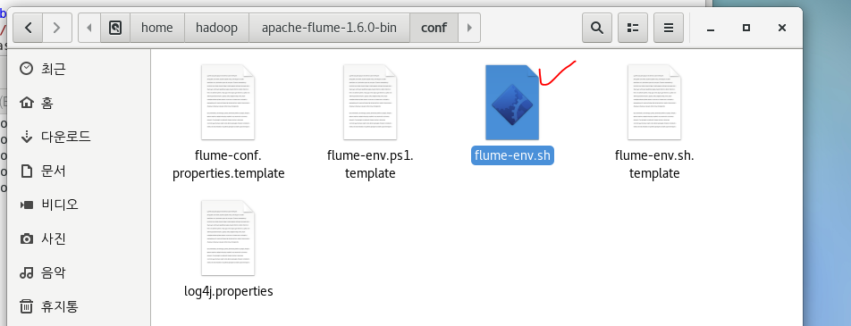

# 8. 머신

## WAS 구축 및 배포

1. 3번 가상머신 톰캣 다운 후 압축푼다

   wget 주소

2. 1번 가상머신 터미널: scp /bashrc hadoop@hadoop03: /home/hadoop/ .bashrc

   

3. 3번 .bashrc 열고 2번에서 이전에 해놨던 거 복붙

   

   

   

   

   3번 인터넷열고 아이피로 톰캣 접속되는지 확인

   

   3번 WAS 설치/ 구축완료

4. 아파치 톰캣 conf에 들어가서 tomcat-users.xml 설정하기

   

   

   

   3번 가상머신에 톰캣 WAS 구축했고 admin 등록까지 완료함

   3번 IP주소: 192.168.111.132

   자 이제 외부(윈도우 크롬)에서 접속할 수 있도록 설정을 변경하자.

   

   이제 외부에서도 admin으로 접속가능 (윈도우 크롬에서 접속한 화면)

   

   

5. 3번 WAS에 bigdataShop 배포하기

   이클립스에서 war파일 배포한게 이미 있음

   윈포우에서 3번머신 톰캣에 war 배치 등록

   

   3번 가상머신에 들어옴

   

   3번 머신 IP

   

   

## Flume

1. 3번 머신에 flume 설치

   

   다운 완료

   

   압축풀기

   

   .bashrc 설정

   

   설정 변경했으니

   

   
### 플룸 정보 등록

> jdk 홈디렉토리
>
> hadoop 홈디렉토리

1. flume-env.sh 복사 및 설정

   복사본 만들고 이름 변경

   

   

   

   플룸 정보 등록: 자바홈이랑 하둡홈 위치 설정함

   

   

### 플롬 설정 등록 (전송)

   

   저 파일 열기

   내용 다 지움

   

   

   이름 마음에 안 들어서 변경하고 안에 avro로 설절했음

아래처럼 설정

   플룸 설정 다 마친 후 실행:
플룸 시작한다는 명령어 -c 폴더위치 -f 파일명 -n 에이전트이름 

플룸켜짐.

플룸의 tomcatlog access log 파일을 복사해서 하둡 input 폴더로 복붙하기

### 플룸 수신

1번 터미널로 이동

열고 설정하기

다했으면 터미널 돌리기

