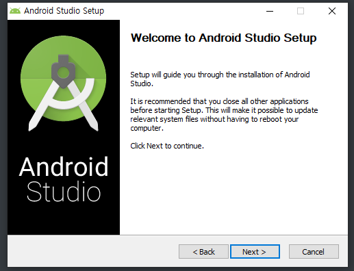
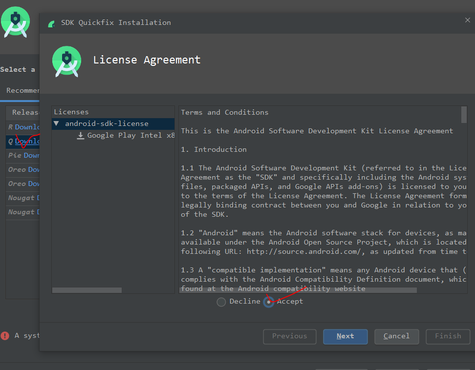

# 1. 안드로이드

---

## 1. 설치 

안드로이드 스튜디오 최신판
https://developer.android.com/studio

다 기본값으로 install

윈도우에서 android studio 실행


next => standard => dracula => finish


가장 기본. 





---

##  2. 특징

1. 컴포넌트 기반

   - Activity: 앱의 화면
   - Service: 
   - Content Provider
   - Broad Cast Receiver 
   - Intent: 앱에 대한 설명서 같은 것

2. 리소스의 외부화 

   - 문자열, 화면, 이미지 

     - 웹: 이미지의 경우 path를 정의해주기 때문에 유지보수가 힘들었음. 

     - 
- 외부파일: R.java
   - 리소스를 외부화해서 밖으로 뺐음. 그래서 유지보수가 쉬움. 

3. View

   화면을 구성

   - View Group - Layout
   - Widget - TextView - Button

   ```
   layout_width	뷰 너비
   layout_height	뷰 높이
   orientation		배치 방향
   id			    각 위젯의 식별	btn, txt
   margin			주위 여백
   padding			내부 컨텐츠 간격
   layout_weight	여백 비율을 여러게로 나뉨
   layout_gravity	parent 내부에서 뷰의 정렬
   gravity			뷰 내부에서의 정렬(텍스트)
   ```

   

---

## 3. 