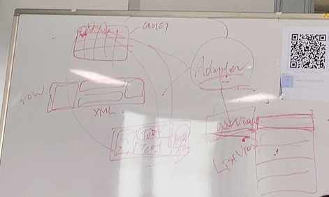
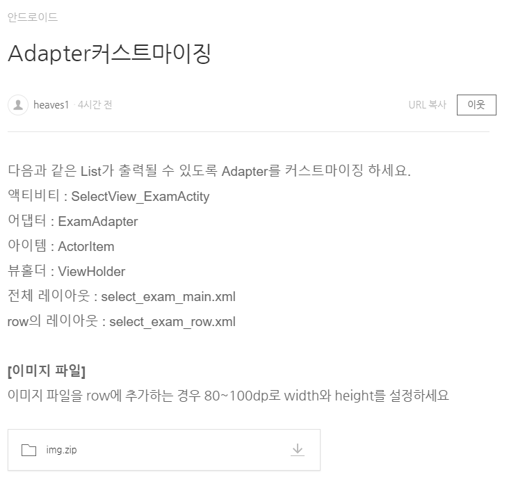
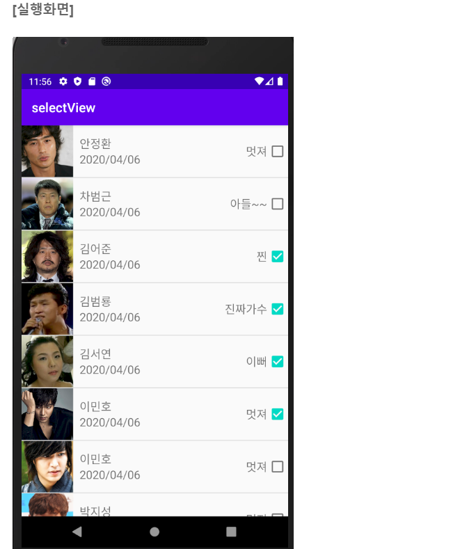

# 사용자정의 Adapter

- 안드로이드에서 앱을 구성할 떄 목록형식을 가장 많이 사용
- 사용자정의로 디자인한 뷰를 목록으로 사용하고 싶은 경우
- 안드로이드 내부에서 제공하는 Adapter로 표현하고 싶은 내용을 모두 표현할 수 없다. (이벤트 연결, 각 목록의 구성을 다르게 생성..)




[구성요소]

- Adapter를 이용해서 출력할 데이터를 저장하는 객체 (DTO와 같은 개념)
- 사용자정의 Adapter
  1. 안드로이드에서 제공하는 Adapter 클래스를 상송
     - 리스트뷰를 만들 때 필요한 정보를 저장할 수 있도록 멤버변수 정의 (Context, row디자인 리소스, 데이터)
  2. 생성자 정의
     -  상속받고 있는 ArrayAdapter의 생성자 호출
  3. ArrayAdapter에 정의되어 있는 메서드 오버라이딩
     - getView: 리스뷰의 한 항목이 만들어질 때 마다 호출
       - 전달된 리소르를 이용해서 뷰를 생성(레이아웃 inflator)
       - 한 row를 구성하는 뷰를 찾아서 데이터와 연결
  4. getView메소드에서 성능 개선을 위한 코드를 작성
     - 한 번 생성한 뷰를 재 사용
     - findViewById는 한 번만 찾아오기
  5. 그렇기 위해서 ViewHolder 객체를 생성해야 한다.
     - row를 구성하는 뷰를 한 번만 findViewById하기
     - row에 대한 구성 View를 멤버변수로 선언
     - 생성자에서 findViewById처리를 구현
     - 최초로 뷰를 만들 때 (row에 대한 뷰)이 객체를 활용 
  6. row를 구성하는 뷰에 상태값을 저장하기
     - 각 뷰의 이벤트를 통해 저장
     - 각 뷰의 상태값을 저장할 수 있도록 객체 생성
       - 상태값을 저장한 객체를 자료 구조로 저장
       - focus를 잃어버릴 떄 상태를 저장


- Adapter를 통해 만들어진 리스트뷰를 보여줄 액티비티
  - main 레이아웃


## 예제





```
CustomAdapterTestActivity			SelectView_ExamActivity
activity_custom_adapter_test		select_exam_main.xml
User							  ActorItem
custrow2 				(row의 레이아웃)select_exam_row.xml
MyAdapter2							ExamAdapter
SaveUserState						UserState
UserViewHolder						ViewHolder

```

