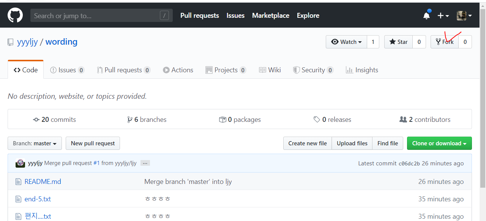

# How to use Github

## 1. Branch

> 초대를 통함 참여

```

student@M15014 MINGW64 /c/IoTJY/dummy (master)
$ git checkout -b end-5
Switched to a new branch 'end-5'

student@M15014 MINGW64 /c/IoTJY/dummy (end-5)
$ touch end-5.txt

student@M15014 MINGW64 /c/IoTJY/dummy (end-5)
$ git push desktop end-5
Total 0 (delta 0), reused 0 (delta 0)
remote:
remote: Create a pull request for 'end-5' on GitHub by visiting:
remote:      https://github.com/jaywagger/dummy/pull/new/end-5
remote:
To https://github.com/jaywagger/dummy.git
 * [new branch]      end-5 -> end-5

```


그룹초대

1. Create Repository (Inviter)

2. Setting > Manage access (Inviter)

3. Invite a collaborator (Inviter)

4. Accept or Decline (Invitee)

5. Clone Repository (Invitee)

6. Check

   

```
// 브랜치 만들기
$ git branch jyh

// 브랜치로 이동
$ git checkout jyh
Switched to branch 'jyh'

//커밋
$ git add .
$ git commit -m "JY Hwang commit"
$ git push origin jyh

Enumerating objects: 5, done.
Counting objects: 100% (5/5), done.
Delta compression using up to 4 threads
Compressing objects: 100% (2/2), done.

깃허브로 가서 Open a pull request
메세지 적고 reviwer request까지 추가
그리고 Create Pull Request

최종 승인자가 수락 (Merge)하면 끝
```

OR

```
cd (Repository Name)
cd wording

git checkout -b (브랜치이름)
git checkout -b (JYH)

git add.
git commit -m "test"
git push origin JYH
```


---

## 2. Fork



1. Fork를 누르면 내깃으로 프로젝트를 가져온다
2. Clone해서 수정한다
3. cd 프로젝트명
4. git add, commit, push origin master
5. 내 깃으로 가서 new request pull을 한다
6. Create request pull을 하면 본 주인에게 승락여부가 간다
7. 프로젝트 본 주인이 승락/거절을 한다
8. 승락되면 기존 프로젝트에 참여된다

## 3. 기타 코드

### 1. Stash

> 작업 내역을 임시 저장
> Stash : 임시저장
> 덮어쓰기 전 stash로 임시저장하고 
> pull한다. 
> 그리고 다시 git stash pop

```bash
# 1. stash 공간에 작업내역 저장
git stash
# 2. stash list 보기 
git stash list
# 3. 임시 공간 내용 가져오기
git stash pop
```

예시 

* 로컬에서 작업하고 있던 중, pull을 받아서 원격 저장소에 새로운 내용을 반영해야 하는 경우

  ```
  Please commit your changes or stash them before you merge.
  Aborting
  ```

  * 해결방법

    ```bash
    git stash
    git pull origin master
    git statsh pop
    # 그리고 다시 수정
    ```

### 2. Reset

> 변동 사항을 취소하고 이전 버전으로 되돌리기. 내역은 없다.
>
> 특정 버전으로 되돌리는 작업

```bash
 git reset {커밋해쉬코드}
 
 #결과 확인
 git log --online
 275a7e2 ddd
 00d69a4 (origin/master) Update README.md
 git rset 0069a4
 git log --online
 00d69a4 (origin/master) Update README.md
 
```


​	reset: 커밋한 사항을 취소하고 working directory에 보존

​	reset 옵션:reset --hard: 아예 그냥 이전 버전으로 가기. 이력 변경 삭제

### 3. Revert

> 내역은 그대로. 되돌렸다는 내역이 남는다.
>
> 특정 시점으로 되돌렸다는 커밋을 발생시킴

```bash
 git log --online
 275a7e2 ddd
 00d69a4 (origin/master) Update README.md
 git revert 275a7e2
 git log --onelone
 bca6426 (HEAD -> mater) Revert "ddd"
 275a7e2 ddd
  00d69a4 (origin/master) Update README.md
```

