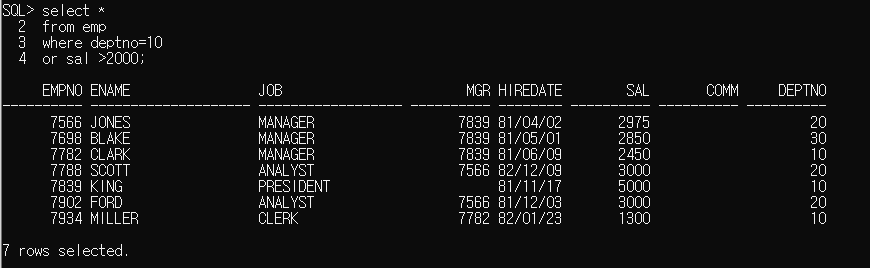
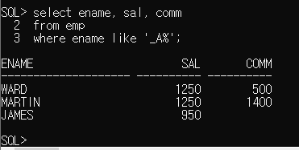

# DBMS (1)

**정의**: Detabase Management System

- 데이터베이스(데이터가 모여있는 곳) 관리 프로그램이다.
- DBMS의 개발자를 DBA라 부른다.
- 파일로 데이터를 관리할 수 있지만 그 데이터의 양이 점점 많아지면 관리가 어려워지므로 DBMS가 나왔다.
- Oracle 프로그램인 SQL이 가장 유명하다.
- DB2, Oracle, MySQL, MS SQL, 티베로 등이 있다.
- 수정, 삽입, 삭제, 조회 (거이 80%)

**목적**

대용량의 데이터를 빠르게 관리할 수 있도록 함. 관공서나 대기업에서 사용.

---

# RDB (1)

>  관계형 데이터베이스 (Relational Database: RDB)
>
>  엑셀 시트처럼 열과 행으로 이루어진 2차원 표 형식으로 데이터를 관리한다.
>
>  SQL: Structured Query Language라는 언어로 RDB를 관리한다. 

**대표 5개 RDBMS:**

- Oracle RDBMS :오라클
- SQL Server : MS
- DB2 : IBM
- PostgreSQL : 오픈소스
-  MySQL :  오픈소스

- RDBMS 
  1. 기본 키 (Primiary Key): 중복되지 않은 유일한 키. Parent Table
  2. 외래 키 (Foreign Key): 기본 키를 참조하여 사용하는 키. Child Table
  3. 조인 (Join): 기본 키와 외래키의 연관성을 활용하여 연결하는 작업

4. 테이블을 구분 짓어야 하는 이유는 코드의 중복을 막기 위함이고 이를 **정규화**라고 한다. 
5. 이렇게 관리된 데이터베이스에 접근하기 위해서 만들어진 언어가 **SQL**이다.

#  SQL: RDB 언어 (1)

> RDB 에서 사용되는 컴퓨터 언어: Structured Query Language 구조화 조회 언어

**특징:** 

> 1. sql문은 대소문자 구분하지 않는다.
>
> 2. ;은 sql문의 종료를 의미
>
> 3. ;을 입력하기 전에 여러 주로 sql문을 작성할 수 있다.
>
> 4. *는 모든 컬름을 조회하겠다는 의미
>
> 5. 컬럼에 null을 저장할 수 있다.
>
>    null은 0이나 space만 입력해 놓은 값과 다른 값
>
>    null 아무 값도 없는 것을 의미
>
>    null은 사용할 수 없고, 저장되어 있지 않은 상태
>
> 6. 컬럼명 대신 alias를 정의해서 사용할 수 있다.
>
>    select 컬렁명 alias명, 컬럼명 as alias명, 컬렁명 "alias명"
>    																					----------- alias명에 공백이 있는 경우 사용
>
> 7. 여러 컬럼을 합쳐서 하나의 컬럼으로 조회할 경우 사용
>
>    || or 연산자이용
>
> 8. 오라클의 문자열, 날짜 데이터는 ' '로 표현
>
> 9. 연산의 결과로 컬럼을 생성할 수 있다. (+,-,*,/ 및 기타 함수... ) 단 null 이 포함되어 있으면 연산불가
>
> 10. 중복이 있는 경우 제거하기 위해 select문에 distinct 를 추가할 수 있다

---

## 1. 기본 SQL (2)

**emp라는 테이블에서 job이라는 컬럼을 불러옴**

``` sql
SQL> select job         ---job이라는 컬럼을
  2  from emp;			---emp라는 테이블에서 불러온다.

JOB						-- 결과본
------------------
CLERK
SALESMAN
SALESMAN
MANAGER
SALESMAN
MANAGER
MANAGER
ANALYST
PRESIDENT
SALESMAN
CLERK

JOB
------------------
CLERK
ANALYST
CLERK

14 rows selected.
```

---

**중복되어 나온 데이터를 제외하기**

```SQL
SQL> select distinct job from emp;

JOB
------------------
CLERK
SALESMAN
PRESIDENT
MANAGER
ANALYST

//중복이 제외되어 나왔다.
```

---

## 2. SQL 종류(2)

### 2.1) DDL 

>  (Data Definition Language) : 데이터 정의 언어
>
>  데이터를 저장하는 데이터베이스 및 테이블 생성.
>
>  주의: 명령어 사용 후 꼭 커밋을 해야 저장이 된다. 
>
>  생성, 삭제, 수정


**A. CREATE:** 데이터베이스나 테이블 등을 작성한다.

```SQL
create table member(
           id varchar2(10),
           pass varchar2(10),
           addr varchar2(20));
```


**B. DROP:** 데이터베이스나 테이블 등을 삭제한다.

```SQL
drop table member;
```


**C. ALTER:** 데이터베이스나 테이블 등의 구성을 수정한다.

> 차후에 부연 설명을 해주기로 함


#### 예제

``` sql
conn system/manager --------시스템 사용자명이 manager이다.

create user scott identified by 123; ----scott 이라는 아이디와 123 이라는 비번을 만들었음
create user (아이디) identified by (비밀번호);

//alter을 활용하여 비번을 변경한다.
alter user scott identified by tiger --- 비밀번호를 변경하였다.

//계정을 만들었으니 사용 권한을 줘야한다.
grant connect,resource to (아이디));

conn java/java //(아이디)/(비번)
set linesize 300;


//관리자 계정을 통해서 사용자 권한 부여까지 했음.
```

---

### 2.2) DML 

 > (Data Manipulation Language) - 데이터값을 변경한다.
 >
 > 테이터의 행을 검색하거나 변경하기 위한 것 이다

**A. SELECT:** 테이블에 등록되어 있는 콜롬을 검색한다.

```SQL
select *
from tab;

select 다음에 조회할 column를 준다. from 다음에 테이블명

SQL> select sysdate from dual;   ---------sysdate는 함수이다. 당일 날짜를 보여준다.

SYSDATE
--------
19/12/18
```


```
select * from member;
```


**B. DELETE:** 테이블에 등록되어 있는 콜롬을 지운다 

​															   		 

**C. INSERT:** 테이블에 콜롬을 삽입/추가한다.


> Insert :하나씩 콜롬만 데이터 추가하기

``` SQL
 insert into member values('jang','1234','서울');
```


> insert를 통해서 장, 1234, 서울이  추가되었다.

>  Insert all: 여러개 콜롬을 한번에 추가하기

```SQL
insert all
   into member values('Lee','1234','인천')
   into member values('Kang','1234','안산')
   into member values('Hong','1234','수원')
select * from dual;
```

---


> insert와 insert all 을 통해 4개의 데이터를 테이블에 삽입하였다.

**D. UPDATE:** 테이블의 이미 추가된 데이터를 업데이트한다. 

```SQL
update member
set addr = (select addr
	from member
	where id='jang') -----------소문자 구분해야한다.
where id = 'Lee';  -------------대문자 구분해야 한다.
```


### 2.3) DCL 

> (Data Control Language) 
>
> 데이터베이스에서 처리한 변경 내용을 확정하거나 취소하기 위한 것 이다. 
>
> RDBMS 사용자에게 처리 권한을 부여하기도 한다.

**A. COMMIT:**  insert, update, drop등 DML에서 작성한 변경 내용을 확정해준다. 커밋을 하지 않으면 수정된 사항이 저장되지 않는다.


**B. ROLLBACK:** 데이터베이스 변경 내용을 취소한다.


**C. GRANT:** 사용자에게 처리 권한을 부여한다.


**D. REVOKE:** 아직 안 배웠다.

---

## 3. Query (2)

> RDBMS에서 거이 80%이상 차지는 부분으로 주로 Select를 활용한 부분을 칭한다.
>
> 세미콜론 (;) 사용
>
> 대문자, 소문자 구분 없음
>
> 상수 작성법에는 규칙이 있다.
>
> 단어는 공백 문자나 줄바꿈 문자로 구분한다.

### 3.1) 기본세팅

#### A. 오류

	> Windows 시스템-관리도구- oracle: OracleServiceXe & Listener 재시작
	>
	> 또한 아래 주소에
	>
	> C:\oraclexe\app\oracle\product\11.2.0\server\network\ADMIN
	>
	> listener와 tnsnames는 영문 체크하기

#### B. 세팅

> 시작에서 Run SQL 관리자 권한 실행 팝업창의 속성. 레이아웃 너비 2000설정. 그 외 설정은 알아서

#### C. 문자타입

>  Char vs Varchar  
>
> char (5): 고정문자. 5자가 다 안 채워져도 5자 메모리 그대로 있다.
>
> varchar (50): 가변문자. 3자만 채워지면 메모리가 3자에 대해서만 할당.

#### D. 제약설정

> 테이블에 특정 제약을 설정할 수 있다.  
>
> 문법적으로 제안을 둘 떄 사용
>
> Column에 제약조건을 넣으면 콜롬의 제약수준이라 함

### 3.2) 테이블 만들기

``` sql
---0. 로그인
SQL> conn scott/tiger
Connected.

---1. 테이블 생성
SQL> create table customer( ---create table 이름 ()
  2  id varchar2(10) primary key, ---콜룸과 데이터타입 선언
  3  pass varchar2(10), ---id,pass,name, point, regdate등의 콜롬이 생선된다
  4  name varchar2(15) not null,
  5  point number,
  6  regdate date			);

Table created. ---결과

---2. 조회: 테이블의 데이터를 조회:select

SQL> select * from tab; 

TNAME                                                        TABTYPE         CLUSTERID
------------------------------------------------------------ -------------- ----------
CUSTOMER                                                     TABLE

--- 3. desc 테이블명은 테이블의 구성을 확인

desc customer
 ID
 PASS
 NAME
 POINT
 REGDATE  ------지정한데로 콜룸이 생선되었다.


----4. 만들어진 테이블의 데이터를 넣는 작업: Insert
SQL> insert into customer values('jang','1234','장동건', 1000,sysdate)
							 ---	ID   pass   name    point  날짜 
							 --- 맞춰진 구성대로 데이터를 잘 입력하였다.

1 row created. ---결과
```

#### 예제1

```SQL
 ---1. 테이블 구성 생선
 create table test(
  num1 number,		--- 입력값 그대로
  num2 number(3),   --- 정수값만 
  num3 number(3,2),	---소수점 2자리 까지
  num4 number (5,2), 
  num5 number (10,3), ---소수점 3가지 까지
  num6 integer); --정수만
  
  ---2. 테이블 데이터값 입력
  insert into test values(125.88,125.88,125.88,125.88,1234.12345,125.88);
 
 ---3 테이블 입력값 확인  
   select * from test;

  NUM1       NUM2       NUM3       NUM4       NUM5       NUM6
------ ---------- ---------- ---------- ---------- ----------
125.88        126       5.88     125.88   1234.123        126

```

#### 예제2

```SQL
---워크북 124페이지
create table product(
 PDNO number primary key,
 PDNAME varchar2(10),
 PDSUBNAME varchar2(10) not null,
 FACTNO varchar2(5),
 PDDATE date,
 PDCOST integer,
 PDPRICE number,
 PDAMOUNT number);

create table factory(
 FACTNO varchar2(5) primary key,
 FACNAME varchar2(14) not null,
 FACLOC varchar2(13));

create table store(
 STONO varchar2(5) primary key,
 PDNAME varchar2(14) not null,
 PDSUBNAME number,
 FACTNO number,
 PDPRICE number,
 PDAMOUNT number);
```

---

## 4. SQL 코드정리 (2)

``` SQL
select
from
where
group by
having
order by
```

###  4.1) 테이블 만들기 복습

>  conn scott/tiger; //아이디와 비번에 연결
>
> create table (테이블명); 테이블 생성
>
> insert into  (테이블명) values('jang','1234','장동건', 1000,sysdate); 테이블 데이터 입력
>
> select * from (테이블명) tab; 데이틀의 모든 항목을 조회
>
> commitl; 입력한 데이터 저장
>
> set linesize 300; // 라인 길이

**테이블의 틀 생성**

``` SQL
create table test(
 num1 number,
 num2 number(3),
 num3 number(3,2),
 num4 number (5,2),
 num5 number (10,3),
 num6 integer);
```

---------------------------------------------------

**select과 desc의 차이점**

1. select은 테이블을 보기 위해

2. desc는 테이블의 데이터 형식을 보기 위해

   즉 둘이 보여주는게 다름.


**SQL> select * from test; // select로 테스트 테이블을 조회하면 **

SQL> select * from test;

      NUM1       NUM2       NUM3       NUM4       NUM5       NUM6
---------- ---------- ---------- ---------- ---------- ----------
    125.88        126       5.88     125.88   1234.123        126

**이렇게 나오지만 desc test 를 치면...**

SQL> desc test
 Name                                                                                                                                                                          Null?    Type

----------------------------------------------------------------------------------------------------------------------------------------------------------------------------- -------- --------------
 NUM1                                                                                                                                                                                   NUMBER
 NUM2                                                                                                                                                                                   NUMBER(3)
 NUM3                                                                                                                                                                                   NUMBER(3,2)
 NUM4                                                                                                                                                                                   NUMBER(5,2)
 NUM5                                                                                                                                                                                   NUMBER(10,3)
 NUM6                                                                                                                                                                                   NUMBER(38)

**서로 다른 형식으로 나온다.**

---

select * from 테이블명; //테이블 전체보기

select * from 특정 콜롬명; 특정 콜롬만 보기

select * from 콜롬1, 콜롬2....etc; 여러 콜롬만 보기

select distinct 컬럼명, 컬럼명...............(alias명) from 테이블명 //distinct 중복방지, alias는 명칭변경

from절 다음에 where절 정의

where 절은 조건식이 true가 되도록 정의

where 절에 사용할 수 있는 비교 연산자: >,>=,<,<=,=,<> 같지않다, != 같지않다, = 같다(자바와 다름)

where절에서 조건과 함꼐 비교하는 값을 추가해야 하는 경우 문자, 날짜는 작은따옴표로 묶어줘야 한다.

SQL은 대소문자를 구문하지 않는다. 하지만 값을 비교하는 경우 정확하게 대소문까지 일치해야 한다.


---

### 4.2)  연산자

#### A. 기본연산자

##### 1. AND 연산자:				

모둔 조건이 일치면 true. 다른 컬럼. 

   

   

##### 2. BETWEEN 연산자:  	  

A and B: 같은 컬럼에서 비교할 경우

   

   

##### 3. OR 연산자:                   

둘중 하나만 일치하면 true
 deptno가 10인 사람과, 월급이 2000천 이상인 두 조건 다 나왔다.
두 조건 모두 일치할 필요는 없고 둘중 하나만 맞나도 출력된다. 

   

   

##### 4. IN 연산자:                    

or연산자의 의미와 동일하다.
컬럼명 in (비교할 값, 값.......) 같은 컬럼에서 값을 많이 비교한다
                                    매니저 이거나 사장님 사람 모두 출력되었나.

   

   

##### 5. NOT 연산자: 

부정. 이 예제에서는 매니저도 아니거나 사장도 아니다라고 정의됐다. 
그렇게 때문에 매니저와 사람 둘다 나오지 않았다.
무엇가를 뺄 때


##### 6. Null 연산자

**is null:** null인 데이터 조회. 	커미션없는 사람만 조회.


**is not null:** null이 아닌 데이터를 조회

##### 7. LIKE ('%')

대표 문자와 함꼐 사용. 조건비교를 위해 입력한 값이 문자열에 포함되어 있는지 확인함.

​					%: 모든 문자열

​					_: 한 자리 문자를 의미

**이름중 A로 시작하는 모든 것**


**이름 중 A로 끝나는 단어는 없음**


**A번째 단어가 두번째 자리에 오고 뒤에 오는 문자는 상관없다. **



**특정 이름을 넣을 때**

```SQL
SQL> select ename, job, deptno
  2  from emp
  3  where ename  like '%T%';

ENAME                JOB                    DEPTNO
-------------------- ------------------ ----------
SMITH                CLERK                      20
MARTIN               SALESMAN                   30
SCOTT                ANALYST                    20
TURNER               SALESMAN                   30

```

**특정 이름을 뺄 때**

```SQL
SQL> select ename, job, deptno
  2  from emp
  3  where ename  not like '%T%';

ENAME                JOB                    DEPTNO
-------------------- ------------------ ----------
ALLEN                SALESMAN                   30
WARD                 SALESMAN                   30
JONES                MANAGER                    20
BLAKE                MANAGER                    30
CLARK                MANAGER                    10
KING                 PRESIDENT                  10
ADAMS                CLERK                      20
JAMES                CLERK                      30
FORD                 ANALYST                    20
MILLER               CLERK                      10
황제윤                                          20
```


### 4.3) 데이터 정렬 여기서부터 다시 정리


select (distinct) 컬럼명, 컬럼명.....(alias명)
from 테이블명
where 조건
order by 컬럼명 정렬기준. 여러 컬럼명 기준으로 정렬이 가능하다

**asc:** 오름차순

**desc:** 내림차순

정렬기준을 생략하면 기본은 오름차순


​											구체적인 정렬기준이 없으므로 default인 오름차순


​											desc기준 내림차순


​											문자열도 동일

#### 3.2 Group by

#### 3.3 Having

#### 3.4 Join

#### 3.5 서브커리

#### 3.6 함수


## 함수: 단일형 & 그룹형

>  Date: 2019-12-19
>
> 1. 단일행 함수: 행 각각 검사하고 넘어감
>
> 2. 그룹 함수: 그룹별로 검사하고 넘어감. 
>
> where절은 단일행이므로 그룹함수안에 사용할 수 없다.

``` SQL
select ename, sal, comm
from emp
where sal >= avg(sal);


 select sum(sal), avg(sal), max(sal),min(sal), count(sal)
 from emp
 where deptno=10;
 
   SUM(SAL)   AVG(SAL)   MAX(SAL)   MIN(SAL) COUNT(SAL)
---------- ---------- ---------- ---------- ----------
      8750 2916.66667       5000       1300          3
      
where sal >= avg(sal)
ERROR at line 3:
ORA-00934: group function is not allowed here


```

#### 1. 단일행 함수(스칼라): select, from, where절에 모두 사용할 수 있다.

##### 1. 문자함수 (195페이지)

- **lower**(문자열 또는 컬럼명): 값을 소문자로 변환
- **upper**(문자열 또는 컬럼명): 값을 대문자로 변환
- **initcap**(문자열 또는 컬럼명): 전달된 값의 첫 글자만 대문자로 변환

**테스트 시, dual 활용:** dual = 임시테이블

``` SQL
select lower('TEST'), upper('test'), initcap('test')
from dual;

LOWER('T UPPER('T INITCAP(
-------- -------- --------
test     TEST     Test

```

- **substr** (문자열 또는 컬럼명, 시작위치, 추출할 문자열의 갯수, ) : 짤라내기
  - SQL의 인텍스 넘버는 1부터 시작

```SQL
---이름의 끝 단어가 H인 사람 찾기
select *
from emp
where substr(ename, -1,1) = 'H';

EMPNO ENAME                JOB                       MGR HIREDATE        SAL
----- -------------------- ------------------ ---------- -------- ----------
 7369 SMITH                CLERK                    7902 80/12/17        800
 
 select *
from emp
where substr(ename, length(ename),1) = 'H';

 select *
from emp
where ename like '%H';
```


``` SQL
select substr('oracle',2,2)
from dual;

SUBS
----
ra
```

- Length: 문자길이

``` SQL
select length('oracle')
from dual;

LENGTH('ORACLE')
----------------
               6

```

- **instr**(문자열 또는 컬럼명, 찾을 문자, 찾을 위치, n번째 문자                                                                                                ) : 찾기

```SQL
select instr('oracle oracle oracle oracle','a',-1,2)
from dual;
 //오라클 문자열에서 -1(뒤에서보터) 2번째 a를 찾는다

 
INSTR('ORACLEORACLEORACLEORACLE','A',-1,2)
------------------------------------------
                                        17
```

​	해달 문자열의 5번 위치 부터 a를 찾아 위치를 반한

​	단, 2번째 a 위치를 반환

```SQL
select instr('oracle oracle oracle','a',5,2)
from dual;

INSTR('ORACLEORACLEORACLE','A',5,2)
-----------------------------------
                                 17
```

- **concat:** 문자열 연결

  ```SQL
  select concat('oracle','dbms')
  from dual;
  CONCAT('ORACLE','DBM
  --------------------
  oracledbms
  ```

  

- **lpad:** 지정해준 길이에 문자열을 채우고 부족한 만큼 왼쪽부터 지정한 문자를 채움

  (문자열 or 컬럼명, 출력할 문자열의 길이, 채움문자/문자열 연결)

- **rpad:** 전체 출력할 문자열의 길이에 문자열을 출력한 후 남는 공간에 정의한 문자를 채워 출력해주는 함수 (오른쪽)

  (문자열 or 컬럼명, 출력할  문자열의 길이, 채움문자/문자열 연결)

  

- **ltrim** (문자열 or 컬럼명, 제거할 문자). 지우기

  컬럼에서 매개변수로 정의한 문자를 왼쪽에서 찾아 모두 제거

  단. 연속된 문자만 제거

  ```SQL
  select ltrim('aaaaaaaaaaaaaaaaaaaaaaaaaaaaoracle','a')
  from dual;
  
  LTRIM('AAAAA
  ------------
  oracle
  ```

  

- **rtrim** (문자열 or 컬럼명, 제거할 문자)

  컬럼에서 매개변수로 정의한 문자를 오른쪽에서 찾아 모두 제거

  단. 연속된 문자만 제거

  ```SQL
  이건 공백을 지운 예제
  select rtrim('  oracle                              ',' ')
  from dual;
  
  RTRIM('ORACLE','
  ----------------
    oracle
  ```

##### 2. 문자함수 (195페이지)

- round (숫자, 반올림할 위치): 반올림 

  

```SQL
select round(125.8888,0) from dual;

ROUND(125.8888,0)
-----------------
              126
              
select round(125.8888,1) from dual;
ROUND(125.8888,1)
-----------------
            125.9
            
select round(125.8888,-1) from dual;
ROUND(125.8888,-1)
------------------
               130
            
```

- 변환함수

  - 데이터의 타입을 변환하기 위한 함수
  - cast (값 or 컬럼명 as 타입)
                                         타입은 날짜:date, 숫자: integer

  ``` SQL
  select cast('2019/11/11' as date) from dual;
  CAST('20
  --------
  19/11/11
  
       
  select cast(0111 as integer) from dual;     
  CAST(0111ASINTEGER)
  -------------------
                  111
  ```

  - to, char (변환할 데이터, 표시할 format)

    *숫자를 문자로 변환

  ​	숫자는 한 자리를 표시 => 9,0

  ​	콤마=> , 

  ​	소수점 = > .

  ​	통화기호 => $, 원화, L(지역의 통화기호를 출력

  ```SQL
  select ename, sal, to_char(sal,'L9,999') from emp;
  ENAME                       SAL TO_CHAR(SAL,'L9,999')
  -------------------- ---------- --------------------------------
  SMITH                       800           ￦800
  ALLEN                      1600         ￦1,600
  WARD                       1250         ￦1,250
  JONES                      2975         ￦2,975
  MARTIN                     1250         ￦1,250
  BLAKE                      2850         ￦2,850
  CLARK                      2450         ￦2,450
  SCOTT                      3000         ￦3,000
  KING                       5000         ￦5,000
  TURNER                     1500         ￦1,500
  ADAMS                      1100         ￦1,100
  
  ENAME                       SAL TO_CHAR(SAL,'L9,999')
  -------------------- ---------- --------------------------------
  JAMES                       950           ￦950
  FORD                       3000         ￦3,000
  MILLER                     1300         ￦1,300
  ```

  

  

  - 날짜를 문자열로 변환: 년 월 일 각각의 데이터를 추출하고 싶은 경우

    년도=> YYYY (2019)

    ```SQL
    select ename, hiredate, to_char(hiredate,'YYYY')
    from emp;
    
    ENAME                HIREDATE TO_CHAR(
    -------------------- -------- --------
    SMITH                80/12/17 1980
    ALLEN                81/02/20 1981
    WARD                 81/02/22 1981
    JONES                81/04/02 1981
    MARTIN               81/09/28 1981
    BLAKE                81/05/01 1981
    CLARK                81/06/09 1981
    SCOTT                82/12/09 1982
    KING                 81/11/17 1981
    TURNER               81/09/08 1981
    ADAMS                83/01/12 1983
    
    ENAME                HIREDATE TO_CHAR(
    -------------------- -------- --------
    JAMES                81/12/03 1981
    FORD                 81/12/03 1981
    MILLER               82/01/23 1982
        
        
    select ename, to_char(hiredate,'MON') 월,
                           to_char(hiredate,'MONTH') 월
    from emp;
        
        ENAME                월               월
    -------------------- ---------------- ----------------
    SMITH                12월             12월
    ALLEN                2월              2월
    WARD                 2월              2월
    JONES                4월              4월
    MARTIN               9월              9월
    BLAKE                5월              5월
    CLARK                6월              6월
    SCOTT                12월             12월
    KING                 11월             11월
    TURNER               9월              9월
    ADAMS                1월              1월
    
    ENAME                월               월
    -------------------- ---------------- ----------------
    JAMES                12월             12월
    FORD                 12월             12월
    MILLER               1월              1월
    
    14 rows selected.
    ```

    

    월=> MM (12)

    ```SQL
    select ename, hiredate, to_char(hiredate,'MM')
    from emp;
    ENAME                HIREDATE TO_C
    -------------------- -------- ----
    SMITH                80/12/17 12
    ALLEN                81/02/20 02
    WARD                 81/02/22 02
    JONES                81/04/02 04
    MARTIN               81/09/28 09
    BLAKE                81/05/01 05
    CLARK                81/06/09 06
    SCOTT                82/12/09 12
    KING                 81/11/17 11
    TURNER               81/09/08 09
    ADAMS                83/01/12 01
    
    ENAME                HIREDATE TO_C
    -------------------- -------- ----
    JAMES                81/12/03 12
    FORD                 81/12/03 12
    MILLER               82/01/23 01
    

    select ename,to_char(hiredate,'month')월 from emp;
    
    
    
    ENAME                월
    -------------------- -----------
    SMITH                december
    ALLEN                february
    WARD                 february
    JONES                april
    MARTIN               september
    BLAKE                may
    CLARK                june
    SCOTT                december
    KING                 november
    TURNER               september
    ADAMS                january
    
    ENAME                월
    -------------------- -----------
    JAMES                december
    FORD                 december
    MILLER               january
    
    14 rows selected.
    ```
    
    일=>DD(19)

- 날짜함수

  - sysdate: 오늘 날짜

  ```SQL
  select sysdate from dual;
  SYSDATE
  --------
  19/12/19
  
  
  select sysdate-5, sysdate, sysdate+5 from dual;
  SYSDATE- SYSDATE  SYSDATE+
  -------- -------- --------
  19/12/14 19/12/19 19/12/24
  ```

- null처리함수

  - nvl(컬럼, null인 경우 처리할 식이나 값) - null 경우 대신할 식이나 ㄱ밧을 명시
  - nvl2(컬럼, 표현값1,표현값2)
                     '------------'  '------------'
             null이 아닌경우  null인 경우   

  ```SQL
  null인 경우 0으로 표시하기
  select ename,sal,comm, nvl(comm,0) from emp;
  ENAME                       SAL       COMM NVL(COMM,0)
  -------------------- ---------- ---------- -----------
  SMITH                       800                      0
  ALLEN                      1600        300         300
  WARD                       1250        500         500
  JONES                      2975                      0
  MARTIN                     1250       1400        1400
  BLAKE                      2850                      0
  CLARK                      2450                      0
  SCOTT                      3000                      0
  KING                       5000                      0
  TURNER                     1500          0           0
  ADAMS                      1100                      0
  
  ENAME                       SAL       COMM NVL(COMM,0)
  -------------------- ---------- ---------- -----------
  JAMES                       950                      0
  FORD                       3000                      0
  MILLER                     1300                      0
  
  
  
  
  
  
  --------------------오류발생-------------------------
  그 이유는 comm는 데이터값이 정수이기에.
  
  select ename,sal,comm, nvl(comm,'신입사원') from emp;
  ENAME                       SAL       COMM NVL(COMM,0)
  -------------------- ---------- ---------- -----------
  JAMES                       950                      0
  FORD                       3000                      0
  MILLER                     1300                      0
  
  14 rows selected.
  
  SQL> select ename,sal,comm, nvl(comm,'신입사원') from emp;
  select ename,sal,comm, nvl(comm,'신입사원') from emp
                                  *
  ERROR at line 1:
  ORA-01722: invalid number
  
  
  
  ---------------------변환해주면 됌-----------------------
  select ename,sal,comm, nvl(to_char(comm),'신입사원') from emp;
  
  ENAME                       SAL       COMM NVL(TO_CHAR(COMM),'신입사원')
  -------------------- ---------- ---------- ------------------------------
  SMITH                       800            신입사원
  ALLEN                      1600        300 300
  WARD                       1250        500 500
  JONES                      2975            신입사원
  MARTIN                     1250       1400 1400
  BLAKE                      2850            신입사원
  CLARK                      2450            신입사원
  SCOTT                      3000            신입사원
  KING                       5000            신입사원
  TURNER                     1500          0 0
  ADAMS                      1100            신입사원
  
  ENAME                       SAL       COMM NVL(TO_CHAR(COMM),'신입사원')
  -------------------- ---------- ---------- ------------------------------
  JAMES                       950            신입사원
  FORD                       3000            신입사원
  MILLER                     1300            신입사원
  ```

  vnl2

  ```SQL
  select ename,sal,comm, nvl2(to_char(comm),'영업부','타부서') from emp;
  
  ENAME                       SAL       COMM NVL2(TO_CHAR(COMM)
  -------------------- ---------- ---------- ------------------
  SMITH                       800            타부서
  ALLEN                      1600        300 영업부
  WARD                       1250        500 영업부
  JONES                      2975            타부서
  MARTIN                     1250       1400 영업부
  BLAKE                      2850            타부서
  CLARK                      2450            타부서
  SCOTT                      3000            타부서
  KING                       5000            타부서
  TURNER                     1500          0 영업부
  ADAMS                      1100            타부서
  
  ENAME                       SAL       COMM NVL2(TO_CHAR(COMM)
  -------------------- ---------- ---------- ------------------
  JAMES                       950            타부서
  FORD                       3000            타부서
  MILLER                     1300            타부서
  ```


언어설정

alter session set nls_language='korean';

alter session set nls_language='american';

#### 2. 그룹함수

> 통계를 내기 위해서 한 그룹으로 묶을 수 있다.

**count** (기본키 컬럼)

**group by:**

```SQL
select deptno, count(empno) from emp
group by deptno;

DEPTNO COUNT(EMPNO)
------ ------------
    30            6
    20            5
    10            3
```

**그룹화:** 

​	select 컬럼
​		from 테이블
​			where 조건
​				group by 그룹화할 컬럼며이 (함수를 포함한 식도 가능
​					order by 정렬할 컬럼명

- 테이블에 저장된 레코드를 그룹화하여 분류하고 싶은 경우 사용
- select절에는 group by절에 명시한 컬럼명과 그룹함수만 사용할 수 있다.

```SQL
직업별 월급 평균구하기
-----------------코드-------------------
select job, avg(sal)
from emp
group by job;

JOB                  AVG(SAL)
------------------ ----------
CLERK                  1037.5
SALESMAN                 1400
PRESIDENT                5000
MANAGER            2758.33333
ANALYST                  3000

-----------------설명-------------------
직업으로 묶었고, 평균 함수를 사용함

----------------다른예제-------------------
부서면 직무당 인원 확인 group by를 2개씀

select deptno, job, count(empno)
from emp
group by deptno, job
order by deptno;

    DEPTNO JOB                COUNT(EMPNO)
---------- ------------------ ------------
        10 CLERK                         1
        10 MANAGER                       1
        10 PRESIDENT                     1
        20 ANALYST                       2
        20 CLERK                         2
        20 MANAGER                       1
        30 CLERK                         1
        30 MANAGER                       1
        30 SALESMAN                      4

9 rows selected.
```

또 다른 예제

```SQL
select job, deptno, count(empno), max(sal)
from emp
group by deptno, job
order by job;

JOB                    DEPTNO COUNT(EMPNO)   MAX(SAL)
------------------ ---------- ------------ ----------
ANALYST                    20            2       3000
CLERK                      10            1       1300
CLERK                      20            2       1100
CLERK                      30            1        950
MANAGER                    10            1       2450
MANAGER                    20            1       2975
MANAGER                    30            1       2850
PRESIDENT                  10            1       5000
SALESMAN                   30            4       1600
```

- 데이터가 복잡한 경우 group by절에 두 개 이상의 컬럼을 명시할 수 있다
- group by 하기전에 적용해야 하는 조건은 where절에 정의하고
- group by한 결과에 조건으 ㄹ적용해야 하는 경우 **having**절을

##### 그룹화 순서

1. select 컬럼
2. from 테이블
3. where 조건
4. order by 컬럼
5. group by 컬럼
6. group by 하기전 조건은 where에
7. group by 한 후에 필요한 조건은 having에 기재한다.

#### 3. 조인

> 정규화된 테이블이나 혹은 일반적으로 작성된 여러 테이블의 컬럼을 이용해서 데이터를 조쇠하는 것을
>
> 조인이라고 함
>
> 조인을 하는 경우 무족건 where절에 조인조건을 정의해야 한다.
>
> 여러 테이블을 사용하는 경우 모든 테이블들의 조인조건을 정의해야 함
>
> 두개의 테이블올 합칠 때 기준이 되는 콜럼이 있어야 한다. 
>
> 명확한 기준: primary key 기본 키 이다. PK를 다른 테이블로 가져가 쓴 콜롬을 FK라고 한다.
>
> 여러 테이블에서 내가 원하는 값만 불러와서 하나로 합치는 작업: **조인**

#### 조인방법

1. from 절에 조회하고 싶은 데이터가 저장된 테이블을 모두 명시

2. 조인을 하는 겨웅 컬럼이 어떤 테이블의 컬럼인지 명확하게 정의해야 한다. (예: 테이블명.컬럼명)

3. from 절에 테이블명을 정의할 때 alias를 함께 추가하여 aslias로 엑세스 하도록 한다.

   예: select alias.컬럼명1, alias 컬럼명2

   ​	from 테이블1 alias1, 테이블2 alias2

4. where 절에는 반드시 조인조건을 추가하며 조인조건에는 두 테이블의 값을 비교하기 위해 정의하는 것이므로 외래키와 기본키를 정의한다. 외래키는 child table & 기본키 parent table 이라고도 불린다.
   기본키 테이블에서 비교하여 정확하게 일치하는 경우 값을 가져온다. 


``` SQL
ㅇㅇ
select d.dname, e.ename, e.sal
from emp e, dept d
where e.deptno = d.deptno;

DNAME                        ENAME                       SAL
---------------------------- -------------------- ----------
RESEARCH                     SMITH                       800
SALES                        ALLEN                      1600
SALES                        WARD                       1250
RESEARCH                     JONES                      2975
SALES                        MARTIN                     1250
SALES                        BLAKE                      2850
ACCOUNTING                   CLARK                      2450
RESEARCH                     SCOTT                      3000
ACCOUNTING                   KING                       5000
SALES                        TURNER                     1500
RESEARCH                     ADAMS                      1100
SALES                        JAMES                       950
RESEARCH                     FORD                       3000
ACCOUNTING                   MILLER                     1300

14 rows selected.


------------------------다른 예시 ------------------------------
select d.dname, e.ename, e.sal
from emp e, dept d
where e.deptno = d.deptno and sal >= 3000;

DNAME                        ENAME                       SAL
---------------------------- -------------------- ----------
ACCOUNTING                   KING                       5000
RESEARCH                     FORD                       3000
RESEARCH                     SCOTT                      3000

```

##### 조인의 종류

- **equi join (inner join): ** 두 테이블에서 정확하게 일치하는 컬럼에 대한 데이터만 조인
- **outer join:** 두 개 이상의 테이블에 조인을 적용했을 떄 join조건을 만족하지 않아도 데이터를 조회하고 싶은 경우. 조인조건에 (+)를 추가한다.


	


- **outer join:** join 조건을 만족하지 않아도 한 쪽 테이블의 모든 데이터를 출력하고 싶을 때 사용하는 조인방식으로 정보가 부족한 테이블의 컬럼에 (+)를 추가한다. 

  select 테이블 alias.컬럼명....
  from 테이블 aslias
  where 테이블 alias.컬럼명 = 테이블 alias.컬럼명(+)
  or
  where 테이블alias.컬럼명(+) = 테이블alias.컬럼명

  => (+)기호는 한쪽에만 사용한다.
  데이터가 확장되어야 하는 곳에 추가한다.

  - [실습예제]

    1. 부서별 인원수를 출력하기. 단, 부서명을 출력하고 인원이 없는 부서명도 모두 출력한다.

       ``` SQL
       select d.dname, count(e.empno) 
       from emp e, dept d
       where e.deptno = d.deptno (+)
       group by d.dname
       
       DNAME                        COUNT(E.EMPNO)
       ---------------------------- --------------
       ACCOUNTING                                3
                                                 1
       RESEARCH                                  5
       SALES                                     6
       
       ```

       

    2. 부서별 인원수를 출력하고 부서가 배치되지 않은 사원은 "신입사원"으로 표시한다.

       ``` SQL
       select nvl(d.dname,'신입사원'), count(e.empno) 
       from emp e, dept d
       where e.deptno = d.deptno (+)
       group by d.dname
       
       NVL(D.DNAME,'신입사원')      COUNT(E.EMPNO)
       ---------------------------- --------------
       ACCOUNTING                                3
       신입사원                                    1
       RESEARCH                                  5
       SALES                                     6
       ```

- **self조인:** 두 개 이상의 테이블에서 조인하지 않고 같은 테이블의 컬럼들을 이용해서
   조인(하나를 가상테이블)  예를 들어 같은 테이블에서 2개의 컬럼을 조인하고 싶다면 셀프조인을 활용하면 된다.

  - [실습예제]

    1. emp 테이블을 두개로 나눈다. emp 사원 테이들 e 에서 관리자 테이블 m (가상테이블) 조인

       ``` SQL
       select e.empno, e.ename, e.mgr, m.ename
       from emp e, emp m
       where e.mgr = m.empno;
       
            EMPNO ENAME                       MGR ENAME
       ---------- -------------------- ---------- ----------
             7902 FORD                       7566 JONES
             7788 SCOTT                      7566 JONES
             7900 JAMES                      7698 BLAKE
             7844 TURNER                     7698 BLAKE
             7654 MARTIN                     7698 BLAKE
             7521 WARD                       7698 BLAKE
             7499 ALLEN                      7698 BLAKE
             7934 MILLER                     7782 CLARK
             7876 ADAMS                      7788 SCOTT
             7782 CLARK                      7839 KING
             7698 BLAKE                      7839 KING
             7566 JONES                      7839 KING
             7369 SMITH                      7902 FORD
       
       13 rows selected.
       ```

    2.  관리자별 인원수 구하기. 
       관리자명 인원수 출력

       

       매니저 목록만 정리된게 없음. 그래서 emp e와 emp m을 따로 만들고 m.mgr로 매니저 컬럼만 따로 정리한 후 e.mgr = m.empno 가상테이블과 emp 테이블을 연결해 준다. 그 후에 관리자명으로 그룹핑을 해주면 사람당 몇명의 인원을 관리하는 지 알 수 있다.

       ```SQL
       select m.ename 관리자명, count(e.empno) 인원수
       from emp e, emp m
       where e.mgr = m.empno
       group by m.ename;
       
       관리자명                 인원수
       -------------------- ----------
       JONES                         2
       FORD                          1
       CLARK                         1
       SCOTT                         1
       BLAKE                         5
       KING                          3
       
       6 rows selected.
       ```

       **관리자가 없는 사람의 목록은 나오지 않았음, 나오게 하려면**

       ```SQL
       select m.ename, count(e.empno)
       from emp e, emp m
       where e.mgr = m.empno(+)
       group by m.ename;
       
       ENAME                COUNT(E.EMPNO)
       -------------------- --------------
       JONES                             2
                                         2 ---매니저가 없는 사람 2명
       FORD                              1
       CLARK                             1
       SCOTT                             1
       BLAKE                             5
       KING                              3
       
       7 rows selected.
       
       null에 매니저없음이라고 넣기
       select nvl(m.ename,'매니저없음'), count(e.empno)
       from emp e, emp m
       where e.mgr = m.empno(+)
       group by m.ename;
       
       
       NVL(M.ENAME,'매니저없음')      COUNT(E.EMPNO)
       ------------------------------ --------------
       JONES                                       2
       매니저없음                                    2 --------성공
       FORD                                        1
       CLARK                                       1
       SCOTT                                       1
       BLAKE                                       5
       KING                                        3
       
       7 rows selected.
       ```

---

### 뷰(VIEW)

뷰와 테이블과 차이점은 테이블은 물리적으로 메모리에 저장되어 있지만 뷰는 원하는 데이터를 실행 시점에만 임시적으로 보여짐. 복잡한 select 문을 뷰에 저장함. 


작업을 하다 보면 SQL 코드가 한 화면을 넣어갈 수도 있다. 그걸 매먼 일일이 작업하면 불편하기 때문에 
뷰(view)를 만들어 뷰 이름을 설정하면 내가 자주 사용하는 select문이  저장된다. 

예시

```SQL
create view countdata
as
select deptno, avg(sal) empcount
from emp
group by deptno;
```


뷰가 추가됌


테이블을 물리적으로 저정되어 있음. 뷰는 가상테이플과 같이 실행 결과로만 보여짐.

### 서브쿼리 (Sub Query)

> 서브쿼리는 뷰를 기반으로 하는 기술
>
> 일회용 뷰
>
> - SQL문에 삽인된 query
> - select문에 주로 사용하고 select문에 삽입된 select문 바깥쪽에 query를 main query,
> - 안쪽에 삽입된 query를 sub Query라 한다

[실습]

1. 10번 부서의 평균 급여보다 급여를 많이 받는 사원들을 조회

   ```SQL
   --- 일단 10번 부서의 평균 급여를 구한다
   select avg(sal)
   from emp
   where deptno=10;
   
     AVG(SAL)
   ----------
   2916.66667
   
   ---이 금액보다 급여를 많이 받는 사원들을 조회해야 한다.
   --- 따로 구하면 쿼리를 2번 사용하는 것 이다. 
   --- 데이터를 1번에 다 가지고 와야하는데 쿼리를 2번 사용하면 비효율적이다. 
   --- 2개의 일을 한번에 처리하기 위해 기존 쿼리에 한번 더 쿼리를 추가한다는 의미로 서브쿼리라는
   ---작업을 수행한다.
   
   --- 서브쿼리는 괄호로 묶어 주어야 하낟.
   --- 서브 쿼리는 메인쿼리가 실행되기 전에 한번 실행되며, 그 실행결과를 메인쿼리에서 사용한다.
   --- 한번 사용된 서브쿼리는 소멸된다. 그래서 서브쿼리는 마치 일회용성 뷰 같다.
   
   --메인쿼리에 추가하기
   select avg(sal)
   from emp
   where deptno=10; 
   ----------------------------
     select ename, sal
     from emp
     where sal> (select avg(sal)
                from emp
                where deptno=10);
                
      ENAME                       SAL
   -------------------- ----------
   JONES                      2975
   SCOTT                      3000
   KING                       5000
   FORD                       3000
   
   ```

   ##### 서브쿼리의 종류

   1. **단일행 서브쿼리** (위 예제): 서브쿼리의 결과가 1행 1열인 것

      [실습]

      1. 전체 평균보다 높은 급여를 받는 사원의 목록(ename, sal)

         ```SQL
         ---일단 전체 급여 평균을 구하기: 메인쿼리
         select avg(sal)
         from emp;
         
           AVG(SAL)
         ----------
         2073.21429
         --- 
         
         ---서브쿼리 붙히기
         select ename, sal
         from emp
         where sal> (select avg(sal)
         	   from emp);
         	   
         ENAME                       SAL
         -------------------- ----------
         JONES                      2975
         BLAKE                      2850
         CLARK                      2450
         SCOTT                      3000
         KING                       5000
         FORD                       3000
         
         6 rows selected.
         ```

         

      2. smith와 같은 job을 갖고 있는 사원의 목록(ename,job,hiredate)

         

         ```SQL
         --- 스미스의 job을 검색하기
         select ename, job
         from emp
         where ename = 'SMITH';
         
         ENAME                JOB
         -------------------- -------
         SMITH                CLERK
         
         ---서브쿼리를 붙히기
         
         select ename, job, hiredate
         from emp
         where job = 
         	(select  job
         	from emp
         	where ename = 'SMITH');
         
         ENAME                JOB                HIREDATE
         -------------------- ------------------ --------
         SMITH                CLERK              80/12/17
         ADAMS                CLERK              83/01/12
         JAMES                CLERK              81/12/03
         MILLER               CLERK              82/01/23
         
         ------만약 SMITH를 제외하면
         
         select ename, job, hiredate
         from emp
         where job = 
         	(select  job
         	from emp
         	where ename = 'SMITH')
         and ename != 'SMITH';
         
         select ename, job, hiredate
         from emp
         where job =
         (select  job
         from emp
         where ename = 'SMITH')
         and ename != 'SMITH';
         
         ```

         

      3. 10번 부서에 근무하는 사원들의 job과 같은 job을 갖고 있는 사원의 목록

         ```SQL
         
         select *
         from emp
         where job = 
         	(select  job
         	from emp
         	where deptno=10);
         
         ```

         


​								single-row returns more than one row 라는 오류가 떴음. 단일행 서브쿼리인
​								리턴값이 단일행이 아닌 3개행임. 이럴땐.... 다중행 서브쿼리를 사용해야 한다.

   2. **다중행 서브쿼리**

      - 서브쿼리의 실행결과가 열 하나의 행이 여러개인 경우
      - =연산자와 같은 비교연산자를 사용할 수 없다. (XXXXXXXXXXXXXXXXXXXXX)
      - in 연산자를 사용하면 된다. in, any, all
      - <any: 최대값보다 작다
      - '>any :' 서브쿼리의 최소값보다 큰 값을 수하는 경우
      - <all: 모든 값보다 커야한다
      - '>all' 모든 값보다 작아야 한다.

      ``` SQL
      select *
      from emp
      where job in 
      	(select  job
      	from emp
      	where deptno=10);
      ```

      

      

      ```SQL
      select ename, sal
      from emp
      where sal < any(select sal  ------오른쪽에 나오는 어떠한 값보다 작아야 한다.
                     from emp
                     where deptno=10); --- 서브쿼리 결과의 최대값보다 작은 값을 구하는 경우
                     
      ENAME                       SAL
      -------------------- ----------
      SMITH                       800
      JAMES                       950
      ADAMS                      1100
      WARD                       1250
      MARTIN                     1250
      MILLER                     1300
      TURNER                     1500
      ALLEN                      1600
      CLARK                      2450
      BLAKE                      2850
      JONES                      2975
      FORD                       3000
      SCOTT                      3000
      
      13 rows selected.
      
      -----------------all 예제-------------------
      select ename, sal
      from emp
      where sal<all(select sal  ------오른쪽에 나오는 모든 값보다 작아야한다
                     from emp
                     where deptno=10);
                     
       ENAME                       SAL
      -------------------- ----------
      WARD                       1250
      MARTIN                     1250
      ADAMS                      1100
      JAMES                       950
      SMITH                       800
      ```

      - 다중컬럼 서브쿼리

        - 두 개 이상의 컬럼과 다중행을 반환하는 서브쿼리

        - 메인쿼리 비교 컬럼의 갯수, 종류가 서브쿼리의 반환 결과와 동일

          .......

          where (컬럼1, 컬럼2) in (select 컬럼1, 컬럼2)

          ​											..........)

          [실습]

          > 각 부서별로 최소급여를 받는 사원의 정보를 출력
          >
          > (사원명, 부서코드, 급여, 입사일)

```SQL
---틀린답
select ename, deptno, sal, hiredate
from emp
where sal in (select  min(sal)
from emp
group by deptno);

ENAME                    DEPTNO        SAL HIREDATE
-------------------- ---------- ---------- --------
SMITH                        20        800 80/12/17
JAMES                        30        950 81/12/03
MILLER                       10       1300 82/01/23
황제윤                       20       1300 19/12/20

---정답
두개의 조건을 같이 확인해야 한다. 1. 최소금액 2. 부서코드
```

3. **상관형 서브쿼리  (상호연관서브쿼리)**

   - 메인쿼리의 값이 서브쿼리에서 사용되는 경우
   - 메인쿼리 한 row에 대해 서브쿼리가 한 번씩 실행된다
   - 메인쿼리의 값이 어떤 값이냐에 따라 서브쿼리의 결과가 달라진다.

   [실습]

   > 소속부서의 급여 평균보다 급여가 많은 사원들의 정보를 출력
   >
   > (ename, deptno, sal)
   >
   > 1. 메인쿼리에서 비교할 값을 가져온다
   > 2. 메인쿼리에서 받은 값을 이용해서 서브쿼리가 실행된다
   > 3. 서브쿼리의 실행결과로 메인쿼리가 실행된다
   > 4. 메인쿼리의 레코드 수만큼 반복된다.

   ```SQL
   
   select ename, deptno, sal
   from emp outer
   where sal>	 (select avg(sal)
   		from emp e
   		where e.deptno = outer.deptno);
   		
   ENAME                    DEPTNO        SAL
   -------------------- ---------- ----------
   ALLEN                        30       1600
   JONES                        20       2975
   BLAKE                        30       2850
   SCOTT                        20       3000
   KING                         10       5000
   FORD                         20       3000
   
   6 rows selected.
   
   
   ------------검산-----------------
   select deptno, avg(sal)
   from emp
   group by deptno
   
      DEPTNO   AVG(SAL)
   --------- ----------
          30 1566.66667
          20 2029.16667
          10 2916.66667
   ```

4. **from 절에서 사용되는 서브쿼리(inline view)**

   > from 절에 서브쿼리를 추가해서 사용
   >
   > 서브쿼리 결과를 가상 테이블로 사용하겠다는 의미
   >
   > select 컬럼명1.....
   >
   > from (select 컬럼......
   >
   > ​			from 테이블명
   >
   > ​			where.....
   >
   > ​			group bu......) alias;
   >
   > from 절에 추가되는 서브쿼리는 alias 를 정의해야 한다.
   >
   > from 절에 추가되는 서브커리 내부의 컬럼은 실제 컬럼처럼 메인쿼리에서 사용해야 하므로 컬럼도
   >
   > 컬럼명이 존재하거나 alias를 정의해야 한다. 

   ```SQL
   ---from 절에서 서브쿼리 만들기
   SQL> select deptcode, countdata
     2  from (select deptno as deptcode, count(empno) as countdata
     3             from emp
     4             group by deptno) mytable;
   
     DEPTCODE  COUNTDATA
   ---------- ----------
           30          6
           20          6
           10          3
   ```

   

   [실습] 

   > 소속부서의 급여 평균보다 급여가 많은 사원들의 정보를 출력
   >
   > => 조인과 from절에 추가하는 서브쿼리를 이용해서 작업
   >
   > emp 테이블과 가상테이블(부서코드, 평균급여) 두개를 join으로 비교해서 풀면 됌

   ```SQL
   select e.ename, e.deptno, e.sal, d.avgsal
   from emp e, 	(select deptno, avg(sal) avgsal
   		from emp
   		group by deptno) d
   where e.deptno = d.deptno
   	and e.sal > d.avgsal;
   	
   ENAME                    DEPTNO        SAL     AVGSAL
   -------------------- ---------- ---------- ----------
   BLAKE                        30       2850 1566.66667
   ALLEN                        30       1600 1566.66667
   FORD                         20       3000 2029.16667
   SCOTT                        20       3000 2029.16667
   JONES                        20       2975 2029.16667
   KING                         10       5000 2916.66667
   
   6 rows selected.
   
   ```

---


---

delete from member;

```SQL
SQL> delete from member;

4 rows deleted.

SQL> select * from member;

no rows selected

SQL>

```


---

commit 하고

rollback

```SQL
SQL>  select * from member;

ID                   PASS                 ADDR
-------------------- -------------------- ----------------------------------------
Lee                  1234                 인천
Kang                 1234                 안산
Hong                 1234                 수원

SQL> commit;

Commit complete.

SQL> delete member;

3 rows deleted.

SQL> select * from member;

no rows selected

SQL> rollback
  2  ;

Rollback complete.

SQL> select * from member;

ID                   PASS                 ADDR
-------------------- -------------------- ----------------------------------------
Lee                  1234                 인천
Kang                 1234                 안산
Hong                 1234                 수원

```


---

delte from member
	where id='jjang';

---

update member
	set addr = (select addr
							from member
								where id='jang')
where id = 'lee';

---

delete
from member
where add = (select add
							from member
							where id='jang');

commit

---

