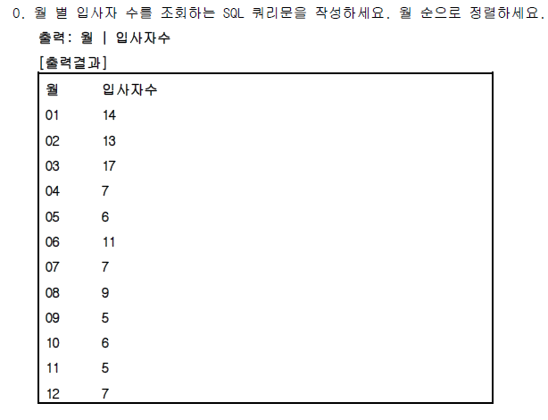
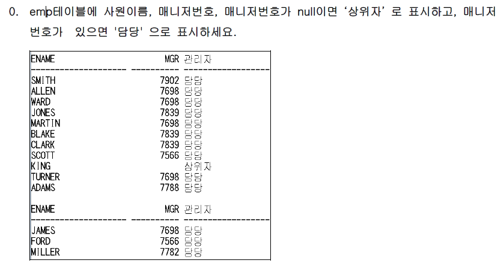
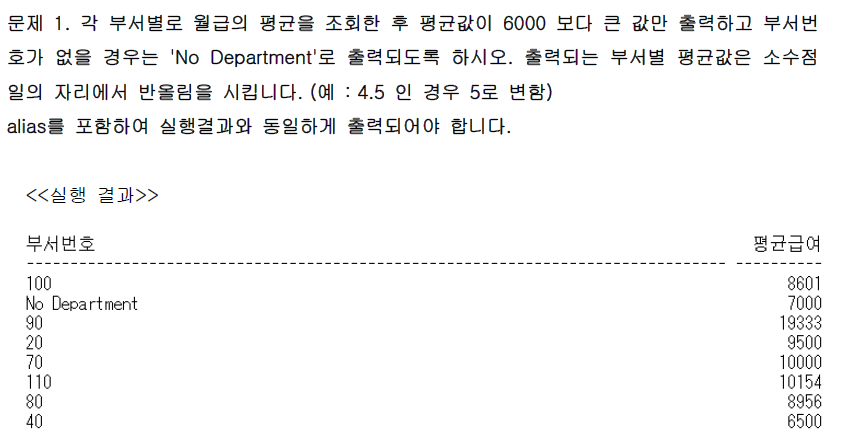
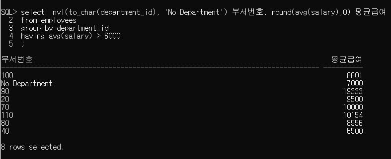
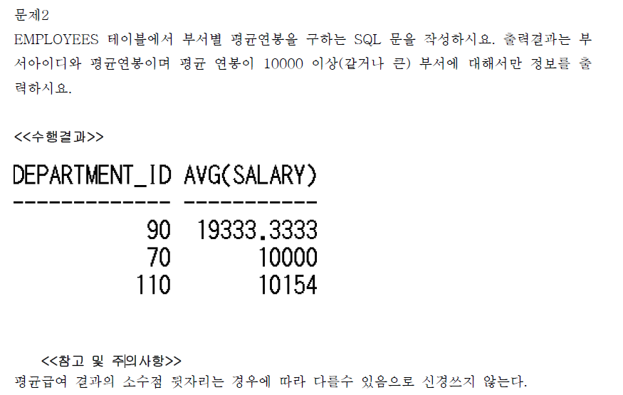
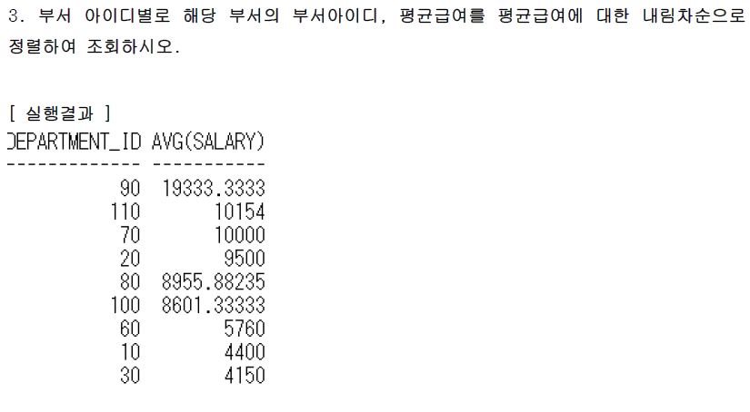
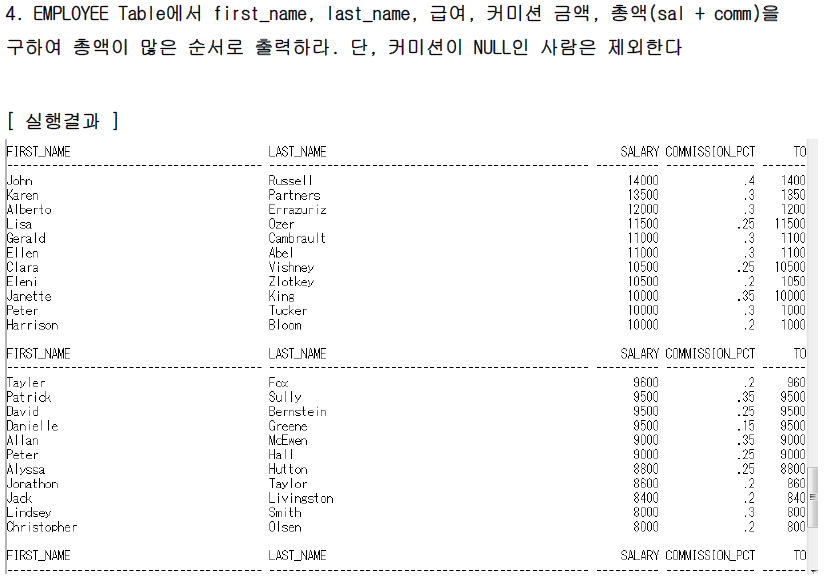
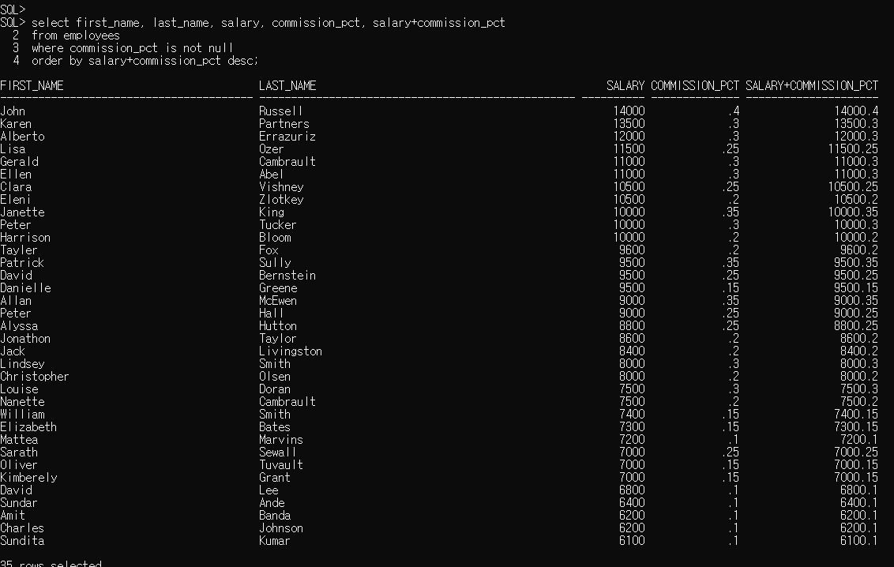

## 기본 SQL 문

2019-12-18

#### 1번 문제:

> "SMITH의 급여 800만원"의 유형으로 출력할 수 있도록 concat함수를 써서 작업하세요.   단, 급여가 1000만원 미만인 직원에 대해서 작업


```SQL
select concat(concat(ename,'의 급여 '),concat(sal, '만원'))
from emp
where sal <1000;

CONCAT(CONCAT(ENAME,'의급여'),CONCAT(SAL,'만원'))
---------------------------------------------------
SMITH의 급여 800만원
JAMES의 급여 950만원

---------------------------아니면------------------------------------

select concat(ename||'의 급여 ',sal||'만원' )
from emp
where sal <1000;

CONCAT(ENAME||'의급여',SAL||'만원')
-------------------------------------
SMITH의 급여 800만원
JAMES의 급여 950만원
```

#### 2번 문제:

> 입사일이 81년인 직원에 대해서 각 직원의 이름과 입사일을 나타내시오. (substr이용)

```SQL
select ename, hiredate
from emp
where substr(hiredate,1,2) ='81';

ENAME                HIREDATE
-------------------- --------
ALLEN                81/02/20
WARD                 81/02/22
JONES                81/04/02
MARTIN               81/09/28
BLAKE                81/05/01
CLARK                81/06/09
KING                 81/11/17
TURNER               81/09/08
JAMES                81/12/03
FORD                 81/12/03
```


#### 3번 문제:

> 각 직원의 이름, job,급여를 나타내되 급여는 5자리로 나타내며 부족한 자릿수는 *로 표시한다.    
>
> 급여가 2000만원 이하인 직원만 나타내기

> 

```SQL
select ename, job, rpad(sal,5,'*')
from emp
where sal <=2000;

ENAME                JOB                RPAD(SAL,5,'*')
-------------------- ------------------ ---------------
SMITH                CLERK              800**
ALLEN                SALESMAN           1600*
WARD                 SALESMAN           1250*
MARTIN               SALESMAN           1250*
TURNER               SALESMAN           1500*
ADAMS                CLERK              1100*
JAMES                CLERK              950**
MILLER               CLERK              1300*
```


#### 4번 문제:

> 3번의 결과에서 *를 없애고 출력해보세요..단,함수를 이용하여 작업

> 

```SQL
select ename, job, rpad(sal,5,'*'), rtrim(sal,'*')
from emp
where sal <=2000;

ENAME                JOB                RPAD(SAL,5,'*')                          RTRIM(SAL,'*')
-------------------- ------------------ ---------------------------------------- ---------------
SMITH                CLERK              800**                                    800
ALLEN                SALESMAN           1600*                                    1600
WARD                 SALESMAN           1250*                                    1250
MARTIN               SALESMAN           1250*                                    1250
TURNER               SALESMAN           1500*                                    1500
ADAMS                CLERK              1100*                                    1100
JAMES                CLERK              950**                                    950
MILLER               CLERK              1300*                                    1300
```


#### 5번 문제:

> emp 테이블에서 scott의 사원번호, 성명, 담당업무(소문자로), 부서번호를조회한다.

> 

```SQL
select empno, ename, lower(job), deptno
from emp
where ename = 'SCOTT';

EMPNO ENAME                LOWER(JOB)             DEPTNO
----- -------------------- ------------------ ----------
 7788 SCOTT                analyst                    20

```


#### 6번 문제:

> emp 테이블에서 이름의 첫글자가 'K'보다크고 'Y'보다 작은 사원의 사원번호, 이름, 업무, 급여,   부서번호를 조회한다. 단, 이름순으로 정렬하여라.

> 

```SQL
select empno, ename, job, deptno
from emp
where substr(ename,1) between 'K' and 'Y'
order by ename asc;

SUBSTR(ENAME,1)
--------------------
SMITH
WARD
MARTIN
SCOTT
KING
TURNER
MILLER

7 rows selected.
```


#### 7번 문제:

> emp 테이블에서 10번부서의 사원에 대하여 담당업무 중 좌측에 'A'를 삭제하고 급여 중   좌측의 1을 삭제하여 출력하여라.

> 

```SQL
select deptno, ltrim(job,'A'), ltrim(sal,1)
from emp
where deptno = 10;

DEPTNO LTRIM(JOB,'A')     LTRIM(SAL,1)
------ ------------------ ------------
    10 MANAGER            2450
    10 PRESIDENT          5000
    10 CLERK              300


```

#### 실습1번 문제:

>  부서별 직군의 인원수, 최대급여

```SQL
select deptno,job, count(empno), max(sal)
from emp
group by deptno, job;

DEPTNO JOB                COUNT(EMPNO)   MAX(SAL)
------ ------------------ ------------ ----------
    20 CLERK                         2       1100
    30 SALESMAN                      4       1600
    20 MANAGER                       1       2975
    30 CLERK                         1        950
    10 PRESIDENT                     1       5000
    30 MANAGER                       1       2850
    10 CLERK                         1       1300
    10 MANAGER                       1       2450
    20 ANALYST                       2       3000
```

#### 실습2번 문제:

> 직업별 평균 월급 2000만원 이상인 사람을 출력한다
>
> 단,  사람 이름중 마지막 단어에 H 들어간 사람은 제외한다.

```SQL
select job, avg(sal)
from emp
where ename not like '%H'
group by job
having avg(sal) >= 2000;

JOB                  AVG(SAL)
------------------ ----------
PRESIDENT                5000
MANAGER            2758.33333
ANALYST                  3000
```

#### 실습2번 문제:

> 직업별 인원수를 구하기
>
> 단, 1983년 입사자는 제외하고 최종 결과로는 인원수가 3명 이상인 직업에 대한 결과 출력하기

```SQL
select job, count(empno)
from emp
where hiredate not like '83%'
group by job
having count(empno) >=3;

JOB                COUNT(EMPNO)
------------------ ------------
CLERK                         3
SALESMAN                      4
MANAGER                       3


```

#### 그룹 예제 1번 (hr/hr로 풀기)



select to_char(hire_date,'MM') 월 , count(employee_id) 입자사수
from employees
group by to_char(hire_date,'MM')
order by 월;

```SQL
월     입자사수
---- ----------
01           14
02           13
03           17
04            7
05            6
06           11
07            7
08            9
09            5
10            6
11            5
12            7


-----------다른 풀이---------
select substr(hire_date, 4,2)  월, count(employee_id) 입사자수
from employees
group by substr(hire_date, 4,2)
order by 월;

월                 입사자수
---------------- ----------
01                       14
02                       13
03                       17
04                        7
05                        6
06                       11
07                        7
08                        9
09                        5
10                        6
11                        5
12                        7

12 rows selected.
```

#### 그룹 예제 0번 (scott/tiger 에서 풀기)



``` SQL
select ename, mgr, nvl2(to_char(mgr),'담당','상위자') 관리자
from emp;

ENAME                       MGR 관리자
-------------------- ---------- ------------------
SMITH                      7902 담당
ALLEN                      7698 담당
WARD                       7698 담당
JONES                      7839 담당
MARTIN                     7698 담당
BLAKE                      7839 담당
CLARK                      7839 담당
SCOTT                      7566 담당
KING                            상위자
TURNER                     7698 담당
ADAMS                      7788 담당
JAMES                      7698 담당
FORD                       7566 담당
MILLER                     7782 담당

14 rows selected.
```


#### 그룹 예제 1번 (hr/hr로 풀기)



```SQL
select  nvl(to_char(department_id), 'No Department') 부서번호, round(avg(salary),0) 평균급여
from employees
group by department_id
having avg(salary) > 6000;

SQL> select  nvl(to_char(department_id), 'No Department') 부서번호, round(avg(salary),0) 평균급여
  2  from employees
  3  group by department_id
  4  having avg(salary) > 6000  5  ;
```



#### 그룹 예제 2번 (hr/hr로 풀기)



```SQL
select department_id, avg(salary)
from employees
group by department_id
having avg(salary) >=10000;

DEPARTMENT_ID AVG(SALARY)
------------- -----------
           90  19333.3333
           70       10000
          110       10154

SQL>

```

#### 그룹 예제 3번 (hr/hr로 풀기)



```SQL
select department_id, avg(salary)
from employees
group by department_id
having not department_id between 40 and 50 
order by avg(salary) desc;

DEPARTMENT_ID AVG(SALARY)
------------- -----------
           90  19333.3333
          110       10154
           70       10000
           20        9500
           80  8955.88235
          100  8601.33333
           60        5760
           10        4400
           30        4150

9 rows selected.


select department_id, avg(salary)
from employees
group by department_id
having department_id not in (40,50) 
order by avg(salary) desc;

DEPARTMENT_ID AVG(SALARY)
------------- -----------
           90  19333.3333
          110       10154
           70       10000
           20        9500
           80  8955.88235
          100  8601.33333
           60        5760
           10        4400
           30        4150

9 rows selected.

```


#### 그룹 예제 4번 (hr/hr로 풀기)



```SQL
select first_name, last_name, salary, commission_pct, salary+commission_pct
from employees
where commission_pct is not null
order by salary+commission_pct desc;
```



