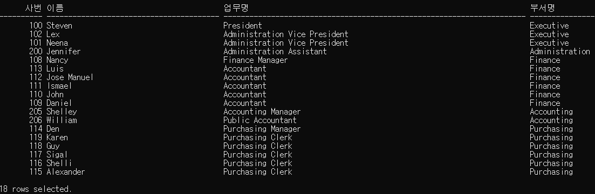
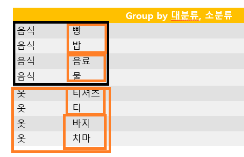

## 기본 SQL 문

2019-12-20

### Scott 계정

#### 예제:

> 부서별 인원수 구하기 (단, 부서명으로 출력하기)


```SQL
select d.dname, count(e.empno)
from dept d, emp e
where e.deptno = d.deptno ---같다가 아니고 조인을 하겠다. 붙이겠다
group by d.dname;

DNAME                        COUNT(E.EMPNO)
---------------------------- --------------
ACCOUNTING                                3
RESEARCH                                  5
SALES                                     6

```

#### 1번 문제:

> SALESMAN의사원번호, 이름, 급여, 부서명, 근무지코드를조회

```SQL
select e.empno 사원번호, e.ename 이름, sal 급여, d.dname 부서명, d.loc_code 근무지코드
from emp e, dept d
where e.deptno = d.deptno 
and e.job = 'SALESMAN';

 사원번호 이름                       급여 부서명                       근무
--------- -------------------- ---------- ---------------------------- ----
     7844 TURNER                     1500 SALES                        C1
     7654 MARTIN                     1250 SALES                        C1
     7521 WARD                       1250 SALES                        C1
     7499 ALLEN                      1600 SALES                        C1


```

#### 2번 문제:

> 사원이름,부서명, 급여, 근무도시명을조회

```SQL
select e.ename 사원이름,  d.dname 부서명, e.sal 급여, l.city 근무도시명
from emp e, dept d, locations l
where e.deptno = d.deptno and d.loc_code = l.loc_code;

사원이름             부서명                             급여 근무도시명
-------------------- ---------------------------- ---------- -------------------
SMITH                RESEARCH                            800 DALLAS
ALLEN                SALES                              1600 CHICAGO
WARD                 SALES                              1250 CHICAGO
JONES                RESEARCH                           2975 DALLAS
MARTIN               SALES                              1250 CHICAGO
BLAKE                SALES                              2850 CHICAGO
CLARK                ACCOUNTING                         2450 SEOUL
SCOTT                RESEARCH                           3000 DALLAS
KING                 ACCOUNTING                         5000 SEOUL
TURNER               SALES                              1500 CHICAGO
ADAMS                RESEARCH                           1100 DALLAS
JAMES                SALES                               950 CHICAGO
FORD                 RESEARCH                           3000 DALLAS
MILLER               ACCOUNTING                         1300 SEOUL

14 rows selected.
```


#### 3번 문제:

> DALLAS에근무하는사원중급여1500 이상인사원의이름,급여,업무, 입사일, 보너스를조회

```SQL
select e.ename 사원이름, e.sal 급여,e.job 업무, e.hiredate 입사일, e.comm 보너스
from emp e, dept d, locations l  ---emp와 locations의 공통 컬럼이 없으므로 dept를 추가해야 한다.
where e.deptno = d.deptno and d.loc_code = l.loc_code and l.city = 'DALLAS' and e.sal >= 1500;

select e.ename 사원이름, e.sal 급여,e.job 업무, e.hiredate 입사일, e.comm 보너스
from emp e, dept d, locations l  ---emp와 locations의 공통 컬럼이 없으므로 dept를 추가해야 한다.
where e.deptno = d.deptno and d.loc_code = l.loc_code and l.city = 'DALLAS' and e.sal >= 1500;

사원이름                   급여 업무               입사일       보너스
------------------- ---------- ------------------ -------- ----------
ORD                       3000 ANALYST            81/12/03
COTT                      3000 ANALYST            82/12/09
ONES                      2975 MANAGER            81/04/02

```

#### 4번 문제:

> EMP 테이블과 DEPT 테이블에있는모든자료를사원번호, 이름, 업무, EMP 테이블의부서번호, DEPT 테이블의부서번호, 부서명을조회

``` SQL
select e.empno 사원번호, e.ename 이름,  e.job 업무, e.deptno 부서번호, d.deptno, d.dname 부서명
from emp e, dept d
where e.deptno = d.deptno;

  사원번호 이름                 업무                 		부서번호     DEPTNO 부서명
---------- -------------------- ------------------ ---------- ---------- ----------------
      7369 SMITH                CLERK                      20         20 RESEARCH
      7499 ALLEN                SALESMAN                   30         30 SALES
      7521 WARD                 SALESMAN                   30         30 SALES
      7566 JONES                MANAGER                    20         20 RESEARCH
      7654 MARTIN               SALESMAN                   30         30 SALES
      7698 BLAKE                MANAGER                    30         30 SALES
      7782 CLARK                MANAGER                    10         10 ACCOUNTING
      7788 SCOTT                ANALYST                    20         20 RESEARCH
      7839 KING                 PRESIDENT                  10         10 ACCOUNTING
      7844 TURNER               SALESMAN                   30         30 SALES
      7876 ADAMS                CLERK                      20         20 RESEARCH
      7900 JAMES                CLERK                      30         30 SALES
      7902 FORD                 ANALYST                    20         20 RESEARCH
      7934 MILLER               CLERK                      10         10 ACCOUNTING

14 rows selected.
```


#### 5번 문제:

> DEPT 테이블, LOCATIONS 테이블을이용하여부서번호, 부서명, 해당부서의city 정보를조회

```SQL
select d.deptno 부서번호, d.dname 부서명, l.city
from dept d, locations l
where d.loc_code = l.loc_code;

부서번호 부서명                       CITY
-------- ---------------------------- -------------
      10 ACCOUNTING                   SEOUL
      20 RESEARCH                     DALLAS
      30 SALES                        CHICAGO
      40 OPERATIONS                   SEOUL

```

### HR 계정

#### 1번 문제:

> 부서별 인원수를 출력하세요
>
> 부서명 인원수

```SQL
select d.department_name, count(e.employee_id)
from departments d, employees e
where d.department_id = e.department_id
group by d.department_name;

DEPARTMENT_NAME                                              COUNT(E.EMPLOYEE_ID)
------------------------------------------------------------ --------------------
Administration                                                                  1
Accounting                                                                      2
Purchasing                                                                      6
Human Resources                                                                 1
IT                                                                              5
Public Relations                                                                1
Executive                                                                       3
Shipping                                                                       45
Sales                                                                          34
Finance                                                                         6
Marketing                                                                       2

11 rows selected.

```

#### 2번 문제:

> IT 부서에서 일하는 직원의 first_name, last_name, salary 를 출력하시요. 출력결과는 salary 가 낮은 사람부터 출력하시요. 전체 결과는 아래 수행결과처럼 하나의 문자열로 결합되어서 나와야 하며 전체 결과 하나의 컬럼으로 출력되도록 작성하세요.


```SQL
select (e.first_name||' '||e.last_name||'의 연봉은 '|| e.salary ||' 입니다.') 결과
from departments d, employees e
where d.department_id = e.department_id
and
d.department_name = 'IT'
order by e.salary asc;

결과
---------------------------------------
Diana Lorentz의 연봉은 4200 입니다.
David Austin의 연봉은 4800 입니다.
Valli Pataballa의 연봉은 4800 입니다.
Bruce Ernst의 연봉은 6000 입니다.
Alexander Hunold의 연봉은 9000 입니다.
```

#### 3번 문제:

> 각 사원(employee)에 대해서 사번(employee_id), 이름(first_name), 업무명(job_title), 부서명(department_name)를 조회하시오. 단 도시명(city)이 ‘Seattle’인 지역(location)의 부서(department)에 근무하는 직원만 출력하시오.


```SQL
select e.employee_id 사번, e.first_name 이름, j.job_title 업무명, d.department_name 부서명
from departments d, employees e, locations l, jobs j
where d.department_id = e.department_id
and d.location_id=l.location_id 
and j.job_id=e.job_id
and l.city = 'Seattle';
```





#### 4번 문제:

> 각 직책 별(job_title)로 급여의 총합을 구하되 직책이 Representative 인 사람은 제외하십시오. 단, 급여 총합이 30000 초과인 직책만 나타내며, 급여 총합에 대한 오름차순으로 정렬하십시오. 출력 결과의 컬럼명은 아래 결과와 동일하게 주십시오.

``` SQL
select j.job_title JOB, sum(e.salary) 급여
from employees e, jobs j 
where e.job_id=j.job_id
and instr(j.job_title,'Representative',1,1) = 0
group by j.job_title
having sum(e.salary) > 30000
order by sum(e.salary) asc;

JOB                                                                          급여
---------------------------------------------------------------------- ----------
Administration Vice President                                               34000
Stock Manager                                                               36400
Accountant                                                                  39600
Stock Clerk                                                                 55700
Sales Manager                                                               61000
Shipping Clerk                                                              64300

6 rows selected.
```

#### 5번 문제:

> 각 부서 이름 별로 2005년 이전에 입사한 직원들의 인원수를 조회하시오.

```SQL
select d.department_name, count(e.employee_id)
from employees e, departments d
where e.department_id=d.department_id
and e.hire_date < '05/01/01'
group by d.department_name;

DEPARTMENT_NAME                                              COUNT(E.EMPLOYEE_ID)
------------------------------------------------------------ --------------------
Administration                                                                  1
Accounting                                                                      2
Purchasing                                                                      2
Human Resources                                                                 1
Public Relations                                                                1
Executive                                                                       2
Shipping                                                                        7
Sales                                                                           5
Finance                                                                         2
Marketing                                                                       1

10 rows selected.
```


#### 6번 문제: 덜풀었다

> 사원수가 3명 이상의 사원을 포함하고 있는 부서의 부서번호(department_id), 부서이름(department_name), 사원 수, 최고급여, 최저급여, 평균급여, 급여총액을 조회하여 출력하십시오. 출력 결과는 부서에 속한 사원의 수가 많은 순서로 출력하고, 컬럼명은 아래 결과와 동일하게 출력하십시오. (평균급여 계산시 소수점 이하는 버리시오)

```SQL
select 
from 
where 
group by
order by

d
```




그룹을 두번 나누었을 떄 이런식으로 분류가 된다.


### 서브쿼리 

#### 1. 문제: 다시풀기

> 이름에 'T'를 포함하고 있는 사원과 같은 부서에서 근무하는 사원의 이름과 사원번호 출력

```SQL
select ename, empno
from emp
where deptno in
	(select  deptno
	from emp
	where ename like '%T%');
	
	ENAME                     EMPNO
-------------------- ----------
FORD                       7902
ADAMS                      7876
SCOTT                      7788
JONES                      7566
SMITH                      7369
JAMES                      7900
TURNER                     7844
BLAKE                      7698
MARTIN                     7654
WARD                       7521
ALLEN                      7499

11 rows selected.


```

#### 2. 문제: 풀기

>  20번 부서의 최고 급여보다 급여가 많은 사원들의 사원명, 부서코드, 급여 목록 출력하기

```SQL
select

```

#### 3. 문제: 풀기

> 1982년에 입사한 직원의 평균 급여보다 급여가 높은 사원들의 사원명, 입사일, 급여의 목록을  출력하기

```SQL
select

```

#### 4. 문제: 

> 각 부서별 최소급여를 받는 사원의 정보를 출력
>
> (사원명, 부서코드,급여,입사일)

```SQL
select e.ename, e.deptno, e.sal, e.hiredate
from emp e
where e.sal in(select min(e.sal)
          from emp e, dept d
         where e.deptno = d.deptno
			group by d.dname);
			
			
ENAME                    DEPTNO        SAL HIREDATE
-------------------- ---------- ---------- --------
SMITH                        20        800 80/12/17
JAMES                        30        950 81/12/03
MILLER                       10       1300 82/01/23

--------------------강사님이 설명하시는 틀린 답변--------------------
select ename, deptno, sal, hiredate
from emp
where sal in (	select  min(sal)
		from emp
		group by deptno);


ENAME                    DEPTNO        SAL HIREDATE
-------------------- ---------- ---------- --------
SMITH                        20        800 80/12/17
JAMES                        30        950 81/12/03
MILLER                       10       1300 82/01/23


select ename, deptno, sal, hiredate
from emp
where sal in (select  min(sal)
from emp
group by deptno);

ENAME                    DEPTNO        SAL HIREDATE
-------------------- ---------- ---------- --------
SMITH                        20        800 80/12/17
JAMES                        30        950 81/12/03
MILLER                       10       1300 82/01/23
황제윤                       20       1300 19/12/20
---------------------1300이라는 데이터가 또 있어서 2개가 나옴. 금액만 가지고 비교를 해서 그럼
---그럴땐 2개 이상의 조건을 가지고 비교를 해야한다.

select ename, deptno, sal, hiredate
from emp
where (deptno, sal) in (select deptno, min(sal)
                        from emp
                        group by deptno);
                        
 ENAME                    DEPTNO        SAL HIREDATE
-------------------- ---------- ---------- --------
SMITH                        20        800 80/12/17
JAMES                        30        950 81/12/03
MILLER                       10       1300 82/01/23
```


