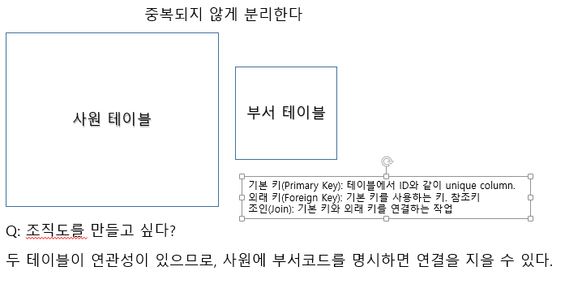
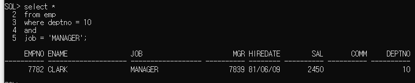
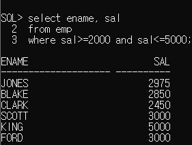
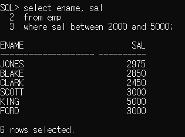
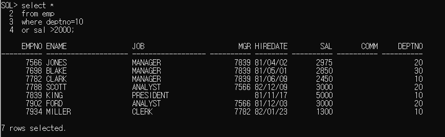
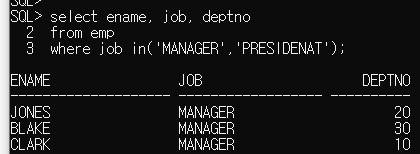
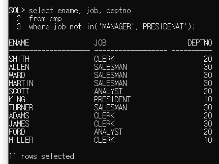
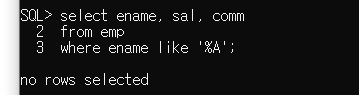
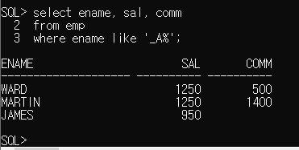

## DBMS: Database Management System

**DBMS란 **

- 데이터베이스(데이터가 모여있는 곳) 관리 프로그램이다.
- DBMS의 개발자를 DBA라 부른다.
- 파일로 데이터를 관리할 수 있지만 그 데이터의 양이 점점 많아지면 관리가 어려워지므로 DBMS가 나왔다.
- Oracle 프로그램인 SQL이 가장 유명하다.
- DB2, Oracle, MySQL, MS SQL, 티베로 등이 있다.
- 수정, 삽입, 삭제, 조회 (거이 80%)

**목적:**

대용량의 데이터를 빠르게 관리할 수 있도록 함. 관공서나 대기업에서 사용.

---

#### 관계형 데이터베이스 (Relational Database: RDB)

>  엑셀 시트처럼 열과 행으로 이루어진 2차원 표 형식으로 데이터를 관리한다.
>
> SQL: Structured Query Language라는 언어로 RDB를 관리한다. 

- 대표 5개 RDBMS:
  - Oracle RDBMS :오라클
  - SQL Server : MS
  - DB2 : IBM
  - PostgreSQL : 오픈소스
  -  MySQL :  오픈소스
- RDBMS 
  1. 기본 키 (Primiary Key): 중복되지 않은 유일한 키. Parent Table
  2. 외래 키 (Foreign Key): 기본 키를 참조하여 사용하는 키. Child Table
  3. 조인 (Join): 기본 키와 외래키의 연관성을 활용하여 연결하는 작업.



4. 테이블을 구문 짓어야 하는 이유는 코드의 중복을 막기 위함이고 이를 **정규화**라고 한다. 
5. 이렇게 관리된 데이터베이스에 접근하기 위해서 만들어진 언어가 **SQL**이다.

## SQL

> **특징:** 
>
> 1. sql문은 대소문자 구분하지 않는다.
>
> 2. ;은 sql문의 종료를 의미
>
> 3. ;을 입력하기 전에 여러 주로 sql문을 작성할 수 있다.
>
> 4. *는 모든 컬름을 조회하겠다는 의미
>
> 5. 컬럼에 null을 저장할 수 있다.
>
>    null은 0이나 space만 입력해 놓은 값과 다른 값
>
>    null 아무 값도 없는 것을 의미
>
>    사용할 수 없고, 저장되어 있지 않은 상태
>
> 6. 컬럼명 대신 alias를 정의해서 사용할 수 있다.
>
>    select 컬렁명 alias명, 컬럼명 as alias명, 컬렁명 "alias명"
>    																					----------- alias명에 공백이 있는 경우 사용
>
> 7. 여러 컬럼을 합쳐서 하나의 컬럼으로 조회할 경우 사용
>
>    || or 연산자이용
>
> 8. 오라클의 문자열, 날짜 데이터는 ' '로 표현
>
> 9. 연산의 결과로 컬럼을 생성할 수 있다. (+,-,*,/ 및 기타 함수... ) 단 null 이 포함되어 있으면 연산불가
>
> 10. 중복이 있는 경우 제거하기 위해 select문에 distinct 를 추가할 수 있다.

#### 실습예제

``` sql

SQL> select job
  2  from emp;

JOB
------------------
CLERK
SALESMAN
SALESMAN
MANAGER
SALESMAN
MANAGER
MANAGER
ANALYST
PRESIDENT
SALESMAN
CLERK

JOB
------------------
CLERK
ANALYST
CLERK

14 rows selected.

SQL> select distinct job from emp;

JOB
------------------
CLERK
SALESMAN
PRESIDENT
MANAGER
ANALYST

//중복이 제외되어 나왔다.
```

---

3가지 종류로 나뉜다: DDL, DML, and DCL

#### 1.DDL (Data Definition Language) - 정의

>  명령어 사용 후 꼭 커밋을 해야 저장이 된다. 데이터를 담기 위한 포멧을 생성한다.

- **CREATE:**

- **DROP:**

- **ALTER:**

  

#### 2. DML (Data Manipulation Language) - 조작

- **UPDATE:**
- **DELETE:**
- **INSERT:**


#### 3. DCL (Data Control Language) - 제어

- **CREATE:**
- **CREATE:** 
- **CREATE:**

#### 4. Query: 가장 중요한 조회부분

- **SELECT:**
  - 기본
  - group by
  - having
  - join
  - 서브커리
  - 함수

#### 기본 규칙

1. 세미콜론 (;) 사용
2. 대문자, 소문자 구분 없음
3. 상수 작성법에는 규칙이 있다.
4. 단어는 공백 문자나 줄바꿈 문자로 구분한다.


#### 계정생성 및 권한 부여

``` sql
conn system/manager //로그인 방법 manager가 아이디임.
create user (아이디) identified by (비밀번호);
//계정을 만들었으니 사용 권한을 줘야한다.

//수정
alter user scoot identified by tiger // 스컷아이디의 비번이 수정됌

grant connect,resource to (아이디));

conn java/java //(아이디)/(비번)
set linesize 300;


//관리자 계정을 통해서 사용자 권한 부여까지 했음.
select *
from tab;

select 다음에 조회할 column를 준다. from 다음에 테이블명

SQL> select sysdate from dual;

SYSDATE
--------
19/12/18
```


#### 오류 시:

Windows 시스템-관리도구- oracle: OracleServiceXe & Listener 재시작

또한 아래 주소에

C:\oraclexe\app\oracle\product\11.2.0\server\network\ADMIN

listener와 tnsnames는 영문 체크하기

#### 세팅

시작에서

Run SQL 관리자 권한 실행

팝업창의 속성. 레이아웃 너비 2000설정. 그 외 설정은 알아서

#### Char vs Varchar  

char (5): 고정문자. 5자가 다 안 채워져도 5자 메모리 그대로 있다.

varchar (50): 가변문자. 3자만 채워지면 메모리가 3자에 대해서만 할당.

#### 제약설정

> 테이블에 특정 제약을 설정할 수 있다.  
>
> 문법적으로 제안을 둘 떄 사용
>
> Column에 제약조건을 넣으면 콜롬의 제약수준이라 함

#### 테이블 만들기

``` sql
1. 테이블 생성
create table 이름 ()


SQL> create table customer(
  2  id varchar2(10) primary key,
  3  pass varchar2(10),
  4  namem varchar2(15) not null,
  5  point number,
  6  regdate date);

Table created.


SQL> conn scott/tiger
Connected.
SQL> select * from tab;

TNAME                                                        TABTYPE         CLUSTERID
------------------------------------------------------------ -------------- ----------
CUSTOMER                                                     TABLE

//테이블이 만들고 보는 법.

desc customer
 ID
 PASS
 NAMEM
 POINT
 REGDATE


//행 삽입
SQL> insert into customer values('jang','1234','장동건', 1000,sysdate)

1 row created.

 create table test(
  num1 number,
  num2 number(3),   //소수점
  num3 number(3,2),
  num4 number (5,2),
  num5 number (10,3),
  num6 integer);
  
  insert into test values(125.88,125.88,125.88,125.88,1234.12345,125.88);
  
   select * from test;

  NUM1       NUM2       NUM3       NUM4       NUM5       NUM6
------ ---------- ---------- ---------- ---------- ----------
125.88        126       5.88     125.88   1234.123        126

//워크북 124페이지
create table product(
 PDNO number primary key,
 PDNAME varchar2(10),
 PDSUBNAME varchar2(10) not null,
 FACTNO varchar2(5),
 PDDATE date,
 PDCOST integer,
 PDPRICE number,
 PDAMOUNT number);

create table factory(
 FACTNO varchar2(5) primary key,
 FACNAME varchar2(14) not null,
 FACLOC varchar2(13));

create table store(
 STONO varchar2(5) primary key,
 PDNAME varchar2(14) not null,
 PDSUBNAME number,
 FACTNO number,
 PDPRICE number,
 PDAMOUNT number);
```

SQL> select empno, ename, hiredate, job
  2  from emp;

     EMPNO ENAME                HIREDATE JOB
---------- -------------------- -------- ------------------
      7369 SMITH                80/12/17 CLERK
      7499 ALLEN                81/02/20 SALESMAN
      7521 WARD                 81/02/22 SALESMAN
      7566 JONES                81/04/02 MANAGER
      7654 MARTIN               81/09/28 SALESMAN
      7698 BLAKE                81/05/01 MANAGER
      7782 CLARK                81/06/09 MANAGER
      7788 SCOTT                82/12/09 ANALYST
      7839 KING                 81/11/17 PRESIDENT
      7844 TURNER               81/09/08 SALESMAN
      7876 ADAMS                83/01/12 CLERK
    
     EMPNO ENAME                HIREDATE JOB
---------- -------------------- -------- ------------------
      7900 JAMES                81/12/03 CLERK
      7902 FORD                 81/12/03 ANALYST
      7934 MILLER               82/01/23 CLERK
## SQL 코드정리

conn scott/tiger; //아이디와 비번에 연결

create table (테이블명); 테이블 생성

insert into  (테이블명) values('jang','1234','장동건', 1000,sysdate); 테이블 데이터 입력

select * from (테이블명) tab; 데이틀의 모든 항목을 조회

commitl; 입력한 데이터 저장

set linesize 300; // 라인 길이

---

//테이블의 틀 생성
create table test(
 num1 number,
 num2 number(3),
 num3 number(3,2),
 num4 number (5,2),
 num5 number (10,3),
 num6 integer);

---------------------------------------------------

**select과 desc의 차이점**

1. select은 테이블을 보기 위해

2. desc는 테이블의 데이터 형식을 보기 위해

   즉 둘이 보여주는게 다름.


**SQL> select * from test; // select로 테스트 테이블을 조회하면 **

SQL> select * from test;

      NUM1       NUM2       NUM3       NUM4       NUM5       NUM6
---------- ---------- ---------- ---------- ---------- ----------
    125.88        126       5.88     125.88   1234.123        126

**이렇게 나오지만 desc test 를 치면...**

SQL> desc test
 Name                                                                                                                                                                          Null?    Type

----------------------------------------------------------------------------------------------------------------------------------------------------------------------------- -------- --------------
 NUM1                                                                                                                                                                                   NUMBER
 NUM2                                                                                                                                                                                   NUMBER(3)
 NUM3                                                                                                                                                                                   NUMBER(3,2)
 NUM4                                                                                                                                                                                   NUMBER(5,2)
 NUM5                                                                                                                                                                                   NUMBER(10,3)
 NUM6                                                                                                                                                                                   NUMBER(38)

**서로 다른 형식으로 나온다.**

---

select * from 테이블명; //테이블 전체보기

select * from 특정 콜롬명; 특정 콜롬만 보기

select * from 콜롬1, 콜롬2....etc; 여러 콜롬만 보기

select distinct 컬럼명, 컬럼명...............(alias명) from 테이블명 //distinct 중복방지, alias는 명칭변경

from절 다음에 where절 정의

where 절은 조건식이 true가 되도록 정의

where 절에 사용할 수 있는 비교 연산자: >,>=,<,<=,=,<> 같지않다, != 같지않다, = 같다(자바와 다름)

where절에서 조건과 함꼐 비교하는 값을 추가해야 하는 경우 문자, 날짜는 작은따옴표로 묶어줘야 한다.

SQL은 대소문자를 구문하지 않는다. 하지만 값을 비교하는 경우 정확하게 대소문까지 일치해야 한다.


#### 2개 이상의 조건이 있는 경우 사용하는 연산자

1. and 연산자: 모둔 조건이 일치면 true. 다른 컬럼. 경우 && between A and B: 같은 컬럼에서 비교할 경우
2. or 연산자: 둘중 하나만 일치면 true
3. in 연산자: or연산자의 의미와 동일. 컬럼명 in (비교할 값, 값.......) 같은 컬럼에서 값을 여러 개 비교

4. not 연산자: 부정

**AND**





**BETWEEN**



**OR**



​	10번이거나 월급 2000이상

**IN**



​	한개의 콜롭에서 조건을 비교. 매니저이거나 사장이거나

**NOT**



**NULL**

is null: null인 데이터 조회

is not null: null이 아닌 데이터를 조회


​							커미션없는 사람만.

**LIKE**

like 연산자: 대표문자와 함꼐 사용. 조건비교를 위해 입력한 값이 문자열에 포함되어 있는지 확인함.

​					%: 모든 문자열

​					_: 한 자리 문자를 의미


​										이름중 A로 시작하는 모든 것



​										이름 중 A로 끝나는 단어는 없음



​										A번째 단어가 A이고 뒤에는 상관없다. 

#### 데이터 정렬

select (distinct) 컬럼명, 컬럼명.....(alias명)
from 테이블명
where 조건
order by 컬럼명 정렬기준. 여러 컬럼명 기준으로 정렬이 가능하다

**asc:** 오름차순

**desc:** 내림차순

정렬기준을 생략하면 기본은 오름차순


​											구체적인 정렬기준이 없으므로 default인 오름차순


​											desc기준 내림차순


​											문자열도 동일

## 함수: 단일형 & 그룹형

>  Date: 2019-12-19
>
> 1. 단일행 함수: 행 각각 검사하고 넘어감
>
> 2. 그룹 함수: 그룹별로 검사하고 넘어감. 
>
> where절은 단일행이므로 그룹함수안에 사용할 수 없다.

``` SQL
select ename, sal, comm
from emp
where sal >= avg(sal);


 select sum(sal), avg(sal), max(sal),min(sal), count(sal)
 from emp
 where deptno=10;
 
   SUM(SAL)   AVG(SAL)   MAX(SAL)   MIN(SAL) COUNT(SAL)
---------- ---------- ---------- ---------- ----------
      8750 2916.66667       5000       1300          3
      
where sal >= avg(sal)
ERROR at line 3:
ORA-00934: group function is not allowed here


```

#### 1. 단일행 함수: select, from, where절에 모두 사용할 수 있다.

 1. 문자함수 (195페이지)

    - **lower**(문자열 또는 컬럼명): 값을 소문자로 변환
    - **upper**(문자열 또는 컬럼명): 값을 대문자로 변환
    - **initcap**(문자열 또는 컬럼명): 전달된 값의 첫 글자만 대문자로 변환

    **테스트 시, dual 활용:** dual = 임시테이블

    ``` SQL
    select lower('TEST'), upper('test'), initcap('test')
    from dual;
    
    LOWER('T UPPER('T INITCAP(
    -------- -------- --------
    test     TEST     Test
    
    ```

    - **substr** (문자열 또는 컬럼명, 시작위치, 추출할 문자열의 갯수, ) : 짤라내기
      - SQL의 인텍스 넘버는 1부터 시작

    ``` SQL
    select substr('oracle',2,2)
    from dual;
    
    SUBS
    ----
    ra
    ```

    - Length: 문자길이

    ``` SQL
    select length('oracle')
    from dual;
    
    LENGTH('ORACLE')
    ----------------
                   6
    
    ```

    - **str**(문자열 또는 컬럼명, 찾을 문자, 찾을 위치, n번째 문자                                                                                                ) : 찾기

    ```SQL
    select instr('oracle oracle oracle oracle','a',-1,2)
    from dual;
     //오라클 문자열에서 -1(뒤에서보터) 2번째 a를 찾는다
     
     
    INSTR('ORACLEORACLEORACLEORACLE','A',-1,2)
    ------------------------------------------
                                            17
    ```

    ​	해달 문자열의 5번 위치 부터 a를 찾아 위치를 반한

    ​	단, 2번째 a 위치를 반환

    ```SQL
    select instr('oracle oracle oracle','a',5,2)
    from dual;
    
    INSTR('ORACLEORACLEORACLE','A',5,2)
    -----------------------------------
                                     17
    ```

    - **concat:** 문자열 연결

      ```SQL
      select concat('oracle','dbms')
      from dual;
      CONCAT('ORACLE','DBM
      --------------------
      oracledbms
      ```

      

    - **lpad:** 지정해준 길이에 문자열을 채우고 부족한 만큼 왼쪽부터 지정한 문자를 채움

      (문자열 or 컬럼명, 출려갛ㄹ 문자열의 길이, 채움문자/문자열 연결)

    - **rpad:** 전체 출력할 문자열의 길이에 문자열을 출력한 후 남는 공간에 정의한 문자를 채워 출력해주는 함수 (오른쪽)

      (문자열 or 컬럼명, 출려갛ㄹ 문자열의 길이, 채움문자/문자열 연결)

    - **ltrip** (문자열 or 컬럼명, 제거할 문자)

      컬럼에서 매개변수로 정의한 문자를 왼쪽에서 찾아 모두 제거

      단. 연속된 문자만 제거

      ```SQL
      select ltrim('aaaaaaaaaaaaaaaaaaaaaaaaaaaaoracle','a')
      from dual;
      
      LTRIM('AAAAA
      ------------
      oracle
      ```

      

    - **rtrip** (문자열 or 컬럼명, 제거할 문자)

      컬럼에서 매개변수로 정의한 문자를 오른쪽에서 찾아 모두 제거

      단. 연속된 문자만 제거

      ```SQL
      이건 공백을 지운 예제
      select rtrim('  oracle                              ',' ')
      from dual;
      
      RTRIM('ORACLE','
      ----------------
        oracle
      ```

      

 2. 