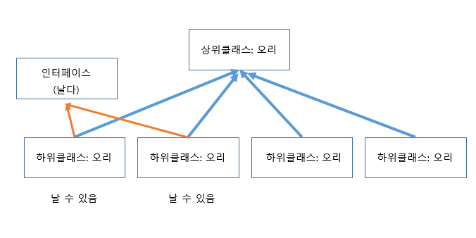

## 인터페이스 (Interface) 12/16/19

**인터페이스란...**

- 추상클래스를 부분적으로만 완성된 '미완성 설계도'라고 한다면, 인터페이스는 구현된 것은 아무 것도 없고 밑그림만 그려져 있는 '기본설계도'라 할 수 있다.

- 인터페이스도 추상클래스처럼 불완전한 것이기 떄문에 그 자체만으로 사용되기 보다는 다른 클래스를 작성하는데 도움을 줄 목적으로 작성된다. 

-------------------------------------------------------------------------------------------------------

**특징: 다형성을 위해 사용하는 기능. **

1. 추상메소드만 모아놓은 스패셜한 클래스이다.

   

2. 다중상속이 가능하다. 여러개를 상속할 수 있다. 

   1. 자바는 단일 상속만 가능하다. (하나의 클래스는 하나의 상위클래스만 상속한다.)
   2. 오직 추상메서드와 상수만을 멤버로 가질 수 있다.


상위클래스에서 상속을하면 모든 내용을 하위클래스에서 상속받으는데...

하위클래스가 많으면 공통을 찾기 힘들 수도 있음.

예시: 오리 날다.  오리의 기본 구조만 상위에서 상속받고, 날 수 있는 오리만 인터페이스로 묶어서 표현한다.



----------------------------------------------------------------------------------------------------


``` java
package chap07Poly;
/*
	인터페이스 연습
	<<인터페이스>>
	=> 추상메소드 (상수도 포함)만 정의하는 특별한 클래스
	1. 인터페이스는 interface키워드를 이용해서 정의
	2. 인터페이스는 추상메소드만 정의하는 특별한 클래스
		- public abstract이 생략가능
		- 상속을 받으면 자동으로 추가한다.
	3. 인터페이스가 인터페이스를 상속할 수 있다. (extends이용)
		- 하위가 상위 인터페이스의 추상메소드를 상속받는다.
	4. 클래스가 인터페이스를 상속할 수 있다. (implements 이용)
		- 인터페이스를 상속받는 클래스가 이미 다른 클래스를 상속하는 경우에
		extends를 먼저 정의하고 implements를 정의해야 한다. (순서대로)
	5. 인터페이스는 다중상속이 가능하다. implements 위에서 인터페이스를 정의할 떄
		','로 구분하여 나열.
	6. 클래스와 인터페이스를 상속받는 하위클래스는 모든 클래스와 인터페이스의 하위로 인식된다.
*/
//인터페이스 상위클래스
interface InterA{
	public abstract void test(); // 인터페이스는 어차피 추상만 취급. 생략가능
	void display(int num);
}
//인터페이스 하위클래스
interface InterB extends InterA{
	void show();
}
interface InterC {
	
}
class SuperA{
	
}
					//B가 A를 상속중
//SubA는 SuperA,InterA,InterB,InterC의 하위가 된다.
class SubA extends SuperA implements InterB, InterC{ 
				//A에서 2개, B에서 1개 추상메서드 총 3개 오버라이드 해야 함.

	@Override
	public void test() {
		
	}

	@Override
	public void display(int num) {
		
	}

	@Override
	public void show() {
		
	}
	
}


public class InterfaceTest01 {

	public static void main(String[] args) {
		SuperA obj1 = new SubA(); // 부모타입이니 가능
		InterA obj2 = new SubA();
		InterB obj3 = new SubA();
		InterC obj4 = new SubA();// SubA은 모른 클래스의 하위클래스.
	}

}

//-----------------------다른 클래스---------------------------
package chap07Poly;
/*
		객체의 타입을 검사하고 작업할 수 있다.
		instanceof 연산자를 이용
*/
class AA{
	
}
interface IA{
	
}

public class InstanceOfTest {
	public static void main(String[] args) {
		SubA obj = new SubA();
		//obj가 SUperA타입이면 if블럭을 실행해라
		//이 뜻은 SuperA의 하위냐?
		if(obj instanceof SuperA){
			System.out.println("Super A타입이다.");
		} else {
			System.out.println("Super A타입이 아니다.");
		}
		System.out.println("================================");
		if(obj instanceof InterA){
			System.out.println("Inter A타입이다.");
		} else {
			System.out.println("Inter A타입이 아니다.");
		}
		System.out.println("================================");
		if(obj instanceof InterB){
			System.out.println("Inter B타입이다.");
		} else {
			System.out.println("Inter B타입이 아니다.");
		}
		System.out.println("================================");
		//아무런 상속관계가 없는 클래스
		if(obj instanceof IA){
			System.out.println("AI타입이다.");
		} else {
			System.out.println("AI타입이 아니다.");
		}
	}
	

}

**출력화면**
    Super A타입이다.
================================
Inter A타입이다.
================================
Inter B타입이다.
================================
AI타입이 아니다.
```

#### 장점

1. 개발시간을 단축시킬 수 있다.
2. 표준화가 가능하다.
3. 서로 관계없는 클래스들에게 관계를 맺어 줄 수 있다.
4. 독립적인 프로그매잉이 가능하다.